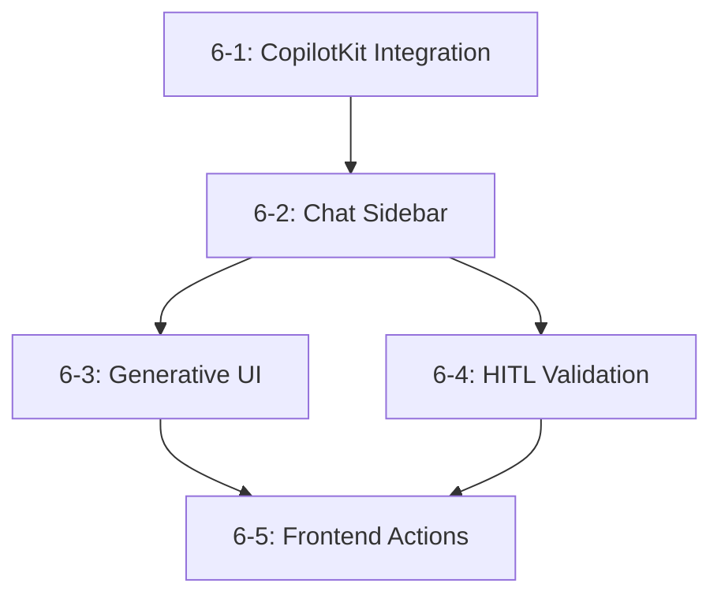

# Epic 6 Tech Spec: Interactive Copilot Experience

**Version:** 1.0
**Created:** 2025-12-30
**Status:** Ready for Implementation

---

## Overview

Epic 6 implements the **Interactive Copilot Experience** - a polished AI chat interface integrated with CopilotKit that provides Human-in-the-Loop (HITL) source validation, generative UI components, and frontend action capabilities. This epic transforms the existing Next.js frontend into a fully-featured AI copilot application.

### Business Value

- End-users get a production-ready chat interface for interacting with the AI system
- Researchers gain trust through HITL source validation before answer generation
- Developers can extend the system with custom generative UI components
- The application demonstrates full AG-UI protocol compliance (FR5, NFR7)

### Functional Requirements Covered

| FR | Description | Story |
|----|-------------|-------|
| FR3 | npm package for React integration | 6-1 |
| FR19 | Chat sidebar interface | 6-2 |
| FR20 | Generative UI components | 6-3 |
| FR21 | Human-in-the-Loop validation | 6-4 |
| FR22 | Frontend actions | 6-5 |

### NFRs Addressed

| NFR | Requirement | Implementation |
|-----|-------------|----------------|
| NFR1 | <10s E2E response | Streaming responses, optimistic UI |
| NFR7 | 100% AG-UI compliance | CopilotKit protocol bridge |

---

## Architecture Decisions

### 1. CopilotKit Version and Packages

**Decision:** Use CopilotKit latest stable (currently 1.0.0 installed, upgrade to latest)

**Packages Required:**
```json
{
  "@copilotkit/react-core": "^1.0.0",
  "@copilotkit/react-ui": "^1.0.0",
  "@copilotkit/runtime": "^1.0.0"
}
```

**Rationale:** The project already has CopilotKit dependencies installed. We leverage the official CopilotKit integration which provides:
- Built-in AG-UI protocol support
- Streaming response handling
- State synchronization between frontend and backend
- Type-safe action definitions

### 2. Backend Integration Pattern

**Decision:** Create a Next.js API route that proxies to the FastAPI backend

**Pattern:**
```
Frontend (CopilotKit) -> /api/copilotkit (Next.js Route) -> Backend (FastAPI + Agno)
```

**Rationale:**
- CopilotKit expects a specific endpoint format
- Next.js API routes provide server-side processing for the CopilotKit runtime
- The FastAPI backend already has the orchestrator agent infrastructure

### 3. State Management Strategy

**Decision:** Use CopilotKit's built-in state management + TanStack Query for non-chat data

| State Type | Technology | Use Case |
|------------|------------|----------|
| Chat/Agent State | CopilotKit (useCoAgent, useCopilotChat) | Agent responses, tool calls, HITL |
| Server State | TanStack Query | Knowledge graph data, documents |
| UI State | React useState/context | Sidebar visibility, filters |

### 4. Component Architecture

**Decision:** Layered component structure

```
CopilotProvider (root)
  - CopilotSidebar (chat interface)
    - ThoughtTraceStepper (agent progress)
    - GenerativeUIRenderer (dynamic components)
    - SourceValidationPanel (HITL)
  - MainContent (application)
    - ActionableElements (frontend actions)
```

---

## Component Structure

### Frontend Directory Updates

```
frontend/src/
  app/
    api/
      copilotkit/
        route.ts              # CopilotKit runtime endpoint (NEW)
    layout.tsx                # Updated with CopilotProvider
    page.tsx                  # Updated with CopilotSidebar

  components/
    copilot/                  # NEW directory
      CopilotProvider.tsx     # Root CopilotKit wrapper
      ChatSidebar.tsx         # Main chat interface
      ThoughtTraceStepper.tsx # Agent progress indicator
      SourceValidationPanel.tsx # HITL approval cards
      GenerativeUIRenderer.tsx  # Dynamic UI component dispatcher
      ActionPanel.tsx         # Frontend action triggers
      components/             # Generative UI sub-components
        GraphVisualizerCard.tsx
        DataTableCard.tsx
        SourceCard.tsx

  hooks/
    use-copilot-actions.ts    # Custom action hook (NEW)
    use-source-validation.ts  # HITL state hook (NEW)
    use-thought-trace.ts      # Trajectory display hook (NEW)

  types/
    copilot.ts               # CopilotKit types (NEW)
```

### Backend Directory Updates

```
backend/src/agentic_rag_backend/
  api/
    routes/
      copilot.py             # AG-UI protocol endpoint (NEW)

  protocols/
    ag_ui_bridge.py          # AG-UI protocol handler (NEW)

  models/
    copilot.py               # CopilotKit payloads (NEW)
```

---

## Integration Points

### 1. Backend API Endpoints

**New Endpoint: POST /api/v1/copilot**

```python
# Endpoint signature
@router.post("/copilot")
async def copilot_handler(
    request: CopilotRequest,
    orchestrator: OrchestratorAgent = Depends(get_orchestrator),
) -> StreamingResponse:
    """Handle AG-UI protocol requests from CopilotKit."""
```

**Request Format (AG-UI Protocol):**
```json
{
  "messages": [
    {"role": "user", "content": "..."},
    {"role": "assistant", "content": "..."}
  ],
  "config": {
    "configurable": {
      "tenant_id": "uuid",
      "session_id": "uuid"
    }
  },
  "actions": [...]
}
```

**Response Format (SSE Stream):**
```
data: {"type": "text_delta", "content": "..."}
data: {"type": "tool_call", "tool": "retrieve_sources", "args": {...}}
data: {"type": "state_snapshot", "state": {...}}
data: {"type": "action_request", "action": "validate_sources", "args": {...}}
```

### 2. AG-UI Protocol Usage

CopilotKit implements the AG-UI protocol which defines:

| Event Type | Direction | Purpose |
|------------|-----------|---------|
| `text_delta` | Backend -> Frontend | Streaming text responses |
| `tool_call` | Backend -> Frontend | Agent tool invocations |
| `tool_result` | Frontend -> Backend | Tool execution results |
| `state_snapshot` | Backend -> Frontend | Agent state updates |
| `action_request` | Backend -> Frontend | Request frontend action |
| `action_response` | Frontend -> Backend | Frontend action result |

### 3. State Management Approach

**CopilotKit State Flow:**
```typescript
// Agent state (managed by CopilotKit)
interface AgentState {
  currentStep: string;
  thoughts: string[];
  retrievedSources: Source[];
  validatedSources: Source[];
  answer: string | null;
  trajectory_id: string | null;
}

// Using useCoAgent hook
const { state, run, stop } = useCoAgent<AgentState>({
  name: "orchestrator",
  initialState: { currentStep: "idle", thoughts: [], ... }
});
```

**Source Validation State:**
```typescript
// HITL validation state
interface SourceValidationState {
  sources: Source[];
  approvedIds: Set<string>;
  rejectedIds: Set<string>;
  isPending: boolean;
}
```

---

## Story Technical Details

### Story 6-1: CopilotKit React Integration

**Objective:** Set up the foundational CopilotKit integration with proper provider configuration.

**Technical Approach:**

1. **Create CopilotKit Provider Wrapper**
   - File: `frontend/src/components/copilot/CopilotProvider.tsx`
   - Wrap the application in `<CopilotKit>` component
   - Configure `runtimeUrl` to point to `/api/copilotkit`

2. **Create Next.js API Route**
   - File: `frontend/src/app/api/copilotkit/route.ts`
   - Use CopilotKit's runtime package for request handling
   - Proxy requests to FastAPI backend

3. **Create Backend AG-UI Endpoint**
   - File: `backend/src/agentic_rag_backend/api/routes/copilot.py`
   - Implement SSE streaming response
   - Integrate with existing OrchestratorAgent

4. **Update Root Layout**
   - Wrap application in CopilotProvider
   - Ensure proper TypeScript types

**Files to Create/Modify:**
```
NEW:  frontend/src/components/copilot/CopilotProvider.tsx
NEW:  frontend/src/app/api/copilotkit/route.ts
NEW:  backend/src/agentic_rag_backend/api/routes/copilot.py
NEW:  backend/src/agentic_rag_backend/protocols/ag_ui_bridge.py
NEW:  frontend/src/types/copilot.ts
MOD:  frontend/src/app/layout.tsx
MOD:  backend/src/agentic_rag_backend/main.py (add router)
```

**Code Pattern - Provider Setup:**
```typescript
// frontend/src/components/copilot/CopilotProvider.tsx
"use client";

import { CopilotKit } from "@copilotkit/react-core";
import { ReactNode } from "react";

interface CopilotProviderProps {
  children: ReactNode;
}

export function CopilotProvider({ children }: CopilotProviderProps) {
  return (
    <CopilotKit runtimeUrl="/api/copilotkit">
      {children}
    </CopilotKit>
  );
}
```

**Acceptance Criteria Verification:**
- CopilotProvider wraps the app successfully
- API route responds to CopilotKit requests
- Backend SSE stream delivers messages
- TypeScript types are complete

---

### Story 6-2: Chat Sidebar Interface

**Objective:** Implement a polished chat sidebar using CopilotKit's UI components with the project's design system.

**Technical Approach:**

1. **Create Chat Sidebar Component**
   - File: `frontend/src/components/copilot/ChatSidebar.tsx`
   - Use `CopilotSidebar` from `@copilotkit/react-ui`
   - Apply design system colors (Indigo-600, Slate)
   - Integrate Inter + JetBrains Mono fonts

2. **Create Thought Trace Stepper**
   - File: `frontend/src/components/copilot/ThoughtTraceStepper.tsx`
   - Vertical progress indicator showing agent steps
   - Clickable steps to expand raw logs
   - Use `useCoAgentStateRender` for state rendering

3. **Implement Message Streaming**
   - Use `useCopilotChat` for message handling
   - Display streaming responses as they arrive
   - Show typing indicators during generation

4. **Style with Design System**
   - Primary: Indigo-600 (#4F46E5)
   - Neutral: Slate-900 to Slate-50
   - Typography: Inter (headings), JetBrains Mono (traces)

**Files to Create/Modify:**
```
NEW:  frontend/src/components/copilot/ChatSidebar.tsx
NEW:  frontend/src/components/copilot/ThoughtTraceStepper.tsx
NEW:  frontend/src/hooks/use-thought-trace.ts
MOD:  frontend/src/app/page.tsx (integrate sidebar)
MOD:  frontend/tailwind.config.ts (add custom colors if needed)
```

**Code Pattern - Thought Trace:**
```typescript
// frontend/src/components/copilot/ThoughtTraceStepper.tsx
"use client";

import { useCoAgentStateRender } from "@copilotkit/react-core";

interface ThoughtStep {
  step: string;
  status: "pending" | "in_progress" | "completed";
  details?: string;
}

export function ThoughtTraceStepper() {
  useCoAgentStateRender<{ steps: ThoughtStep[] }>({
    name: "orchestrator",
    render: ({ state }) => (
      <div className="flex flex-col gap-2 font-mono text-sm">
        {state.steps?.map((step, idx) => (
          <StepIndicator key={idx} step={step} />
        ))}
      </div>
    ),
  });

  return null; // Render is handled by hook
}
```

**Design System Integration:**
```css
/* Thought Trace styling */
.thought-trace {
  @apply font-mono text-sm text-slate-600;
}

.thought-trace-step {
  @apply flex items-center gap-2;
}

.thought-trace-step.completed {
  @apply text-emerald-500;
}

.thought-trace-step.in-progress {
  @apply text-indigo-600 animate-pulse;
}
```

---

### Story 6-3: Generative UI Components

**Objective:** Enable the AI to render specialized UI components (graph visualizers, data tables) within the chat flow.

**Technical Approach:**

1. **Create Generative UI Renderer**
   - File: `frontend/src/components/copilot/GenerativeUIRenderer.tsx`
   - Component dispatcher based on tool/action type
   - Register renderers for each component type

2. **Create Graph Visualizer Card**
   - File: `frontend/src/components/copilot/components/GraphVisualizerCard.tsx`
   - Reuse existing React Flow KnowledgeGraph component
   - Render within chat message flow
   - Support zoom, pan, node selection

3. **Create Data Table Card**
   - File: `frontend/src/components/copilot/components/DataTableCard.tsx`
   - Render structured data from agent responses
   - Sortable columns, pagination

4. **Register with useCopilotAction**
   - Define render functions for generative UI
   - Use `useCopilotAction` with `render` option

**Files to Create/Modify:**
```
NEW:  frontend/src/components/copilot/GenerativeUIRenderer.tsx
NEW:  frontend/src/components/copilot/components/GraphVisualizerCard.tsx
NEW:  frontend/src/components/copilot/components/DataTableCard.tsx
NEW:  frontend/src/components/copilot/components/SourceCard.tsx
MOD:  frontend/src/components/copilot/ChatSidebar.tsx (integrate renderer)
```

**Code Pattern - Generative UI:**
```typescript
// frontend/src/components/copilot/GenerativeUIRenderer.tsx
"use client";

import { useCopilotAction } from "@copilotkit/react-core";
import { GraphVisualizerCard } from "./components/GraphVisualizerCard";
import { DataTableCard } from "./components/DataTableCard";

export function GenerativeUIRenderer() {
  // Register graph visualization action
  useCopilotAction({
    name: "show_knowledge_graph",
    description: "Display a knowledge graph visualization",
    parameters: [
      { name: "nodes", type: "object[]", description: "Graph nodes" },
      { name: "edges", type: "object[]", description: "Graph edges" },
    ],
    render: ({ status, args }) => (
      <GraphVisualizerCard
        nodes={args.nodes}
        edges={args.edges}
        status={status}
      />
    ),
  });

  // Register data table action
  useCopilotAction({
    name: "show_data_table",
    description: "Display structured data in a table",
    parameters: [
      { name: "columns", type: "string[]" },
      { name: "rows", type: "object[]" },
    ],
    render: ({ args }) => (
      <DataTableCard columns={args.columns} rows={args.rows} />
    ),
  });

  return null;
}
```

---

### Story 6-4: Human-in-the-Loop Source Validation

**Objective:** Allow users to review and approve/reject retrieved sources before answer generation.

**Technical Approach:**

1. **Create Source Validation Panel**
   - File: `frontend/src/components/copilot/SourceValidationPanel.tsx`
   - Side-panel UI with source cards
   - Approve/Reject toggle per source
   - Uses Amber-400 for attention items

2. **Create Source Card Component**
   - Display source title, snippet, metadata
   - Similarity score indicator
   - Approve/Reject buttons

3. **Implement HITL State Hook**
   - File: `frontend/src/hooks/use-source-validation.ts`
   - Track approved/rejected sources
   - Communicate decisions back to agent

4. **Register HITL Action**
   - Use `renderAndWait` pattern from CopilotKit
   - Block synthesis until user decision
   - Support "Approve All" / "Reject All" shortcuts

**Files to Create/Modify:**
```
NEW:  frontend/src/components/copilot/SourceValidationPanel.tsx
NEW:  frontend/src/components/copilot/components/SourceCard.tsx
NEW:  frontend/src/hooks/use-source-validation.ts
MOD:  frontend/src/components/copilot/GenerativeUIRenderer.tsx (add HITL action)
MOD:  backend/src/agentic_rag_backend/agents/orchestrator.py (add HITL checkpoint)
```

**Code Pattern - HITL with renderAndWait:**
```typescript
// Source validation using renderAndWait
useCopilotAction({
  name: "validate_sources",
  description: "Request user approval for retrieved sources",
  parameters: [
    {
      name: "sources",
      type: "object[]",
      description: "Sources requiring validation",
    },
  ],
  renderAndWait: ({ args, respond }) => (
    <SourceValidationPanel
      sources={args.sources}
      onApprove={(approvedIds) => respond({ approved: approvedIds })}
      onRejectAll={() => respond({ approved: [] })}
    />
  ),
});
```

**Design - Source Validation Card:**
```typescript
// SourceCard with HITL styling
interface SourceCardProps {
  source: Source;
  isApproved: boolean;
  onToggle: () => void;
}

export function SourceCard({ source, isApproved, onToggle }: SourceCardProps) {
  return (
    <div className={cn(
      "border rounded-lg p-4 transition-colors",
      isApproved
        ? "border-emerald-500 bg-emerald-50"
        : "border-amber-400 bg-amber-50"
    )}>
      <h4 className="font-medium text-slate-900">{source.title}</h4>
      <p className="text-sm text-slate-600 mt-1">{source.preview}</p>
      <div className="flex items-center justify-between mt-3">
        <span className="text-xs text-slate-500">
          Similarity: {(source.similarity * 100).toFixed(0)}%
        </span>
        <button
          onClick={onToggle}
          className={cn(
            "px-3 py-1 rounded text-sm font-medium",
            isApproved
              ? "bg-emerald-500 text-white"
              : "bg-amber-400 text-slate-900"
          )}
        >
          {isApproved ? "Approved" : "Pending"}
        </button>
      </div>
    </div>
  );
}
```

---

### Story 6-5: Frontend Actions

**Objective:** Enable the AI to trigger actions within the host application (highlight text, open modals, scroll to sections).

**Technical Approach:**

1. **Define Frontend Actions**
   - File: `frontend/src/hooks/use-copilot-actions.ts`
   - Register actions: highlight_text, open_modal, scroll_to_section
   - Actions are defined by host application, executed on agent request

2. **Create Action Panel Component**
   - File: `frontend/src/components/copilot/ActionPanel.tsx`
   - Visual feedback when actions execute
   - Action history/log

3. **Implement Action Handlers**
   - Highlight text: Use DOM selection API
   - Open modal: Trigger shadcn/ui Dialog
   - Scroll to section: Smooth scroll with element focus

4. **Action Confirmation in Trajectory**
   - Log action execution in agent trajectory
   - Report success/failure back to agent

**Files to Create/Modify:**
```
NEW:  frontend/src/hooks/use-copilot-actions.ts
NEW:  frontend/src/components/copilot/ActionPanel.tsx
MOD:  frontend/src/components/copilot/CopilotProvider.tsx (register actions)
MOD:  frontend/src/app/page.tsx (add actionable elements)
```

**Code Pattern - Frontend Actions:**
```typescript
// frontend/src/hooks/use-copilot-actions.ts
"use client";

import { useCopilotAction } from "@copilotkit/react-core";

export function useFrontendActions() {
  // Highlight text action
  useCopilotAction({
    name: "highlight_text",
    description: "Highlight text in the document",
    parameters: [
      { name: "text", type: "string", description: "Text to highlight" },
      { name: "elementId", type: "string", description: "Element containing text" },
    ],
    handler: async ({ text, elementId }) => {
      const element = document.getElementById(elementId);
      if (!element) return { success: false, error: "Element not found" };

      // Highlight logic
      const range = document.createRange();
      const textNode = findTextNode(element, text);
      if (textNode) {
        range.selectNodeContents(textNode);
        const selection = window.getSelection();
        selection?.removeAllRanges();
        selection?.addRange(range);
        return { success: true };
      }
      return { success: false, error: "Text not found" };
    },
  });

  // Open modal action
  useCopilotAction({
    name: "open_modal",
    description: "Open a modal dialog",
    parameters: [
      { name: "modalId", type: "string", description: "Modal identifier" },
      { name: "data", type: "object", description: "Data to pass to modal" },
    ],
    handler: async ({ modalId, data }) => {
      // Trigger modal via event or context
      document.dispatchEvent(
        new CustomEvent("copilot:open-modal", { detail: { modalId, data } })
      );
      return { success: true };
    },
  });

  // Scroll to section action
  useCopilotAction({
    name: "scroll_to_section",
    description: "Scroll to a section of the page",
    parameters: [
      { name: "sectionId", type: "string", description: "Section element ID" },
    ],
    handler: async ({ sectionId }) => {
      const element = document.getElementById(sectionId);
      if (!element) return { success: false, error: "Section not found" };

      element.scrollIntoView({ behavior: "smooth", block: "start" });
      element.focus();
      return { success: true };
    },
  });
}
```

---

## Dependencies

### Frontend Dependencies (npm)

```json
{
  "dependencies": {
    "@copilotkit/react-core": "^1.0.0",
    "@copilotkit/react-ui": "^1.0.0",
    "@copilotkit/runtime": "^1.0.0"
  }
}
```

**Note:** These are already installed per package.json. Verify versions are compatible with latest CopilotKit documentation.

### Backend Dependencies (pip)

```toml
# No new backend dependencies required
# Uses existing FastAPI + SSE support
# Optional: ag-ui-protocol package if available
```

### Shared Types

Create shared types for frontend-backend communication:

```typescript
// frontend/src/types/copilot.ts
export interface Source {
  id: string;
  title: string;
  preview: string;
  similarity: number;
  metadata?: Record<string, unknown>;
  isApproved?: boolean;
}

export interface ThoughtStep {
  step: string;
  status: "pending" | "in_progress" | "completed";
  timestamp?: string;
  details?: string;
}

export interface AgentState {
  currentStep: string;
  thoughts: ThoughtStep[];
  retrievedSources: Source[];
  validatedSources: Source[];
  answer: string | null;
  trajectoryId: string | null;
}

export interface FrontendActionResult {
  success: boolean;
  error?: string;
  data?: unknown;
}
```

---

## Testing Strategy

### Story 6-1: CopilotKit React Integration

| Test Type | Description | Location |
|-----------|-------------|----------|
| Unit | CopilotProvider renders without error | `__tests__/copilot/CopilotProvider.test.tsx` |
| Integration | API route proxies to backend | `__tests__/api/copilotkit.test.ts` |
| E2E | Full chat flow works | `tests/e2e/copilot.spec.ts` |

### Story 6-2: Chat Sidebar Interface

| Test Type | Description | Location |
|-----------|-------------|----------|
| Unit | ChatSidebar renders with design system | `__tests__/copilot/ChatSidebar.test.tsx` |
| Unit | ThoughtTraceStepper displays steps | `__tests__/copilot/ThoughtTraceStepper.test.tsx` |
| Visual | Design matches UX spec | Storybook / manual |

### Story 6-3: Generative UI Components

| Test Type | Description | Location |
|-----------|-------------|----------|
| Unit | GraphVisualizerCard renders nodes/edges | `__tests__/copilot/GraphVisualizerCard.test.tsx` |
| Unit | DataTableCard handles empty/large data | `__tests__/copilot/DataTableCard.test.tsx` |
| Integration | Actions trigger correct renderer | `__tests__/copilot/GenerativeUI.test.tsx` |

### Story 6-4: Human-in-the-Loop Source Validation

| Test Type | Description | Location |
|-----------|-------------|----------|
| Unit | SourceCard toggle state works | `__tests__/copilot/SourceCard.test.tsx` |
| Unit | SourceValidationPanel approve/reject flow | `__tests__/copilot/SourceValidationPanel.test.tsx` |
| E2E | HITL blocks synthesis until decision | `tests/e2e/hitl.spec.ts` |

### Story 6-5: Frontend Actions

| Test Type | Description | Location |
|-----------|-------------|----------|
| Unit | Each action handler returns correct result | `__tests__/hooks/use-copilot-actions.test.ts` |
| Integration | Actions affect DOM correctly | `__tests__/copilot/ActionPanel.test.tsx` |
| E2E | Agent-triggered actions work | `tests/e2e/frontend-actions.spec.ts` |

### Test Utilities

```typescript
// __tests__/utils/copilot-test-utils.tsx
import { CopilotKit } from "@copilotkit/react-core";
import { render } from "@testing-library/react";

export function renderWithCopilot(ui: React.ReactElement) {
  return render(
    <CopilotKit runtimeUrl="/api/copilotkit">
      {ui}
    </CopilotKit>
  );
}
```

---

## Risk Considerations

### Technical Risks

| Risk | Likelihood | Impact | Mitigation |
|------|------------|--------|------------|
| CopilotKit API changes | Medium | High | Pin versions, monitor changelog |
| SSE streaming issues | Low | Medium | Fallback to polling, error boundaries |
| AG-UI protocol misalignment | Low | High | Follow official spec, test with Agno |
| HITL blocking UX | Medium | Medium | Non-blocking pattern, clear UI feedback |

### Integration Risks

| Risk | Likelihood | Impact | Mitigation |
|------|------------|--------|------------|
| Backend orchestrator not ready | Low | High | Mock SSE responses for frontend dev |
| React Flow performance | Medium | Medium | Virtualize large graphs, limit nodes |
| Design system conflicts | Low | Low | Use Tailwind utilities, test visuals |

### Mitigation Strategies

1. **Incremental Integration:** Each story builds on previous, with working state at each step
2. **Feature Flags:** Can disable HITL/Generative UI for simpler deployments
3. **Fallback UI:** Show basic text responses if generative UI fails
4. **Error Boundaries:** Wrap CopilotKit components to prevent crashes

---

## Implementation Order



**Recommended Sequence:**
1. **Story 6-1:** Foundation - must be completed first
2. **Story 6-2:** Chat interface - depends on 6-1
3. **Story 6-3 & 6-4:** Can be developed in parallel after 6-2
4. **Story 6-5:** Depends on 6-3 and 6-4 for full integration

---

## References

- [CopilotKit Documentation](https://docs.copilotkit.ai/)
- [AG-UI Protocol Specification](https://github.com/copilotkit/ag-ui)
- [Project Architecture Document](_bmad-output/architecture.md)
- [UX Design Specification](_bmad-output/project-planning-artifacts/ux-design-specification.md)
- [Epic Definition](_bmad-output/project-planning-artifacts/epics.md#epic-5-interactive-copilot-experience)

---

**Tech Spec Status:** COMPLETE
**Ready for Story Implementation:** YES
