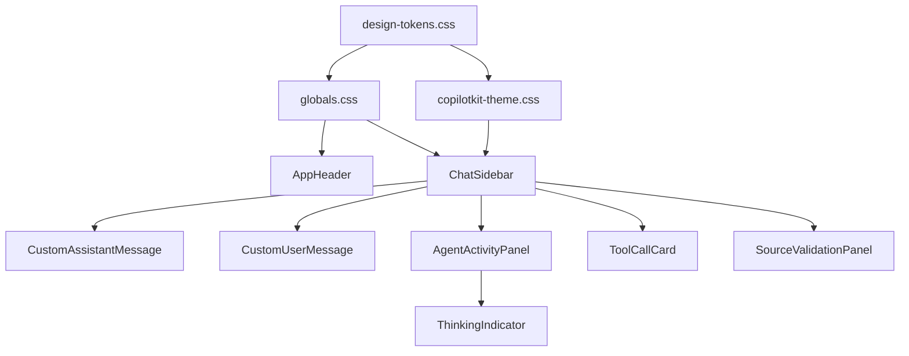

# Ultimate AI RAG - Comprehensive UI/UX Upgrade Plan

**Document Version:** 1.2
**Created:** 2026-01-17
**Updated:** 2026-01-18
**Author:** BMAD Party Mode (Sally, Caravaggio, Maya, Winston, Amelia, Mary, Bob, Murat, Dr. Quinn)
**Status:** Ready for Implementation (Audit Corrections + New Features Applied)

---

## Executive Summary

This document outlines a comprehensive UI/UX upgrade plan for the Ultimate AI RAG platform. The plan transforms the current functional interface into a premium, polished AI application by leveraging:

- **AG-UI Protocol** event visualization for transparency
- **CopilotKit** theming and custom components for branded experience
- **OpenJSON-UI** enhancements for existing component-based rendering (12 components)
- **MCP-UI** integration improvements for tool execution rendering
- **shadcn/ui** components for consistent design language
- **React Flow** enhancements for Knowledge Graph visualization

> **A2UI Protocol Status:** A2UI (Google's declarative agent UI spec, v0.8 preview) is **deferred to Phase 7+**. The codebase already implements rich UI rendering via OpenJSON-UI (`frontend/components/open-json-ui/`) and MCP-UI (`frontend/components/mcp-ui/`). Adding A2UI would create a fourth rendering path requiring significant architectural decisions. Revisit when A2UI reaches v1.0 stability.

### Key Metrics
- **79 features** across 10 tiers
- **8 implementation phases** (including Phase 0: Prerequisites)
- **4 user personas** supported (Developer, Researcher, Ops Engineer, Data Engineer)

### New Features Added (v1.2)
- ✨ **TIER 8: Adaptive Chat Interface** (10 features) - Flexible chat modes (sidebar/bubble/bottom bar), drag-and-drop positioning, resizable windows, multimodal file input
- ✨ **TIER 9: Settings Dashboard** (11 features) - Comprehensive settings page with env config display, connection testing, import/export, workflow sync
- ✨ **TIER 10: Workflow Configuration Hub** (11 features) - Pre-populated RAG workflows from CLI, visual editor, two-way settings sync, backwards CLI compatibility

### Audit Corrections Applied (v1.1)
This version addresses findings from codebase audit validation:
- ✅ Fixed runtime URL (`/api/copilotkit` not `/api/copilot`)
- ✅ Added Phase 0: Prerequisites for dependencies and directory structure
- ✅ Clarified A2UI strategy (deferred, not parallel implementation)
- ✅ Rewrote Feature 2.6 to use static `useChatSuggestions` hook
- ✅ Added Component Inventory reconciling 40+ existing components
- ✅ Clarified CSS strategy (layering approach)
- ✅ Reframed Ops Dashboard as enhancement of existing components
- ✅ Added GraphFilterControls to TIER 3
- ✅ Added theme provider setup requirement

---

## Table of Contents

1. [Current State Analysis](#1-current-state-analysis)
   - 1.4 [Component Inventory & Upgrade Strategy](#14-component-inventory--upgrade-strategy)
2. [Protocol Capabilities Research](#2-protocol-capabilities-research)
3. [Design System Foundation](#3-design-system-foundation)
4. [Feature Implementation Plan](#4-feature-implementation-plan)
   - 4.8 [TIER 8: Adaptive Chat Interface](#48-tier-8-adaptive-chat-interface-p1-new) *(NEW v1.2)*
   - 4.9 [TIER 9: Settings Dashboard](#49-tier-9-settings-dashboard-p2-new) *(NEW v1.2)*
   - 4.10 [TIER 10: Workflow Configuration Hub](#410-tier-10-workflow-configuration-hub-p2-new) *(NEW v1.2)*
5. [Code Implementation Guide](#5-code-implementation-guide)
6. [Component Architecture](#6-component-architecture)
7. [Phase-by-Phase Roadmap](#7-phase-by-phase-roadmap)
   - 7.0 [Phase 0: Prerequisites](#phase-0-prerequisites-sprint-0)
   - 7.1 [Phase 1: Foundation](#phase-1-foundation-sprint-1)
   - 7.2 [Phase 2: Chat Hero](#phase-2-chat-hero-sprint-2) *(TIER 8 added v1.2)*
   - 7.3 [Phase 3: Trust & HITL](#phase-3-trust--hitl-sprint-3)
   - 7.4 [Phase 4: Visualizations](#phase-4-visualizations-sprint-4)
   - 7.5 [Phase 5: Polish](#phase-5-polish-sprint-5)
   - 7.6 [Phase 6: Advanced](#phase-6-advanced-future)
   - 7.7 [Phase 7: Configuration Hub](#phase-7-configuration-hub-sprint-6-7---new-v12) *(TIERs 9-10 NEW v1.2)*
8. [Testing & Validation](#8-testing--validation)
9. [References & Citations](#9-references--citations)

---

## 1. Current State Analysis

### 1.1 Visual Audit Findings

Based on Playwright browser inspection of the live application:

| Page | Current State | Issues Identified |
|------|---------------|-------------------|
| **Homepage** | Basic cards with minimal styling | No icons, no visual hierarchy, lifeless feature cards |
| **Chat** | Default CopilotKit sidebar | Generic styling, no branded experience |
| **Knowledge Graph** | React Flow with basic nodes | No color coding, overwhelming data, no clustering |
| **Ops Dashboard** | Functional data display | Flat charts, no color-coded alerts, hard to scan |
| **Trajectories** | List of sessions | No timeline visualization, missing event icons |

### 1.2 Existing Component Assessment

**Components Already Implemented (to enhance):**

```
frontend/components/
├── copilot/
│   ├── ThoughtTraceStepper.tsx      ✓ Uses useCoAgentStateRender
│   ├── SourceValidationPanel.tsx    ✓ HITL validation exists
│   ├── ChatSidebar.tsx              ✓ Basic CopilotKit integration
│   └── VectorSearchCard.tsx         ✓ Tool rendering exists
├── graphs/
│   ├── EntityNode.tsx               ✓ Has entityColors mapping
│   ├── RelationshipEdge.tsx         ✓ Basic edge styling
│   └── KnowledgeGraph.tsx           ✓ React Flow integration
└── layout/
    └── AppHeader.tsx                ✓ Basic navigation
```

**Current Design Tokens (from `tailwind.config.ts`):**
```typescript
colors: {
  primary: {
    DEFAULT: "#4F46E5", // Indigo-600
    // ... palette exists but underutilized
  },
  secondary: {
    DEFAULT: "#10B981", // Emerald-500
  },
  accent: {
    DEFAULT: "#FBBF24", // Amber-400 for HITL
  },
}
```

### 1.3 User Persona Requirements (from PRD)

| Persona | Role | Primary Need | UI Priority |
|---------|------|--------------|-------------|
| **Alex** | Speed-Driven Developer | < 15 min setup, production-ready feel | Professional polish, clear navigation |
| **Sarah** | Safety-First Researcher | Trust through transparency | HITL validation ceremony, source cards |
| **Jordan** | Reliability Ops Engineer | At-a-glance monitoring | Color-coded dashboards, sparklines |
| **Maya** | Quality Data Engineer | Knowledge exploration | Rich graph visualization, filtering |

### 1.4 Component Inventory & Upgrade Strategy

> **CRITICAL:** This section reconciles all 69 existing component files with the upgrade plan. Each component is marked with its upgrade strategy.

#### 1.4.1 Copilot Components (33 files)

| Component | Path | Strategy | Phase |
|-----------|------|----------|-------|
| `ChatSidebar.tsx` | copilot/ | **ENHANCE** - Add custom renderers | 2 |
| `ChatInterface.tsx` | copilot/ | **ENHANCE** - Premium styling | 2 |
| `PopupChat.tsx` | copilot/ | **ENHANCE** - Match sidebar styling | 2 |
| `EmbeddedChat.tsx` | copilot/ | **ENHANCE** - Custom renderers | 2 |
| `VoiceInput.tsx` | copilot/ | **ENHANCE** - Waveform animation | 6 |
| `SpeakButton.tsx` | copilot/ | **ENHANCE** - Pulse animation | 6 |
| `VoiceChatInput.tsx` | copilot/ | **ENHANCE** - Match VoiceInput | 6 |
| `MessageWithSpeech.tsx` | copilot/ | **ENHANCE** - TTS indicator styling | 6 |
| `AITextarea.tsx` | copilot/ | **ENHANCE** - Focus states | 1 |
| `QuickActions.tsx` | copilot/ | **ENHANCE** - Button styling | 2 |
| `ThoughtTraceStepper.tsx` | copilot/ | **ENHANCE** - Premium step cards | 2 |
| `GenerativeUIRenderer.tsx` | copilot/ | **KEEP AS-IS** - Working well | - |
| `StatusBadge.tsx` | copilot/ | **ENHANCE** - Semantic colors | 1 |
| `MCPToolCallCard.tsx` | copilot/ | **ENHANCE** - Match ToolCallCard | 2 |
| `tool-renderers.tsx` | copilot/ | **ENHANCE** - Unified styling | 2 |
| `CustomEventRenderer.tsx` | copilot/ | **ENHANCE** - Event icons | 3 |
| `CopilotErrorBoundary.tsx` | copilot/ | **KEEP AS-IS** | - |
| `ErrorHandler.tsx` | copilot/ | **KEEP AS-IS** | - |
| `AGUIErrorListener.tsx` | copilot/ | **KEEP AS-IS** - Critical for AG-UI | - |
| `SourceValidationDialog.tsx` | copilot/ | **ENHANCE** - Trust ceremony | 3 |
| `SourceValidationPanel.tsx` | copilot/ | **ENHANCE** - Trust ceremony | 3 |
| `ActionButtons.tsx` | copilot/ | **ENHANCE** - Button styling | 1 |
| `ActionPanel.tsx` | copilot/ | **ENHANCE** - Panel styling | 2 |
| `CopilotProvider.tsx` | copilot/ | **KEEP AS-IS** | - |
| `DynamicInstructionsProvider.tsx` | copilot/ | **KEEP AS-IS** | - |
| `VectorSearchCard.tsx` | copilot/ | **ENHANCE** - Match ToolCallCard | 2 |
| `ActivityProgress.tsx` | copilot/ | **ENHANCE** - Progress styling | 2 |
| `index.ts` | copilot/ | **KEEP AS-IS** | - |
| `AnswerPanel.tsx` | copilot/components/ | **ENHANCE** - Card styling | 2 |
| `GraphPreview.tsx` | copilot/components/ | **ENHANCE** - Mini graph styling | 4 |
| `SourceCard.tsx` | copilot/components/ | **ENHANCE** - Trust indicators | 3 |
| `SourceValidationCard.tsx` | copilot/components/ | **ENHANCE** - Trust ceremony | 3 |

#### 1.4.2 Widgets Components (7 files)

| Component | Path | Strategy | Phase |
|-----------|------|----------|-------|
| `ActivityTrackerWidget.tsx` | widgets/ | **ENHANCE** - AG-UI activity styling | 2 |
| `ApprovalDialogWidget.tsx` | widgets/ | **ENHANCE** - HITL styling | 3 |
| `ChartWidget.tsx` | widgets/ | **REPLACE** - Use recharts | 4 |
| `DataTableWidget.tsx` | widgets/ | **ENHANCE** - Table styling | 4 |
| `StatusIndicatorWidget.tsx` | widgets/ | **ENHANCE** - Semantic colors | 4 |
| `StepProgressWidget.tsx` | widgets/ | **ENHANCE** - Step styling | 2 |
| `WidgetErrorBoundary.tsx` | widgets/ | **KEEP AS-IS** | - |

#### 1.4.3 OpenJSON-UI Components (12 files)

| Component | Path | Strategy | Phase |
|-----------|------|----------|-------|
| `OpenJSONUIRenderer.tsx` | open-json-ui/ | **KEEP AS-IS** - Core renderer | - |
| `AlertComponent.tsx` | open-json-ui/ | **ENHANCE** - Semantic variants | 5 |
| `ButtonComponent.tsx` | open-json-ui/ | **ENHANCE** - Button styling | 1 |
| `CodeComponent.tsx` | open-json-ui/ | **ENHANCE** - Syntax theme | 5 |
| `DividerComponent.tsx` | open-json-ui/ | **KEEP AS-IS** | - |
| `HeadingComponent.tsx` | open-json-ui/ | **ENHANCE** - Typography | 1 |
| `ImageComponent.tsx` | open-json-ui/ | **ENHANCE** - Loading states | 5 |
| `LinkComponent.tsx` | open-json-ui/ | **ENHANCE** - Hover states | 1 |
| `ListComponent.tsx` | open-json-ui/ | **ENHANCE** - List styling | 5 |
| `ProgressComponent.tsx` | open-json-ui/ | **ENHANCE** - Gradient bar | 5 |
| `TableComponent.tsx` | open-json-ui/ | **ENHANCE** - Table styling | 5 |
| `TextComponent.tsx` | open-json-ui/ | **ENHANCE** - Typography | 1 |

#### 1.4.4 Graph Components (4 files)

| Component | Path | Strategy | Phase |
|-----------|------|----------|-------|
| `KnowledgeGraph.tsx` | graphs/ | **ENHANCE** - Layout improvements | 4 |
| `EntityNode.tsx` | graphs/ | **ENHANCE** - Expanded colors | 4 |
| `RelationshipEdge.tsx` | graphs/ | **ENHANCE** - Animated edges | 4 |
| `GraphFilterControls.tsx` | graphs/ | **ENHANCE** - Premium filter UI | 4 |

#### 1.4.5 MCP-UI Components (2 files)

| Component | Path | Strategy | Phase |
|-----------|------|----------|-------|
| `MCPUIBridge.tsx` | mcp-ui/ | **KEEP AS-IS** - Protocol layer | - |
| `MCPUIRenderer.tsx` | mcp-ui/ | **ENHANCE** - Match OpenJSON-UI styling | 5 |

#### 1.4.6 Summary

| Strategy | Count | Description |
|----------|-------|-------------|
| **ENHANCE** | 48 | Apply premium styling, keep functionality |
| **KEEP AS-IS** | 12 | Working well, no changes needed |
| **REPLACE** | 1 | `ChartWidget.tsx` → recharts implementation |
| **NEW** | 8 | Components to create (see Section 6) |

---

## 2. Protocol Capabilities Research

### 2.1 AG-UI Protocol

**Source:** https://docs.ag-ui.com/introduction

AG-UI is an "open, lightweight, event-based protocol that standardizes how AI agents connect to user-facing applications."

#### Event Types for UI Enhancement

| Event Category | Events | UI Opportunity |
|---------------|--------|----------------|
| **Lifecycle** | `RunStarted`, `RunFinished`, `RunError`, `StepStarted`, `StepFinished` | Progress indicators, step visualization |
| **Text Message** | `TextMessageStart`, `TextMessageContent`, `TextMessageEnd` | Streaming text animation |
| **Tool Call** | `ToolCallStart`, `ToolCallArgs`, `ToolCallEnd`, `ToolCallResult` | Live tool execution cards |
| **State** | `StateSnapshot`, `StateDelta` (RFC 6902 JSON Patch) | Reactive state panels |
| **Activity** | `ActivitySnapshot`, `ActivityDelta` | In-progress structured updates |

**Citation:** "Events represent the fundamental units of communication between agents and frontends, enabling real-time, structured interaction." - AG-UI Documentation

### 2.2 A2UI Protocol

**Source:** https://a2ui.org/

A2UI is a "declarative protocol enabling AI agents to generate rich, interactive user interfaces that render natively across web, mobile, and desktop platforms without executing arbitrary code."

#### Key Characteristics

- **Security Model:** "Declarative data format, not executable code. Agents can only use pre-approved components from your catalog—no UI injection attacks."
- **Streaming JSON:** Optimized for LLM generation, incremental interface building
- **Cross-Platform:** Angular, Flutter, React, native mobile from single agent response

**Citation:** Version 0.8 is in public preview under Apache 2.0 license, created by Google with contributions from CopilotKit.

### 2.3 CopilotKit Customization

**Source:** https://github.com/copilotkit/copilotkit (Context7 library ID: /copilotkit/copilotkit)

#### CSS Variables System

```css
:root {
  --copilot-kit-primary-color: #3b82f6;
  --copilot-kit-contrast-color: white;
  --copilot-kit-secondary-contrast-color: #1e293b;
  --copilot-kit-background-color: white;
  --copilot-kit-muted-color: #64748b;
  --copilot-kit-separator-color: rgba(0, 0, 0, 0.08);
  --copilot-kit-scrollbar-color: rgba(0, 0, 0, 0.2);
}
```

**Citation:** "The easiest way to change the colors used in the Copilot UI components is to override CopilotKit CSS variables." - CopilotKit Documentation

#### Dark Mode Support

```css
/* Built-in dark mode via .dark class */
.dark {
  --copilot-kit-background-color: #0F172A;
  --copilot-kit-contrast-color: #1E293B;
}
```

**Citation:** "CopilotKit now includes out-of-the-box dark mode support controlled by the `.dark` class using Tailwind CSS as well as the `color-scheme` CSS selector."

#### Custom Component Renderers

| Prop | Description |
|------|-------------|
| `AssistantMessage` | Custom rendering of AI responses |
| `UserMessage` | Custom rendering of user messages |
| `Input` | Custom input field component |
| `Window` | Custom container (Sidebar/Popup) |
| `Header` | Custom header component |
| `RenderMessage` | Low-level override for complete control |

#### Key Hooks for Generative UI

```typescript
// Agent state visualization
useCoAgentStateRender({
  name: "orchestrator",
  render: ({ state, status }) => <AgentActivityPanel state={state} />
});

// Custom tool rendering
useFrontendTool({
  name: "vector_search",
  handler: async ({ query }) => { /* ... */ },
  render: ({ status, result }) => <VectorSearchCard status={status} results={result} />
});

// HITL patterns
useHumanInTheLoop({
  render: ({ sources, onApprove, onReject }) =>
    <SourceValidationPanel sources={sources} onApprove={onApprove} onReject={onReject} />
});
```

**Citation:** "Render custom UI components dynamically based on agent state and tool outputs. Includes standard generative UI, agentic generative UI, and tool-based rendering capabilities." - CopilotKit API Docs

---

## 3. Design System Foundation

### 3.1 Color Palette

```css
/* design-tokens.css */
:root {
  /* === PRIMARY BRAND === */
  --color-primary-50: #EEF2FF;
  --color-primary-100: #E0E7FF;
  --color-primary-200: #C7D2FE;
  --color-primary-300: #A5B4FC;
  --color-primary-400: #818CF8;
  --color-primary-500: #6366F1;
  --color-primary-600: #4F46E5;  /* Main brand color */
  --color-primary-700: #4338CA;
  --color-primary-800: #3730A3;
  --color-primary-900: #312E81;

  /* === SECONDARY (SUCCESS) === */
  --color-secondary-50: #ECFDF5;
  --color-secondary-500: #10B981;  /* Emerald */
  --color-secondary-600: #059669;

  /* === ACCENT (HITL/WARNING) === */
  --color-accent-50: #FFFBEB;
  --color-accent-400: #FBBF24;  /* Amber */
  --color-accent-500: #F59E0B;

  /* === SEMANTIC === */
  --color-success: #22C55E;
  --color-error: #EF4444;
  --color-warning: #F59E0B;
  --color-info: #3B82F6;

  /* === NEUTRALS === */
  --color-slate-50: #F8FAFC;
  --color-slate-100: #F1F5F9;
  --color-slate-200: #E2E8F0;
  --color-slate-300: #CBD5E1;
  --color-slate-400: #94A3B8;
  --color-slate-500: #64748B;
  --color-slate-600: #475569;
  --color-slate-700: #334155;
  --color-slate-800: #1E293B;
  --color-slate-900: #0F172A;

  /* === GRADIENTS === */
  --gradient-hero: linear-gradient(135deg, #4F46E5 0%, #7C3AED 100%);
  --gradient-glow: radial-gradient(circle, rgba(99,102,241,0.3) 0%, transparent 70%);
  --gradient-card-hover: linear-gradient(180deg, rgba(99,102,241,0.05) 0%, transparent 100%);

  /* === SHADOWS === */
  --shadow-sm: 0 1px 2px 0 rgba(0, 0, 0, 0.05);
  --shadow-md: 0 4px 6px -1px rgba(0, 0, 0, 0.1);
  --shadow-lg: 0 10px 15px -3px rgba(0, 0, 0, 0.1);
  --shadow-glow: 0 0 20px rgba(99, 102, 241, 0.3);
  --shadow-elevated: 0 10px 25px rgba(0, 0, 0, 0.15);

  /* === ANIMATIONS === */
  --duration-micro: 150ms;
  --duration-standard: 300ms;
  --duration-page: 500ms;
  --easing-standard: cubic-bezier(0.4, 0, 0.2, 1);
  --easing-bounce: cubic-bezier(0.68, -0.55, 0.265, 1.55);
}

/* === DARK MODE === */
.dark {
  --color-slate-50: #0F172A;
  --color-slate-100: #1E293B;
  --color-slate-200: #334155;
  --color-slate-800: #F1F5F9;
  --color-slate-900: #F8FAFC;

  --copilot-kit-background-color: #0F172A;
  --copilot-kit-contrast-color: #1E293B;
  --copilot-kit-text-color: #F8FAFC;
}
```

### 3.2 Typography Scale

```css
:root {
  /* Font Families */
  --font-sans: 'Inter', system-ui, -apple-system, sans-serif;
  --font-mono: 'JetBrains Mono', 'Fira Code', monospace;

  /* Font Sizes */
  --text-xs: 0.75rem;     /* 12px */
  --text-sm: 0.875rem;    /* 14px */
  --text-base: 1rem;      /* 16px */
  --text-lg: 1.125rem;    /* 18px */
  --text-xl: 1.25rem;     /* 20px */
  --text-2xl: 1.5rem;     /* 24px */
  --text-3xl: 1.875rem;   /* 30px */
  --text-4xl: 2.25rem;    /* 36px */

  /* Font Weights */
  --font-normal: 400;
  --font-medium: 500;
  --font-semibold: 600;
  --font-bold: 700;

  /* Line Heights */
  --leading-tight: 1.25;
  --leading-normal: 1.5;
  --leading-relaxed: 1.625;
}
```

### 3.3 Animation Tokens

```css
/* Keyframes */
@keyframes pulse-glow {
  0%, 100% { box-shadow: 0 0 0 0 rgba(99, 102, 241, 0.4); }
  50% { box-shadow: 0 0 0 8px rgba(99, 102, 241, 0); }
}

@keyframes thinking-pulse {
  0%, 100% { opacity: 1; }
  50% { opacity: 0.5; }
}

@keyframes slide-up {
  from { opacity: 0; transform: translateY(10px); }
  to { opacity: 1; transform: translateY(0); }
}

@keyframes fade-in {
  from { opacity: 0; }
  to { opacity: 1; }
}

/* Utility Classes */
.animate-pulse-glow { animation: pulse-glow 2s ease-in-out infinite; }
.animate-thinking { animation: thinking-pulse 1.5s ease-in-out infinite; }
.animate-slide-up { animation: slide-up var(--duration-standard) var(--easing-standard); }
.animate-fade-in { animation: fade-in var(--duration-micro) var(--easing-standard); }
```

---

## 4. Feature Implementation Plan

### 4.1 TIER 1: Foundation (P0)

| ID | Feature | Description | Implementation |
|----|---------|-------------|----------------|
| 1.1 | **Design Token System** | CSS variables for colors, spacing, typography, shadows, animations | Create `styles/design-tokens.css`, update `tailwind.config.ts` |
| 1.2 | **CopilotKit Theming** | Configure full CSS variable palette | Update `globals.css` with `--copilot-kit-*` variables |
| 1.3 | **Dark Mode Toggle** | Expose built-in dark mode with UI toggle | Add `ThemeToggle.tsx` component, use `.dark` class |
| 1.4 | **Header Rebrand** | Gradient background, premium nav styling | Enhance `AppHeader.tsx` with gradient and animations |
| 1.5 | **Typography Hierarchy** | Bold hero text, lighter secondary, monospace for data | Update Tailwind config, apply to all pages |

### 4.2 TIER 2: Chat Hero Experience (P0)

| ID | Feature | Description | Implementation |
|----|---------|-------------|----------------|
| 2.1 | **Agent Activity Panel** | Real-time visualization of agent steps | Enhance `ThoughtTraceStepper.tsx` with premium styling |
| 2.2 | **Streaming Text Animation** | Smooth typing effect for AI responses | CSS `@keyframes` + component wrapper |
| 2.3 | **Custom Tool Call Cards** | Rich cards showing tool execution | Create `ToolCallCard.tsx` with `useFrontendTool` |
| 2.4 | **HITL Source Validation UI** | Premium "trust ceremony" | Enhance `SourceValidationPanel.tsx` styling |
| 2.5 | **Custom Message Renderers** | Branded AssistantMessage/UserMessage | Create custom renderers with avatars |
| 2.6 | **Chat Suggestions Styling** | Premium quick-action buttons | Style static `useChatSuggestions` hook output (`frontend/hooks/use-chat-suggestions.ts`) - **DO NOT use `useCopilotChatSuggestions`** as it bypasses AG-UI backend causing ZodError validation failures |
| 2.7 | **Loading/Thinking States** | Skeleton loaders, pulsing indicators | Add `shadcn/skeleton`, create `ThinkingIndicator.tsx` |

### 4.3 TIER 3: Knowledge Graph (P1)

| ID | Feature | Description | Implementation |
|----|---------|-------------|----------------|
| 3.1 | **Entity Type Color Coding** | Different colors for entity types | Enhance `EntityNode.tsx` with expanded color map |
| 3.2 | **Relationship Edge Styling** | Styled edges per relationship type | Enhance `RelationshipEdge.tsx` with animations |
| 3.3 | **Node Clustering** | Visual grouping of related entities | React Flow layout algorithms |
| 3.4 | **Zoom-Level Detail** | Progressive disclosure on zoom | React Flow `onZoom` handler |
| 3.5 | **Graph Statistics Cards** | Premium stat cards with sparklines | Create `GraphStatsCard.tsx` |
| 3.6 | **Search Highlighting** | Highlight searched entities | CSS transitions + state management |
| 3.7 | **Empty State Design** | Welcoming illustration | Create `EmptyGraphState.tsx` |
| 3.8 | **Filter Controls Enhancement** | Premium filter UI with visual feedback | Enhance existing `GraphFilterControls.tsx` with dropdown styling, active state indicators, and filter badges |

### 4.4 TIER 4: Ops Dashboard (P1)

> **Note:** The Ops Dashboard (`frontend/app/ops/page.tsx`) already implements metrics cards, TrendBars chart, cost breakdown, and alert configuration. This tier **enhances existing components** rather than replacing them.

| ID | Feature | Description | Implementation |
|----|---------|-------------|----------------|
| 4.1 | **Cost Trend Charts** | Enhance existing `TrendBars` with interactive tooltips | Upgrade `TrendBars` component OR replace with `recharts` AreaChart - keep existing data fetching |
| 4.2 | **At-a-Glance Status Cards** | Enhance existing 4 metric cards with semantic colors | Add color variants (green/amber/red) based on threshold proximity to existing cards in `ops/page.tsx` |
| 4.3 | **Model Usage Breakdown** | Add pie/donut chart visualization | Add `recharts` PieChart alongside existing "Cost by Model" list |
| 4.4 | **Trajectory Timeline** | Visual timeline with events | Create `TrajectoryTimeline.tsx` for `/ops/trajectories` page |
| 4.5 | **Event Type Icons** | Icons for AG-UI events | Lucide icons mapped to event types (RunStarted, ToolCallStart, etc.) |
| 4.6 | **Alert Badges** | Enhance existing alert threshold UI | Add `shadcn/badge` with warning/danger variants to existing threshold display |
| 4.7 | **Request Sparklines** | Mini charts in recent events list | Add `recharts` Sparkline to existing "Recent Events" section |

### 4.5 TIER 5: Homepage & Navigation (P2)

| ID | Feature | Description | Implementation |
|----|---------|-------------|----------------|
| 5.1 | **Hero Section Redesign** | Bold headline, animated gradient | CSS gradients + Framer Motion |
| 5.2 | **Feature Cards with Icons** | Icons for each feature | Lucide icons + `shadcn/card` |
| 5.3 | **Feature Card Hover Effects** | Scale, shadow lift, glow | Tailwind transitions |
| 5.4 | **Quick Actions Bar** | Persistent action bar | Create `QuickActionsBar.tsx` |
| 5.5 | **Navigation Active States** | Clear current page indicator | Tailwind `ring` + `bg` utilities |
| 5.6 | **Breadcrumbs** | Contextual navigation | `shadcn/breadcrumb` component |

### 4.6 TIER 6: Micro-interactions (P2)

| ID | Feature | Description | Implementation |
|----|---------|-------------|----------------|
| 6.1 | **Button Hover/Press States** | Scale, color shift feedback | Tailwind `hover:` + `active:` |
| 6.2 | **Page Transitions** | Smooth fade/slide between pages | Framer Motion or CSS |
| 6.3 | **Toast Notifications** | Premium toast styling | `shadcn/sonner` customization |
| 6.4 | **Form Input Focus States** | Glowing borders | Tailwind `focus:ring` |
| 6.5 | **Scroll Animations** | Fade-in on viewport entry | Intersection Observer |
| 6.6 | **Loading State Consistency** | Unified skeleton patterns | Design system enforcement |

### 4.7 TIER 7: Advanced Features (P3)

| ID | Feature | Description | Implementation |
|----|---------|-------------|----------------|
| 7.1 | **Command Palette** | Raycast-style ⌘K menu | `shadcn/command` component |
| 7.2 | **A2UI Component Catalog** | Agent-generated UI | A2UI protocol integration |
| 7.3 | **Voice Input UI** | Waveform visualization | Canvas/SVG animation |
| 7.4 | **Keyboard Shortcuts** | Power user shortcuts | Custom hook + hints |
| 7.5 | **Mobile Responsive** | Full mobile optimization | Tailwind responsive utilities |
| 7.6 | **Accessibility Audit** | WCAG 2.1 AA compliance | axe-core + manual testing |

### 4.8 TIER 8: Adaptive Chat Interface (P1) *(NEW)*

> **Goal:** Transform the fixed sidebar chat into a flexible, adaptive interface that users can position, resize, and interact with in multiple modes. Supports multimodal input (documents, images) for the enhanced RAG experience.

| ID | Feature | Description | Implementation |
|----|---------|-------------|----------------|
| 8.1 | **Chat Bubble Minimization** | Sidebar collapses to floating chat bubble when minimized | Create `ChatBubble.tsx` with expand/collapse animation, persist position in localStorage |
| 8.2 | **Horizontal Bottom Bar Mode** | Chat input as horizontal bar at bottom of screen | Create `ChatBottomBar.tsx` with slide-up message panel, keyboard shortcut to toggle |
| 8.3 | **Drag-and-Drop Positioning** | Chat window draggable to any screen position | Use `react-draggable` or `@dnd-kit/core`, save position to localStorage |
| 8.4 | **Resizable Chat Window** | User can resize chat to any dimension | Use `react-resizable` or CSS resize property, min/max constraints |
| 8.5 | **Multimodal File Drop Zone** | Drop documents/images directly into chat | Create `FileDropZone.tsx` with drag-over visual feedback, file type validation |
| 8.6 | **File Search & Add Button** | Button to search/browse files for upload | Create `FilePickerButton.tsx` with file browser modal, recent files list |
| 8.7 | **Image Preview in Chat** | Dropped images shown as thumbnails in input area | Create `ImagePreview.tsx` with remove button, zoom on click |
| 8.8 | **Document Preview Cards** | Uploaded PDFs/docs shown as cards with metadata | Create `DocumentPreviewCard.tsx` with file type icon, size, page count |
| 8.9 | **Chat Mode Switcher** | UI toggle between Sidebar/Bubble/BottomBar modes | Create `ChatModeSwitcher.tsx` in header or as floating control |
| 8.10 | **Position Memory** | Remember user's preferred chat position/size per page | Use localStorage with page-specific keys, restore on mount |

**User Interaction Flow:**
```
┌─────────────────────────────────────────────────────────────────┐
│  SIDEBAR MODE (Default)                                          │
│  ┌──────────────┐                                                │
│  │   Chat       │  ← Fixed right side, full height              │
│  │   Messages   │                                                │
│  │   ...        │                                                │
│  │   [Input]    │                                                │
│  │   [─] [□]    │  ← Minimize to bubble, toggle mode            │
│  └──────────────┘                                                │
├─────────────────────────────────────────────────────────────────┤
│  BUBBLE MODE (Minimized)                                         │
│                                              ┌───┐               │
│                                              │ 💬│ ← Floating    │
│                                              └───┘   bubble      │
│                                                                  │
├─────────────────────────────────────────────────────────────────┤
│  BOTTOM BAR MODE                                                 │
│  ┌─────────────────────────────────────────────────────────────┐│
│  │ 📎 │ [Type your message...              ] │ 🎤 │ ➤ │ ⬆️    ││
│  └─────────────────────────────────────────────────────────────┘│
│  └─ File picker                               └─ Expand to full │
├─────────────────────────────────────────────────────────────────┤
│  FLOATING WINDOW MODE (Dragged/Resized)                          │
│       ┌────────────────────┐                                     │
│       │ ═══ Chat ═══  [×]  │ ← Draggable header                 │
│       │                    │                                     │
│       │   Messages...      │ ← Resizable from edges             │
│       │                    │                                     │
│       │ [📎] [Input   ] [➤]│                                     │
│       └────────────────────┘                                     │
└─────────────────────────────────────────────────────────────────┘
```

**Multimodal Input Interface:**
```
┌────────────────────────────────────────────────────────────────┐
│  Chat Input Area with Multimodal Support                        │
│ ┌──────────────────────────────────────────────────────────────┐
│ │  ┌─────┐ ┌─────┐ ┌─────────────┐                             │
│ │  │ 📷  │ │ 📄  │ │ report.pdf  │  ← Attached files preview   │
│ │  │ img │ │ PDF │ │ 12 pages    │                             │
│ │  │ [×] │ │ [×] │ │ [×]         │                             │
│ │  └─────┘ └─────┘ └─────────────┘                             │
│ └──────────────────────────────────────────────────────────────┘
│ ┌──────────────────────────────────────────────────────────────┐
│ │ 📎 │ 🔍 │ [Ask about these documents...        ] │ 🎤 │ ➤ │  │
│ └──────────────────────────────────────────────────────────────┘
│   │     │                                            │     │    │
│   │     └─ Search files                              │     └─ Send
│   └─ Add file                                        └─ Voice   │
│                                                                 │
│  Drop Zone: "Drop files here to add to conversation"           │
└────────────────────────────────────────────────────────────────┘
```

### 4.9 TIER 9: Settings Dashboard (P2) *(NEW)*

> **Goal:** Create a comprehensive settings page that displays all environment configuration options with an optimized, user-friendly interface. Settings are organized into logical categories with visual feedback and validation.

| ID | Feature | Description | Implementation |
|----|---------|-------------|----------------|
| 9.1 | **Settings Page Route** | New `/settings` page with tabbed navigation | Create `app/settings/page.tsx` with tab-based layout |
| 9.2 | **Environment Variables Display** | Show all configurable env vars with current values | API endpoint to fetch sanitized env config (hide secrets) |
| 9.3 | **Category Organization** | Group settings by domain (LLM, Database, API, Features) | Collapsible sections with icons and descriptions |
| 9.4 | **Toggle Controls** | Boolean settings as premium toggle switches | Use `shadcn/switch` with enabled/disabled states |
| 9.5 | **Secret Masking** | API keys shown as `sk-****...****` with reveal button | Secure display with clipboard copy |
| 9.6 | **Validation Feedback** | Real-time validation with success/error indicators | Inline validation messages, connection test buttons |
| 9.7 | **Connection Testing** | Test buttons for DB, LLM, and API connections | Async test with loading spinner, result toast |
| 9.8 | **Settings Search** | Quick search/filter across all settings | Fuzzy search with highlighted matches |
| 9.9 | **Import/Export Config** | Download/upload settings as JSON | File download/upload with validation |
| 9.10 | **Settings History** | Track changes with undo capability | localStorage history with diff view |
| 9.11 | **Workflow Sync Indicator** | Show which settings affect RAG workflows | Visual link to workflow page for related settings |

**Settings Categories:**

```
┌────────────────────────────────────────────────────────────────┐
│  ⚙️ Settings                                    [🔍 Search...] │
├────────────────────────────────────────────────────────────────┤
│                                                                 │
│  ┌─────────────────────────────────────────────────────────┐   │
│  │ 🤖 LLM Configuration                              [▼]   │   │
│  ├─────────────────────────────────────────────────────────┤   │
│  │ Provider        │ [OpenAI    ▼] │ Anthropic, Azure...   │   │
│  │ Model           │ [gpt-4o    ▼] │ Model selection       │   │
│  │ API Key         │ [sk-****...] [👁] [📋] │ [Test ✓]    │   │
│  │ Temperature     │ [═══●═══] 0.7 │ Creativity level      │   │
│  │ Max Tokens      │ [4096     ] │ Response limit          │   │
│  └─────────────────────────────────────────────────────────┘   │
│                                                                 │
│  ┌─────────────────────────────────────────────────────────┐   │
│  │ 🗄️ Database Connections                          [▼]   │   │
│  ├─────────────────────────────────────────────────────────┤   │
│  │ PostgreSQL      │ [postgres://...] │ [Test ✓ Connected] │   │
│  │ Neo4j           │ [neo4j://...]    │ [Test ✓ Connected] │   │
│  │ Redis           │ [redis://...]    │ [Test ⚠ Timeout]   │   │
│  └─────────────────────────────────────────────────────────┘   │
│                                                                 │
│  ┌─────────────────────────────────────────────────────────┐   │
│  │ 🔌 API & Integrations                            [▼]   │   │
│  ├─────────────────────────────────────────────────────────┤   │
│  │ Backend URL     │ [http://localhost:8000]              │   │
│  │ Tenant ID       │ [default-tenant]                     │   │
│  │ CopilotKit      │ [/api/copilotkit] │ Runtime URL       │   │
│  └─────────────────────────────────────────────────────────┘   │
│                                                                 │
│  ┌─────────────────────────────────────────────────────────┐   │
│  │ 🎛️ Feature Flags                                 [▼]   │   │
│  ├─────────────────────────────────────────────────────────┤   │
│  │ Voice Input     │ [●══] ON  │ Enable voice commands    │   │
│  │ HITL Validation │ [●══] ON  │ Human-in-the-loop        │   │
│  │ Graph RAG       │ [●══] ON  │ Knowledge graph queries  │   │
│  │ Multimodal      │ [●══] ON  │ Image/document input     │   │
│  └─────────────────────────────────────────────────────────┘   │
│                                                                 │
│  ┌─────────────────────────────────────────────────────────┐   │
│  │ 🔗 Workflow Integration                    [→ Workflows]│   │
│  │ Settings here affect: Vector RAG, Graph RAG, Hybrid    │   │
│  └─────────────────────────────────────────────────────────┘   │
│                                                                 │
│  [📥 Import] [📤 Export] [↩️ Undo] [💾 Save Changes]           │
└────────────────────────────────────────────────────────────────┘
```

### 4.10 TIER 10: Workflow Configuration Hub (P2) *(NEW)*

> **Goal:** Transform the RAG workflow page into a configuration hub that comes pre-populated with the 3 standard CLI workflows (Vector RAG, Graph RAG, Hybrid RAG). Users can view, modify, and create workflows that sync with settings and persist after CLI setup.

| ID | Feature | Description | Implementation |
|----|---------|-------------|----------------|
| 10.1 | **Pre-populated Workflows** | 3 default workflows from CLI setup shown on first load | Seed database with Vector/Graph/Hybrid RAG templates |
| 10.2 | **Workflow Cards View** | Visual cards showing each workflow with status/description | Create `WorkflowCard.tsx` with preview, edit, delete actions |
| 10.3 | **Workflow Visual Editor** | React Flow-based drag-and-drop workflow builder | Enhance existing `/workflow` page with editable nodes |
| 10.4 | **Step Configuration Panels** | Click node to configure step parameters | Slide-out panel with form inputs per step type |
| 10.5 | **Settings Sync** | Workflow steps auto-populate from Settings page values | Two-way binding: settings ↔ workflow step configs |
| 10.6 | **Workflow Templates Gallery** | Browse and clone pre-built workflow templates | Template library with search and preview |
| 10.7 | **Workflow Versioning** | Track changes to workflows with version history | Version dropdown, diff view, rollback capability |
| 10.8 | **Workflow Testing** | Run workflow with test query and see step-by-step execution | Test panel with input, live execution trace |
| 10.9 | **Export/Import Workflows** | Download/upload workflow definitions as JSON/YAML | File operations with validation |
| 10.10 | **Workflow Documentation** | Auto-generated documentation for each workflow | Markdown export with step descriptions |
| 10.11 | **CLI Backwards Compatibility** | Changes sync back to CLI configuration files | API endpoint to update CLI config files |

**Default Workflows (Pre-populated from CLI):**

```
┌────────────────────────────────────────────────────────────────┐
│  🔄 RAG Workflow Configuration                                  │
│  Configure and manage your retrieval-augmented generation       │
│  pipelines. These workflows were initialized from CLI setup.    │
├────────────────────────────────────────────────────────────────┤
│                                                                 │
│  ┌─────────────────┐ ┌─────────────────┐ ┌─────────────────┐   │
│  │ 📊 Vector RAG   │ │ 🕸️ Graph RAG    │ │ 🔀 Hybrid RAG   │   │
│  │ ───────────────│ │ ───────────────│ │ ───────────────│   │
│  │ Dense vector   │ │ Knowledge graph │ │ Combined vector │   │
│  │ similarity     │ │ traversal with  │ │ + graph with   │   │
│  │ search using   │ │ entity linking  │ │ intelligent    │   │
│  │ pgvector       │ │ via Neo4j       │ │ reranking      │   │
│  │               │ │               │ │               │   │
│  │ Status: ✅     │ │ Status: ✅     │ │ Status: ✅     │   │
│  │ Active         │ │ Active         │ │ Default        │   │
│  │               │ │               │ │               │   │
│  │ [Edit] [Test] │ │ [Edit] [Test] │ │ [Edit] [Test] │   │
│  └─────────────────┘ └─────────────────┘ └─────────────────┘   │
│                                                                 │
│  [+ Create Workflow]  [📥 Import]  [📚 Templates]              │
│                                                                 │
├────────────────────────────────────────────────────────────────┤
│  Workflow Editor (Click card to expand)                         │
│  ┌──────────────────────────────────────────────────────────┐  │
│  │                                                          │  │
│  │   ┌─────────┐     ┌─────────┐     ┌─────────┐           │  │
│  │   │ Query   │────▶│ Embed   │────▶│ Search  │           │  │
│  │   │ Input   │     │ Query   │     │ Vectors │           │  │
│  │   └─────────┘     └─────────┘     └────┬────┘           │  │
│  │                                        │                 │  │
│  │                                        ▼                 │  │
│  │   ┌─────────┐     ┌─────────┐     ┌─────────┐           │  │
│  │   │ Generate│◀────│ Rerank  │◀────│ Graph   │           │  │
│  │   │ Answer  │     │ Results │     │ Expand  │           │  │
│  │   └─────────┘     └─────────┘     └─────────┘           │  │
│  │                                                          │  │
│  └──────────────────────────────────────────────────────────┘  │
│                                                                 │
│  Step Configuration (selected: "Search Vectors")               │
│  ┌──────────────────────────────────────────────────────────┐  │
│  │ Top K Results    │ [10        ] │ From Settings ⚙️       │  │
│  │ Similarity       │ [0.75      ] │ Threshold              │  │
│  │ Collection       │ [documents ▼] │ Vector store           │  │
│  │ Include Metadata │ [●══] ON     │                        │  │
│  └──────────────────────────────────────────────────────────┘  │
│                                                                 │
│  [💾 Save] [🧪 Test Workflow] [📤 Export] [🔄 Reset to CLI]    │
└────────────────────────────────────────────────────────────────┘
```

**Workflow-Settings Synchronization:**

```
┌─────────────────────────────────────────────────────────────────┐
│                     TWO-WAY SYNC ARCHITECTURE                    │
├─────────────────────────────────────────────────────────────────┤
│                                                                  │
│   ⚙️ Settings Page              🔄 Workflow Page                │
│   ┌───────────────────┐         ┌───────────────────┐           │
│   │ LLM: gpt-4o       │◀───────▶│ Generate Step:    │           │
│   │ Temperature: 0.7  │  SYNC   │  model: gpt-4o    │           │
│   │ Max Tokens: 4096  │         │  temp: 0.7        │           │
│   └───────────────────┘         └───────────────────┘           │
│                                                                  │
│   ┌───────────────────┐         ┌───────────────────┐           │
│   │ Neo4j: bolt://... │◀───────▶│ Graph Expand:     │           │
│   │ DB: knowledge     │  SYNC   │  connection: ...  │           │
│   └───────────────────┘         └───────────────────┘           │
│                                                                  │
│   ┌───────────────────┐         ┌───────────────────┐           │
│   │ pgvector: ...     │◀───────▶│ Search Vectors:   │           │
│   │ Collection: docs  │  SYNC   │  store: pgvector  │           │
│   └───────────────────┘         └───────────────────┘           │
│                                                                  │
│   CLI Config Files (backend/.env, config.yaml)                  │
│   ┌─────────────────────────────────────────────────────────┐   │
│   │ Changes in Settings/Workflows update CLI config files   │   │
│   │ for backwards compatibility with CLI-based workflows    │   │
│   └─────────────────────────────────────────────────────────┘   │
└─────────────────────────────────────────────────────────────────┘
```

---

## 5. Code Implementation Guide

### 5.0 CSS Strategy: Layering Approach

> **IMPORTANT:** This plan uses a **layering approach** for CSS, not replacement.

**Current State (`frontend/app/globals.css`):**
- Custom `.copilot-sidebar` class (lines 21-30) - App-specific container styling
- CopilotKit overrides: `.copilotKitMessages`, `.copilotKitInput` (lines 74-80)
- CSS custom properties in `:root` for CopilotKit theming

**Strategy:**
1. **Keep existing** `.copilot-sidebar` for app-level layout
2. **Add** CopilotKit native classes (`.copilotKitSidebar`, `.copilotKitWindow`) for component-level styling
3. **Layer** new styles ON TOP of existing ones - do not replace
4. **Import order** in globals.css: base → design-tokens → copilotkit-theme → animations

**File Organization:**
```css
/* globals.css - UPDATED import order */
@import './design-tokens.css';        /* NEW: CSS custom properties */
@import './copilotkit-theme.css';     /* NEW: CopilotKit overrides */
@import './animations.css';           /* NEW: Keyframes */

@tailwind base;
@tailwind components;
@tailwind utilities;

/* Existing app-level styles remain below */
```

**Class Hierarchy:**
```
.copilot-sidebar              /* App layout container (KEEP) */
  └── .copilotKitSidebar      /* CopilotKit component (ADD) */
      └── .copilotKitWindow   /* CopilotKit inner window (ADD) */
```

### 5.1 CopilotKit Theme Configuration

**File: `frontend/styles/copilotkit-theme.css`** *(NEW - create this file)*

```css
/* CopilotKit Theme Overrides */
:root {
  /* Primary Brand */
  --copilot-kit-primary-color: #4F46E5;
  --copilot-kit-contrast-color: #FFFFFF;
  --copilot-kit-secondary-contrast-color: #1E293B;

  /* Background */
  --copilot-kit-background-color: #FAFAFA;
  --copilot-kit-muted-color: #64748B;
  --copilot-kit-separator-color: rgba(0, 0, 0, 0.08);

  /* Extended */
  --copilot-kit-response-button-color: #4F46E5;
  --copilot-kit-response-button-background-color: #EEF2FF;
}

/* Custom CopilotKit Styling */
.copilotKitSidebar .copilotKitWindow {
  box-shadow: var(--shadow-elevated);
  border-radius: 1rem;
}

.copilotKitButton {
  transition: transform var(--duration-micro) var(--easing-standard),
              box-shadow var(--duration-micro) var(--easing-standard);
}

.copilotKitButton:hover {
  transform: scale(1.05);
  box-shadow: var(--shadow-glow);
}

/* Message Styling */
.copilotKitAssistantMessage {
  animation: slide-up var(--duration-standard) var(--easing-standard);
}

.copilotKitUserMessage {
  background: linear-gradient(135deg, var(--color-primary-500), var(--color-primary-600));
}

/* Dark Mode */
.dark .copilotKitSidebar .copilotKitWindow {
  background-color: var(--color-slate-900);
  border-color: var(--color-slate-700);
}
```

### 5.2 Custom Assistant Message Component

**File: `frontend/components/copilot/CustomAssistantMessage.tsx`**

```tsx
"use client";

import { type AssistantMessageProps, useChatContext, Markdown } from "@copilotkit/react-ui";
import { SparklesIcon } from "lucide-react";
import { cn } from "@/lib/utils";

export function CustomAssistantMessage(props: AssistantMessageProps) {
  const { icons } = useChatContext();
  const { message, isLoading, subComponent } = props;

  return (
    <div className="py-3 animate-slide-up">
      <div className="flex items-start gap-3">
        {/* Avatar */}
        {!subComponent && (
          <div className={cn(
            "flex items-center justify-center",
            "h-10 w-10 rounded-full",
            "bg-gradient-to-br from-primary-500 to-primary-600",
            "shadow-lg shadow-primary-500/30"
          )}>
            <SparklesIcon className="h-5 w-5 text-white" />
          </div>
        )}

        {/* Message Content */}
        <div className={cn(
          "flex-1 px-4 py-3 rounded-2xl",
          "bg-white border border-slate-100",
          "shadow-sm"
        )}>
          {message && (
            <Markdown
              content={message.content || ""}
              className="prose prose-slate prose-sm max-w-none"
            />
          )}
          {isLoading && (
            <div className="flex items-center gap-2 text-primary-600">
              {icons.spinnerIcon}
              <span className="text-sm animate-thinking">Thinking...</span>
            </div>
          )}
        </div>
      </div>

      {/* Generative UI SubComponent */}
      {subComponent && (
        <div className="mt-3 ml-13">
          {subComponent}
        </div>
      )}
    </div>
  );
}
```

### 5.3 Enhanced Agent Activity Panel

**File: `frontend/components/copilot/AgentActivityPanel.tsx`**

```tsx
"use client";

import { useCoAgentStateRender } from "@copilotkit/react-core";
import {
  Search,
  GitBranch,
  CheckCircle2,
  Loader2,
  Circle,
  Sparkles,
  Database,
  Brain
} from "lucide-react";
import { cn } from "@/lib/utils";

interface AgentStep {
  id: string;
  step: string;
  status: "pending" | "in_progress" | "completed";
  details?: string;
  type?: "search" | "graph" | "rerank" | "generate";
}

interface AgentState {
  steps: AgentStep[];
}

const stepIcons = {
  search: Search,
  graph: GitBranch,
  rerank: Database,
  generate: Brain,
  default: Sparkles,
};

const statusConfig = {
  pending: {
    icon: Circle,
    color: "text-slate-400",
    bg: "bg-slate-100",
  },
  in_progress: {
    icon: Loader2,
    color: "text-primary-600",
    bg: "bg-primary-50",
    animate: "animate-spin",
  },
  completed: {
    icon: CheckCircle2,
    color: "text-secondary-500",
    bg: "bg-secondary-50",
  },
};

export function AgentActivityPanel() {
  useCoAgentStateRender<AgentState>({
    name: "orchestrator",
    render: ({ state, status }) => {
      if (!state?.steps?.length) return null;

      return (
        <div className={cn(
          "rounded-xl border border-slate-200",
          "bg-gradient-to-b from-white to-slate-50",
          "shadow-sm overflow-hidden"
        )}>
          {/* Header */}
          <div className="px-4 py-3 border-b border-slate-100 bg-slate-50/50">
            <div className="flex items-center gap-2">
              <div className={cn(
                "h-2 w-2 rounded-full",
                status === "running" ? "bg-primary-500 animate-pulse-glow" : "bg-secondary-500"
              )} />
              <h3 className="text-sm font-semibold text-slate-700">
                Agent Activity
              </h3>
            </div>
          </div>

          {/* Steps */}
          <div className="p-4 space-y-3">
            {state.steps.map((step, idx) => {
              const config = statusConfig[step.status];
              const StepIcon = stepIcons[step.type || "default"];
              const StatusIcon = config.icon;

              return (
                <div
                  key={step.id || idx}
                  className={cn(
                    "flex items-center gap-3 p-3 rounded-lg transition-all",
                    config.bg,
                    step.status === "in_progress" && "ring-2 ring-primary-200"
                  )}
                >
                  {/* Step Type Icon */}
                  <div className={cn(
                    "flex items-center justify-center",
                    "h-8 w-8 rounded-lg",
                    step.status === "completed" ? "bg-secondary-100" : "bg-white",
                    "shadow-sm"
                  )}>
                    <StepIcon className={cn(
                      "h-4 w-4",
                      step.status === "completed" ? "text-secondary-600" : "text-slate-500"
                    )} />
                  </div>

                  {/* Step Info */}
                  <div className="flex-1 min-w-0">
                    <p className={cn(
                      "text-sm font-medium truncate",
                      step.status === "in_progress" ? "text-primary-700" : "text-slate-700"
                    )}>
                      {step.step}
                    </p>
                    {step.details && (
                      <p className="text-xs text-slate-500 truncate mt-0.5">
                        {step.details}
                      </p>
                    )}
                  </div>

                  {/* Status Icon */}
                  <StatusIcon className={cn(
                    "h-5 w-5 flex-shrink-0",
                    config.color,
                    config.animate
                  )} />
                </div>
              );
            })}
          </div>
        </div>
      );
    },
  });

  return null;
}
```

### 5.4 Premium Tool Call Card

**File: `frontend/components/copilot/ToolCallCard.tsx`**

```tsx
"use client";

import { useFrontendTool } from "@copilotkit/react-core";
import { cn } from "@/lib/utils";
import {
  Search,
  Database,
  GitBranch,
  Loader2,
  CheckCircle2,
  AlertCircle
} from "lucide-react";

interface ToolCallCardProps {
  toolName: string;
  status: "executing" | "inProgress" | "complete" | "error";
  args?: Record<string, unknown>;
  result?: unknown;
}

const toolConfig: Record<string, { icon: typeof Search; label: string; color: string }> = {
  vector_search: { icon: Search, label: "Vector Search", color: "blue" },
  graph_query: { icon: GitBranch, label: "Graph Query", color: "purple" },
  retrieve_documents: { icon: Database, label: "Document Retrieval", color: "emerald" },
};

export function ToolCallCard({ toolName, status, args, result }: ToolCallCardProps) {
  const config = toolConfig[toolName] || {
    icon: Database,
    label: toolName,
    color: "slate"
  };
  const ToolIcon = config.icon;

  const isLoading = status === "executing" || status === "inProgress";
  const isComplete = status === "complete";
  const isError = status === "error";

  return (
    <div className={cn(
      "rounded-xl border-2 overflow-hidden transition-all duration-300",
      isLoading && "border-primary-300 bg-primary-50/50 animate-pulse-glow",
      isComplete && "border-secondary-300 bg-secondary-50/30",
      isError && "border-red-300 bg-red-50/30",
      !isLoading && !isComplete && !isError && "border-slate-200 bg-slate-50/50"
    )}>
      {/* Header */}
      <div className={cn(
        "flex items-center justify-between px-4 py-3",
        "border-b",
        isLoading && "border-primary-200 bg-primary-100/50",
        isComplete && "border-secondary-200 bg-secondary-100/50",
        isError && "border-red-200 bg-red-100/50"
      )}>
        <div className="flex items-center gap-3">
          <div className={cn(
            "flex items-center justify-center h-8 w-8 rounded-lg",
            isLoading && "bg-primary-200",
            isComplete && "bg-secondary-200",
            isError && "bg-red-200",
            !isLoading && !isComplete && !isError && "bg-slate-200"
          )}>
            <ToolIcon className={cn(
              "h-4 w-4",
              isLoading && "text-primary-700",
              isComplete && "text-secondary-700",
              isError && "text-red-700"
            )} />
          </div>
          <div>
            <p className="text-sm font-semibold text-slate-800">{config.label}</p>
            {args?.query && (
              <p className="text-xs text-slate-500 truncate max-w-[200px]">
                {String(args.query)}
              </p>
            )}
          </div>
        </div>

        {/* Status Indicator */}
        <div className="flex items-center gap-2">
          {isLoading && (
            <>
              <Loader2 className="h-4 w-4 text-primary-600 animate-spin" />
              <span className="text-xs text-primary-600 font-medium">Running...</span>
            </>
          )}
          {isComplete && (
            <>
              <CheckCircle2 className="h-4 w-4 text-secondary-600" />
              <span className="text-xs text-secondary-600 font-medium">Complete</span>
            </>
          )}
          {isError && (
            <>
              <AlertCircle className="h-4 w-4 text-red-600" />
              <span className="text-xs text-red-600 font-medium">Error</span>
            </>
          )}
        </div>
      </div>

      {/* Result Preview */}
      {isComplete && result && (
        <div className="px-4 py-3">
          <p className="text-xs text-slate-500 mb-1">Results</p>
          <pre className="text-xs bg-white rounded-lg p-2 overflow-x-auto border border-slate-100">
            {JSON.stringify(result, null, 2).slice(0, 200)}
            {JSON.stringify(result).length > 200 && "..."}
          </pre>
        </div>
      )}
    </div>
  );
}
```

### 5.5 Dark Mode Toggle

**File: `frontend/components/layout/ThemeToggle.tsx`**

> **Updated to use `next-themes`** - Requires Phase 0 dependency installation and Phase 1 ThemeProvider setup.

```tsx
"use client";

import { useTheme } from "next-themes";
import { useEffect, useState } from "react";
import { Moon, Sun } from "lucide-react";
import { cn } from "@/lib/utils";

export function ThemeToggle() {
  const [mounted, setMounted] = useState(false);
  const { theme, setTheme, resolvedTheme } = useTheme();

  // Avoid hydration mismatch
  useEffect(() => {
    setMounted(true);
  }, []);

  if (!mounted) {
    // Return placeholder to avoid layout shift
    return (
      <div className="h-9 w-9 rounded-full bg-slate-100 dark:bg-slate-800" />
    );
  }

  const isDark = resolvedTheme === "dark";

  return (
    <button
      onClick={() => setTheme(isDark ? "light" : "dark")}
      className={cn(
        "relative flex items-center justify-center",
        "h-9 w-9 rounded-full",
        "bg-slate-100 dark:bg-slate-800",
        "hover:bg-slate-200 dark:hover:bg-slate-700",
        "transition-colors duration-200"
      )}
      aria-label={isDark ? "Switch to light mode" : "Switch to dark mode"}
    >
      <Sun className={cn(
        "h-4 w-4 absolute transition-all",
        isDark ? "opacity-0 rotate-90 scale-0" : "opacity-100 rotate-0 scale-100"
      )} />
      <Moon className={cn(
        "h-4 w-4 absolute transition-all",
        isDark ? "opacity-100 rotate-0 scale-100" : "opacity-0 -rotate-90 scale-0"
      )} />
    </button>
  );
}
```

**Key Changes from Original:**
- Uses `next-themes` `useTheme` hook instead of manual localStorage
- Handles hydration mismatch with `mounted` state
- `resolvedTheme` correctly handles system preference
- ThemeProvider in layout.tsx manages `.dark` class automatically

### 5.6 Enhanced Header with Gradient

**File: `frontend/components/layout/AppHeader.tsx` (enhanced)**

```tsx
"use client";

import Link from "next/link";
import { usePathname } from "next/navigation";
import { cn } from "@/lib/utils";
import { ThemeToggle } from "./ThemeToggle";
import { Sparkles } from "lucide-react";

const NAV_ITEMS = [
  { href: "/chat", label: "Chat" },
  { href: "/ingest", label: "Ingest" },
  { href: "/knowledge", label: "Knowledge" },
  { href: "/ops", label: "Ops" },
  { href: "/ops/trajectories", label: "Trajectories" },
  { href: "/workflow", label: "Workflow" },
];

export function AppHeader() {
  const pathname = usePathname();

  return (
    <header className={cn(
      "sticky top-0 z-40",
      "border-b border-slate-200 dark:border-slate-800",
      "bg-white/80 dark:bg-slate-900/80 backdrop-blur-lg"
    )}>
      <div className="container mx-auto flex items-center justify-between px-4 py-3">
        {/* Logo */}
        <Link
          href="/"
          className="flex items-center gap-2 group"
        >
          <div className={cn(
            "flex items-center justify-center",
            "h-8 w-8 rounded-lg",
            "bg-gradient-to-br from-primary-500 to-primary-600",
            "shadow-md shadow-primary-500/30",
            "group-hover:shadow-lg group-hover:shadow-primary-500/40",
            "transition-shadow duration-200"
          )}>
            <Sparkles className="h-4 w-4 text-white" />
          </div>
          <span className={cn(
            "text-lg font-bold",
            "bg-gradient-to-r from-primary-600 to-primary-500",
            "bg-clip-text text-transparent"
          )}>
            Ultimate AI RAG
          </span>
        </Link>

        {/* Navigation */}
        <nav className="flex flex-wrap items-center gap-1 text-sm">
          {NAV_ITEMS.map((item) => {
            const isActive = pathname === item.href;
            return (
              <Link
                key={item.href}
                href={item.href}
                className={cn(
                  "px-3 py-1.5 rounded-lg font-medium transition-all duration-200",
                  isActive
                    ? "bg-primary-100 text-primary-700 dark:bg-primary-900/50 dark:text-primary-300"
                    : "text-slate-600 hover:text-slate-900 hover:bg-slate-100 dark:text-slate-400 dark:hover:text-slate-100 dark:hover:bg-slate-800"
                )}
              >
                {item.label}
              </Link>
            );
          })}
        </nav>

        {/* Theme Toggle */}
        <ThemeToggle />
      </div>
    </header>
  );
}
```

### 5.7 Adaptive Chat System *(NEW v1.2)*

**File: `frontend/components/copilot/AdaptiveChat.tsx`**

> **Core component** managing all chat modes: Sidebar, Bubble, BottomBar, and Floating Window.

```tsx
"use client";

import { useState, useCallback, useEffect } from "react";
import { cn } from "@/lib/utils";
import { CopilotSidebar, CopilotPopup, CopilotChat } from "@copilotkit/react-ui";
import { ChatBubble } from "./ChatBubble";
import { ChatBottomBar } from "./ChatBottomBar";
import { ChatModeSwitcher } from "./ChatModeSwitcher";
import { FileDropZone } from "./FileDropZone";
import { useChatPosition } from "@/hooks/use-chat-position";

export type ChatMode = "sidebar" | "bubble" | "bottombar" | "floating";

interface AdaptiveChatProps {
  defaultMode?: ChatMode;
  enableMultimodal?: boolean;
}

export function AdaptiveChat({
  defaultMode = "sidebar",
  enableMultimodal = true,
}: AdaptiveChatProps) {
  const [mode, setMode] = useState<ChatMode>(defaultMode);
  const [isExpanded, setIsExpanded] = useState(mode !== "bubble");
  const [attachedFiles, setAttachedFiles] = useState<File[]>([]);

  const {
    position,
    size,
    setPosition,
    setSize,
    resetPosition,
  } = useChatPosition(mode);

  const handleFileDrop = useCallback((files: File[]) => {
    setAttachedFiles(prev => [...prev, ...files]);
  }, []);

  const handleRemoveFile = useCallback((index: number) => {
    setAttachedFiles(prev => prev.filter((_, i) => i !== index));
  }, []);

  const handleModeChange = useCallback((newMode: ChatMode) => {
    setMode(newMode);
    setIsExpanded(newMode !== "bubble");
    // Persist preference
    localStorage.setItem("chat-mode-preference", newMode);
  }, []);

  // Render based on current mode
  if (mode === "bubble" && !isExpanded) {
    return (
      <ChatBubble
        onClick={() => setIsExpanded(true)}
        unreadCount={0}
      />
    );
  }

  if (mode === "bottombar") {
    return (
      <ChatBottomBar
        attachedFiles={attachedFiles}
        onFileDrop={handleFileDrop}
        onRemoveFile={handleRemoveFile}
        onExpand={() => handleModeChange("floating")}
        onMinimize={() => handleModeChange("bubble")}
      />
    );
  }

  if (mode === "floating") {
    return (
      <FloatingChatWindow
        position={position}
        size={size}
        onPositionChange={setPosition}
        onSizeChange={setSize}
        onClose={() => handleModeChange("bubble")}
        attachedFiles={attachedFiles}
        onFileDrop={handleFileDrop}
        onRemoveFile={handleRemoveFile}
      />
    );
  }

  // Default: Sidebar mode
  return (
    <div className="relative">
      <ChatModeSwitcher
        currentMode={mode}
        onModeChange={handleModeChange}
      />
      <FileDropZone
        onDrop={handleFileDrop}
        className="h-full"
      >
        <CopilotSidebar
          defaultOpen={true}
          className="copilot-sidebar"
        >
          {attachedFiles.length > 0 && (
            <AttachedFilesPreview
              files={attachedFiles}
              onRemove={handleRemoveFile}
            />
          )}
        </CopilotSidebar>
      </FileDropZone>
    </div>
  );
}
```

**File: `frontend/components/copilot/ChatBubble.tsx`**

```tsx
"use client";

import { cn } from "@/lib/utils";
import { MessageCircle } from "lucide-react";

interface ChatBubbleProps {
  onClick: () => void;
  unreadCount?: number;
  position?: { x: number; y: number };
}

export function ChatBubble({
  onClick,
  unreadCount = 0,
  position = { x: 24, y: 24 },
}: ChatBubbleProps) {
  return (
    <button
      onClick={onClick}
      style={{
        position: "fixed",
        right: position.x,
        bottom: position.y,
      }}
      className={cn(
        "flex items-center justify-center",
        "h-14 w-14 rounded-full",
        "bg-gradient-to-br from-primary-500 to-primary-600",
        "shadow-lg shadow-primary-500/30",
        "hover:shadow-xl hover:shadow-primary-500/40",
        "hover:scale-105 active:scale-95",
        "transition-all duration-200",
        "z-50"
      )}
      aria-label="Open chat"
    >
      <MessageCircle className="h-6 w-6 text-white" />
      {unreadCount > 0 && (
        <span className={cn(
          "absolute -top-1 -right-1",
          "flex items-center justify-center",
          "h-5 w-5 rounded-full",
          "bg-red-500 text-white text-xs font-bold"
        )}>
          {unreadCount > 9 ? "9+" : unreadCount}
        </span>
      )}
    </button>
  );
}
```

**File: `frontend/components/copilot/ChatBottomBar.tsx`**

```tsx
"use client";

import { useState } from "react";
import { cn } from "@/lib/utils";
import { Paperclip, Search, Mic, Send, ChevronUp, X } from "lucide-react";
import { FileDropZone } from "./FileDropZone";
import { AttachedFilesPreview } from "./AttachedFilesPreview";

interface ChatBottomBarProps {
  attachedFiles: File[];
  onFileDrop: (files: File[]) => void;
  onRemoveFile: (index: number) => void;
  onExpand: () => void;
  onMinimize: () => void;
}

export function ChatBottomBar({
  attachedFiles,
  onFileDrop,
  onRemoveFile,
  onExpand,
  onMinimize,
}: ChatBottomBarProps) {
  const [message, setMessage] = useState("");
  const [showMessages, setShowMessages] = useState(false);

  return (
    <div className={cn(
      "fixed bottom-0 left-0 right-0 z-50",
      "bg-white dark:bg-slate-900",
      "border-t border-slate-200 dark:border-slate-700",
      "shadow-lg"
    )}>
      {/* Expandable message panel */}
      {showMessages && (
        <div className={cn(
          "h-64 overflow-y-auto p-4",
          "border-b border-slate-200 dark:border-slate-700"
        )}>
          {/* Messages would render here */}
          <p className="text-sm text-slate-500">Recent messages...</p>
        </div>
      )}

      {/* Attached files preview */}
      {attachedFiles.length > 0 && (
        <div className="px-4 pt-2">
          <AttachedFilesPreview
            files={attachedFiles}
            onRemove={onRemoveFile}
            compact
          />
        </div>
      )}

      {/* Input bar */}
      <FileDropZone onDrop={onFileDrop} className="p-4">
        <div className="flex items-center gap-2">
          {/* File picker */}
          <button
            className="p-2 hover:bg-slate-100 dark:hover:bg-slate-800 rounded-lg"
            aria-label="Attach file"
          >
            <Paperclip className="h-5 w-5 text-slate-500" />
          </button>

          {/* File search */}
          <button
            className="p-2 hover:bg-slate-100 dark:hover:bg-slate-800 rounded-lg"
            aria-label="Search files"
          >
            <Search className="h-5 w-5 text-slate-500" />
          </button>

          {/* Text input */}
          <input
            type="text"
            value={message}
            onChange={(e) => setMessage(e.target.value)}
            placeholder="Type your message..."
            className={cn(
              "flex-1 px-4 py-2 rounded-xl",
              "bg-slate-100 dark:bg-slate-800",
              "border border-transparent",
              "focus:border-primary-500 focus:ring-2 focus:ring-primary-200",
              "transition-all"
            )}
          />

          {/* Voice input */}
          <button
            className="p-2 hover:bg-slate-100 dark:hover:bg-slate-800 rounded-lg"
            aria-label="Voice input"
          >
            <Mic className="h-5 w-5 text-slate-500" />
          </button>

          {/* Send */}
          <button
            className={cn(
              "p-2 rounded-lg",
              "bg-primary-500 hover:bg-primary-600",
              "text-white"
            )}
            aria-label="Send message"
          >
            <Send className="h-5 w-5" />
          </button>

          {/* Expand to full */}
          <button
            onClick={onExpand}
            className="p-2 hover:bg-slate-100 dark:hover:bg-slate-800 rounded-lg"
            aria-label="Expand chat"
          >
            <ChevronUp className="h-5 w-5 text-slate-500" />
          </button>
        </div>
      </FileDropZone>
    </div>
  );
}
```

**File: `frontend/components/copilot/FileDropZone.tsx`**

```tsx
"use client";

import { useState, useCallback, ReactNode } from "react";
import { cn } from "@/lib/utils";
import { Upload } from "lucide-react";

interface FileDropZoneProps {
  onDrop: (files: File[]) => void;
  children: ReactNode;
  className?: string;
  acceptedTypes?: string[];
}

const DEFAULT_ACCEPTED_TYPES = [
  "image/png", "image/jpeg", "image/gif", "image/webp",
  "application/pdf",
  "text/plain", "text/markdown",
  "application/msword",
  "application/vnd.openxmlformats-officedocument.wordprocessingml.document",
];

export function FileDropZone({
  onDrop,
  children,
  className,
  acceptedTypes = DEFAULT_ACCEPTED_TYPES,
}: FileDropZoneProps) {
  const [isDragOver, setIsDragOver] = useState(false);

  const handleDragOver = useCallback((e: React.DragEvent) => {
    e.preventDefault();
    setIsDragOver(true);
  }, []);

  const handleDragLeave = useCallback((e: React.DragEvent) => {
    e.preventDefault();
    setIsDragOver(false);
  }, []);

  const handleDrop = useCallback((e: React.DragEvent) => {
    e.preventDefault();
    setIsDragOver(false);

    const files = Array.from(e.dataTransfer.files).filter(file =>
      acceptedTypes.includes(file.type)
    );

    if (files.length > 0) {
      onDrop(files);
    }
  }, [acceptedTypes, onDrop]);

  return (
    <div
      onDragOver={handleDragOver}
      onDragLeave={handleDragLeave}
      onDrop={handleDrop}
      className={cn("relative", className)}
    >
      {children}

      {/* Drag overlay */}
      {isDragOver && (
        <div className={cn(
          "absolute inset-0 z-50",
          "flex flex-col items-center justify-center gap-2",
          "bg-primary-50/95 dark:bg-primary-900/95",
          "border-2 border-dashed border-primary-400",
          "rounded-lg"
        )}>
          <Upload className="h-8 w-8 text-primary-600" />
          <p className="text-sm font-medium text-primary-700">
            Drop files to add to conversation
          </p>
          <p className="text-xs text-primary-500">
            Images, PDFs, and documents supported
          </p>
        </div>
      )}
    </div>
  );
}
```

### 5.8 Settings Dashboard *(NEW v1.2)*

**File: `frontend/app/settings/page.tsx`**

```tsx
"use client";

import { useState } from "react";
import { useQuery, useMutation } from "@tanstack/react-query";
import { cn } from "@/lib/utils";
import {
  Bot, Database, Plug, Settings2, Search, Download, Upload,
  Undo, Save, ExternalLink, Eye, EyeOff, Copy, Check, AlertCircle
} from "lucide-react";
import { SettingsSection } from "@/components/settings/SettingsSection";
import { ConnectionTester } from "@/components/settings/ConnectionTester";
import { SecretInput } from "@/components/settings/SecretInput";

interface SettingsConfig {
  llm: {
    provider: string;
    model: string;
    apiKey: string;
    temperature: number;
    maxTokens: number;
  };
  database: {
    postgres: string;
    neo4j: string;
    redis: string;
  };
  api: {
    backendUrl: string;
    tenantId: string;
    copilotRuntime: string;
  };
  features: {
    voiceInput: boolean;
    hitlValidation: boolean;
    graphRag: boolean;
    multimodal: boolean;
  };
}

export default function SettingsPage() {
  const [searchQuery, setSearchQuery] = useState("");
  const [hasChanges, setHasChanges] = useState(false);

  const { data: settings, isLoading } = useQuery<SettingsConfig>({
    queryKey: ["settings"],
    queryFn: async () => {
      const res = await fetch("/api/settings");
      return res.json();
    },
  });

  const saveSettings = useMutation({
    mutationFn: async (newSettings: SettingsConfig) => {
      const res = await fetch("/api/settings", {
        method: "PUT",
        body: JSON.stringify(newSettings),
      });
      return res.json();
    },
    onSuccess: () => {
      setHasChanges(false);
    },
  });

  if (isLoading) {
    return <SettingsPageSkeleton />;
  }

  return (
    <main className="min-h-screen bg-slate-50 dark:bg-slate-900">
      <div className="container mx-auto py-8 px-4 max-w-4xl">
        {/* Header */}
        <div className="flex items-center justify-between mb-8">
          <div className="flex items-center gap-3">
            <div className={cn(
              "flex items-center justify-center",
              "h-10 w-10 rounded-xl",
              "bg-primary-100 dark:bg-primary-900/30"
            )}>
              <Settings2 className="h-5 w-5 text-primary-600" />
            </div>
            <div>
              <h1 className="text-2xl font-bold text-slate-900 dark:text-white">
                Settings
              </h1>
              <p className="text-sm text-slate-500">
                Configure your RAG platform
              </p>
            </div>
          </div>

          {/* Search */}
          <div className="relative">
            <Search className="absolute left-3 top-1/2 -translate-y-1/2 h-4 w-4 text-slate-400" />
            <input
              type="text"
              placeholder="Search settings..."
              value={searchQuery}
              onChange={(e) => setSearchQuery(e.target.value)}
              className={cn(
                "pl-10 pr-4 py-2 rounded-lg",
                "bg-white dark:bg-slate-800",
                "border border-slate-200 dark:border-slate-700",
                "focus:ring-2 focus:ring-primary-200"
              )}
            />
          </div>
        </div>

        {/* Settings Sections */}
        <div className="space-y-6">
          {/* LLM Configuration */}
          <SettingsSection
            icon={Bot}
            title="LLM Configuration"
            description="Configure your language model provider"
          >
            {/* Provider, Model, API Key, Temperature, Max Tokens */}
          </SettingsSection>

          {/* Database Connections */}
          <SettingsSection
            icon={Database}
            title="Database Connections"
            description="Manage database connection strings"
          >
            <ConnectionTester
              label="PostgreSQL"
              connectionString={settings?.database.postgres}
              testEndpoint="/api/test-connection/postgres"
            />
            <ConnectionTester
              label="Neo4j"
              connectionString={settings?.database.neo4j}
              testEndpoint="/api/test-connection/neo4j"
            />
            <ConnectionTester
              label="Redis"
              connectionString={settings?.database.redis}
              testEndpoint="/api/test-connection/redis"
            />
          </SettingsSection>

          {/* API & Integrations */}
          <SettingsSection
            icon={Plug}
            title="API & Integrations"
            description="Backend and runtime configuration"
          >
            {/* Backend URL, Tenant ID, CopilotKit Runtime */}
          </SettingsSection>

          {/* Feature Flags */}
          <SettingsSection
            icon={Settings2}
            title="Feature Flags"
            description="Enable or disable platform features"
          >
            {/* Toggle switches for features */}
          </SettingsSection>

          {/* Workflow Integration Link */}
          <div className={cn(
            "flex items-center justify-between p-4",
            "bg-slate-100 dark:bg-slate-800",
            "rounded-xl border border-slate-200 dark:border-slate-700"
          )}>
            <div>
              <p className="text-sm font-medium text-slate-700 dark:text-slate-200">
                Workflow Integration
              </p>
              <p className="text-xs text-slate-500">
                Settings here affect: Vector RAG, Graph RAG, Hybrid RAG
              </p>
            </div>
            <a
              href="/workflow"
              className="flex items-center gap-1 text-sm text-primary-600 hover:underline"
            >
              Go to Workflows
              <ExternalLink className="h-4 w-4" />
            </a>
          </div>
        </div>

        {/* Action Bar */}
        <div className={cn(
          "fixed bottom-0 left-0 right-0",
          "bg-white dark:bg-slate-900",
          "border-t border-slate-200 dark:border-slate-700",
          "p-4"
        )}>
          <div className="container mx-auto max-w-4xl flex items-center justify-between">
            <div className="flex gap-2">
              <button className="flex items-center gap-2 px-3 py-2 text-sm text-slate-600 hover:bg-slate-100 rounded-lg">
                <Download className="h-4 w-4" /> Import
              </button>
              <button className="flex items-center gap-2 px-3 py-2 text-sm text-slate-600 hover:bg-slate-100 rounded-lg">
                <Upload className="h-4 w-4" /> Export
              </button>
              <button className="flex items-center gap-2 px-3 py-2 text-sm text-slate-600 hover:bg-slate-100 rounded-lg">
                <Undo className="h-4 w-4" /> Undo
              </button>
            </div>
            <button
              disabled={!hasChanges}
              onClick={() => settings && saveSettings.mutate(settings)}
              className={cn(
                "flex items-center gap-2 px-4 py-2 rounded-lg",
                "bg-primary-500 text-white",
                "hover:bg-primary-600",
                "disabled:opacity-50 disabled:cursor-not-allowed"
              )}
            >
              <Save className="h-4 w-4" /> Save Changes
            </button>
          </div>
        </div>
      </div>
    </main>
  );
}
```

### 5.9 Workflow Configuration Hub *(NEW v1.2)*

**File: `frontend/app/workflow/page.tsx`** *(Enhanced)*

> This enhances the existing workflow page with pre-populated workflows and settings sync.

```tsx
"use client";

import { useState, useCallback } from "react";
import { useQuery, useMutation } from "@tanstack/react-query";
import ReactFlow, { Background, Controls, MiniMap } from "reactflow";
import { cn } from "@/lib/utils";
import {
  Plus, Download, Upload, BookOpen, Play, Save,
  RefreshCw, Settings, BarChart3, GitBranch, Shuffle
} from "lucide-react";
import { WorkflowCard } from "@/components/workflow/WorkflowCard";
import { StepConfigPanel } from "@/components/workflow/StepConfigPanel";
import { WorkflowTestPanel } from "@/components/workflow/WorkflowTestPanel";

interface Workflow {
  id: string;
  name: string;
  description: string;
  icon: string;
  status: "active" | "inactive" | "default";
  steps: WorkflowStep[];
  createdAt: string;
  updatedAt: string;
}

// Default workflows seeded from CLI
const DEFAULT_WORKFLOWS: Workflow[] = [
  {
    id: "vector-rag",
    name: "Vector RAG",
    description: "Dense vector similarity search using pgvector",
    icon: "BarChart3",
    status: "active",
    steps: [
      { id: "input", type: "query-input", config: {} },
      { id: "embed", type: "embed-query", config: { model: "text-embedding-ada-002" } },
      { id: "search", type: "vector-search", config: { topK: 10, threshold: 0.75 } },
      { id: "generate", type: "generate-answer", config: { model: "gpt-4o" } },
    ],
    createdAt: "2026-01-01",
    updatedAt: "2026-01-01",
  },
  {
    id: "graph-rag",
    name: "Graph RAG",
    description: "Knowledge graph traversal with entity linking via Neo4j",
    icon: "GitBranch",
    status: "active",
    steps: [
      { id: "input", type: "query-input", config: {} },
      { id: "extract", type: "extract-entities", config: {} },
      { id: "traverse", type: "graph-traverse", config: { depth: 2 } },
      { id: "generate", type: "generate-answer", config: { model: "gpt-4o" } },
    ],
    createdAt: "2026-01-01",
    updatedAt: "2026-01-01",
  },
  {
    id: "hybrid-rag",
    name: "Hybrid RAG",
    description: "Combined vector + graph with intelligent reranking",
    icon: "Shuffle",
    status: "default",
    steps: [
      { id: "input", type: "query-input", config: {} },
      { id: "embed", type: "embed-query", config: { model: "text-embedding-ada-002" } },
      { id: "search", type: "vector-search", config: { topK: 10 } },
      { id: "graph", type: "graph-expand", config: { depth: 1 } },
      { id: "rerank", type: "rerank-results", config: { model: "cohere-rerank-v3" } },
      { id: "generate", type: "generate-answer", config: { model: "gpt-4o" } },
    ],
    createdAt: "2026-01-01",
    updatedAt: "2026-01-01",
  },
];

export default function WorkflowPage() {
  const [selectedWorkflow, setSelectedWorkflow] = useState<Workflow | null>(null);
  const [selectedStep, setSelectedStep] = useState<string | null>(null);
  const [showTestPanel, setShowTestPanel] = useState(false);

  const { data: workflows = DEFAULT_WORKFLOWS } = useQuery<Workflow[]>({
    queryKey: ["workflows"],
    queryFn: async () => {
      const res = await fetch("/api/workflows");
      if (!res.ok) return DEFAULT_WORKFLOWS;
      return res.json();
    },
  });

  const saveWorkflow = useMutation({
    mutationFn: async (workflow: Workflow) => {
      const res = await fetch(`/api/workflows/${workflow.id}`, {
        method: "PUT",
        body: JSON.stringify(workflow),
      });
      return res.json();
    },
  });

  const resetToCLI = useMutation({
    mutationFn: async (workflowId: string) => {
      const res = await fetch(`/api/workflows/${workflowId}/reset`, {
        method: "POST",
      });
      return res.json();
    },
  });

  return (
    <main className="min-h-screen bg-slate-50 dark:bg-slate-900">
      <div className="container mx-auto py-8 px-4">
        {/* Header */}
        <div className="flex items-center justify-between mb-8">
          <div>
            <h1 className="text-2xl font-bold text-slate-900 dark:text-white">
              RAG Workflow Configuration
            </h1>
            <p className="text-sm text-slate-500 mt-1">
              Configure and manage your retrieval-augmented generation pipelines.
              These workflows were initialized from CLI setup.
            </p>
          </div>
          <div className="flex gap-2">
            <button className="flex items-center gap-2 px-3 py-2 text-sm bg-white dark:bg-slate-800 border rounded-lg hover:bg-slate-50">
              <Plus className="h-4 w-4" /> Create Workflow
            </button>
            <button className="flex items-center gap-2 px-3 py-2 text-sm bg-white dark:bg-slate-800 border rounded-lg hover:bg-slate-50">
              <Download className="h-4 w-4" /> Import
            </button>
            <button className="flex items-center gap-2 px-3 py-2 text-sm bg-white dark:bg-slate-800 border rounded-lg hover:bg-slate-50">
              <BookOpen className="h-4 w-4" /> Templates
            </button>
          </div>
        </div>

        {/* Workflow Cards */}
        <div className="grid grid-cols-1 md:grid-cols-3 gap-6 mb-8">
          {workflows.map((workflow) => (
            <WorkflowCard
              key={workflow.id}
              workflow={workflow}
              isSelected={selectedWorkflow?.id === workflow.id}
              onClick={() => setSelectedWorkflow(workflow)}
              onTest={() => {
                setSelectedWorkflow(workflow);
                setShowTestPanel(true);
              }}
            />
          ))}
        </div>

        {/* Workflow Editor */}
        {selectedWorkflow && (
          <div className="bg-white dark:bg-slate-800 rounded-xl border shadow-sm">
            {/* Editor Header */}
            <div className="flex items-center justify-between p-4 border-b">
              <h2 className="font-semibold text-lg">
                Editing: {selectedWorkflow.name}
              </h2>
              <div className="flex gap-2">
                <button
                  onClick={() => resetToCLI.mutate(selectedWorkflow.id)}
                  className="flex items-center gap-2 px-3 py-1.5 text-sm text-slate-600 hover:bg-slate-100 rounded-lg"
                >
                  <RefreshCw className="h-4 w-4" /> Reset to CLI
                </button>
                <button
                  onClick={() => setShowTestPanel(true)}
                  className="flex items-center gap-2 px-3 py-1.5 text-sm bg-secondary-500 text-white rounded-lg hover:bg-secondary-600"
                >
                  <Play className="h-4 w-4" /> Test Workflow
                </button>
                <button
                  onClick={() => saveWorkflow.mutate(selectedWorkflow)}
                  className="flex items-center gap-2 px-3 py-1.5 text-sm bg-primary-500 text-white rounded-lg hover:bg-primary-600"
                >
                  <Save className="h-4 w-4" /> Save
                </button>
              </div>
            </div>

            {/* React Flow Editor */}
            <div className="h-[400px]">
              <ReactFlow
                nodes={workflowToNodes(selectedWorkflow)}
                edges={workflowToEdges(selectedWorkflow)}
                onNodeClick={(_, node) => setSelectedStep(node.id)}
              >
                <Background />
                <Controls />
                <MiniMap />
              </ReactFlow>
            </div>

            {/* Step Configuration Panel */}
            {selectedStep && (
              <StepConfigPanel
                step={selectedWorkflow.steps.find(s => s.id === selectedStep)!}
                onUpdate={(updatedStep) => {
                  // Update step and mark sync needed
                }}
                onClose={() => setSelectedStep(null)}
              />
            )}
          </div>
        )}

        {/* Test Panel Modal */}
        {showTestPanel && selectedWorkflow && (
          <WorkflowTestPanel
            workflow={selectedWorkflow}
            onClose={() => setShowTestPanel(false)}
          />
        )}
      </div>
    </main>
  );
}
```

---

## 6. Component Architecture

### 6.1 Directory Structure

```
frontend/
├── styles/
│   ├── design-tokens.css          # NEW: CSS custom properties
│   ├── copilotkit-theme.css       # NEW: CopilotKit overrides
│   ├── animations.css             # NEW: Keyframes and utilities
│   └── globals.css                # ENHANCE: Import new styles
│
├── app/
│   ├── settings/                  # NEW: Settings page (TIER 9)
│   │   └── page.tsx               # Settings dashboard
│   └── workflow/                  # ENHANCE: Workflow hub (TIER 10)
│       └── page.tsx               # Pre-populated workflows
│
├── components/
│   ├── ui/                        # shadcn/ui components
│   │   ├── badge.tsx              # ADD
│   │   ├── card.tsx               # EXISTS
│   │   ├── chart.tsx              # ADD
│   │   ├── command.tsx            # ADD (P3)
│   │   ├── progress.tsx           # ADD
│   │   ├── skeleton.tsx           # ADD
│   │   ├── spinner.tsx            # ADD
│   │   ├── switch.tsx             # ADD (TIER 9)
│   │   └── tabs.tsx               # ADD
│   │
│   ├── copilot/
│   │   ├── AgentActivityPanel.tsx      # NEW: useCoAgentStateRender
│   │   ├── CustomAssistantMessage.tsx  # NEW: Branded AI message
│   │   ├── CustomUserMessage.tsx       # NEW: Branded user message
│   │   ├── ToolCallCard.tsx            # NEW: Premium tool cards
│   │   ├── StreamingText.tsx           # NEW: Typing animation
│   │   ├── ThinkingIndicator.tsx       # NEW: Loading state
│   │   ├── SourceValidationPanel.tsx   # ENHANCE: Premium styling
│   │   ├── ThoughtTraceStepper.tsx     # ENHANCE: Premium styling
│   │   └── ChatSidebar.tsx             # ENHANCE: Custom renderers
│   │
│   ├── graphs/
│   │   ├── EntityNode.tsx              # ENHANCE: Expanded colors
│   │   ├── RelationshipEdge.tsx        # ENHANCE: Animated edges
│   │   ├── GraphLegend.tsx             # NEW: Color legend
│   │   ├── GraphStatsCard.tsx          # NEW: Premium stats
│   │   └── EmptyGraphState.tsx         # NEW: Empty illustration
│   │
│   ├── dashboard/
│   │   ├── CostTrendChart.tsx          # NEW: Recharts area chart
│   │   ├── ModelBreakdownChart.tsx     # NEW: Recharts pie chart
│   │   ├── StatusCard.tsx              # NEW: Color-coded cards
│   │   ├── AlertBadge.tsx              # NEW: Threshold badges
│   │   ├── RequestSparkline.tsx        # NEW: Mini charts
│   │   └── TrajectoryTimeline.tsx      # NEW: Event timeline
│   │
│   └── layout/
│       ├── AppHeader.tsx               # ENHANCE: Gradient + branding
│       ├── ThemeToggle.tsx             # NEW: Dark mode switch
│       ├── QuickActionsBar.tsx         # NEW: Persistent actions
│       └── CommandPalette.tsx          # NEW: ⌘K menu (P3)
│
├── hooks/
│   ├── use-theme.ts                    # NEW: Theme state hook
│   └── use-keyboard-shortcuts.ts       # NEW: Shortcuts (P3)
│
└── lib/
    └── design-tokens.ts                # NEW: Token type exports
```

### 6.2 Component Dependencies



---

## 7. Phase-by-Phase Roadmap

### Phase 0: Prerequisites (Sprint 0)

**Duration:** 0.5 sprint (setup tasks)
**Dependencies:** None
**Deliverables:**

#### 0.1 Directory Structure Setup
```bash
# Create styles directory (does not exist)
mkdir -p frontend/styles

# Create empty style files
touch frontend/styles/design-tokens.css
touch frontend/styles/copilotkit-theme.css
touch frontend/styles/animations.css
```

#### 0.2 Install Required Dependencies
```bash
cd frontend

# Charting library (required for Ops Dashboard)
pnpm add recharts

# Animation library (required for micro-interactions)
pnpm add framer-motion

# Toast notifications (optional, can use existing Toaster)
pnpm add sonner

# Theme provider (required for dark mode)
pnpm add next-themes
```

#### 0.3 Initialize shadcn/ui (if not already configured)
```bash
# Check if components.json exists
ls frontend/components.json

# If not, initialize shadcn
pnpm dlx shadcn@latest init

# Install required components
pnpm dlx shadcn@latest add badge
pnpm dlx shadcn@latest add chart
pnpm dlx shadcn@latest add progress
pnpm dlx shadcn@latest add skeleton
pnpm dlx shadcn@latest add tabs
```

#### 0.4 Update globals.css Import Structure
```css
/* frontend/app/globals.css - ADD at top */
@import '../styles/design-tokens.css';
@import '../styles/copilotkit-theme.css';
@import '../styles/animations.css';

/* Existing Tailwind directives remain */
@tailwind base;
@tailwind components;
@tailwind utilities;
```

**Acceptance Criteria:**
- [ ] `frontend/styles/` directory exists with 3 empty CSS files
- [ ] `recharts`, `framer-motion`, `next-themes` installed in package.json
- [ ] shadcn/ui components (badge, chart, progress, skeleton, tabs) available
- [ ] globals.css imports new style files without errors

---

### Phase 1: Foundation (Sprint 1)

**Duration:** 1 sprint
**Dependencies:** Phase 0 complete
**Deliverables:**
- [ ] 1.0 Theme Provider Setup (`next-themes` in `layout.tsx`)
- [ ] 1.1 Design Token System (`design-tokens.css`)
- [ ] 1.2 CopilotKit Theming (`copilotkit-theme.css`)
- [ ] 1.3 Dark Mode Toggle (`ThemeToggle.tsx`)
- [ ] 1.4 Header Rebrand (`AppHeader.tsx` enhancement)
- [ ] 1.5 Typography Hierarchy (Tailwind config updates)

#### 1.0 Theme Provider Setup (NEW - REQUIRED)

**File: `frontend/app/layout.tsx`** - Add ThemeProvider wrapper:

```tsx
import { ThemeProvider } from "next-themes";

export default function RootLayout({ children }) {
  return (
    <html lang="en" suppressHydrationWarning>
      <body>
        <ThemeProvider
          attribute="class"
          defaultTheme="system"
          enableSystem
          disableTransitionOnChange
        >
          <CopilotProvider>
            {/* ... existing content */}
          </CopilotProvider>
        </ThemeProvider>
      </body>
    </html>
  );
}
```

**Note:** The `attribute="class"` ensures CopilotKit's `.dark` class detection works correctly.

**Acceptance Criteria:**
- Theme provider wraps entire app
- Dark mode toggle functional across all pages
- System preference detection works
- Header displays gradient and branded logo
- Typography scales correctly
- No hydration mismatch errors

### Phase 2: Chat Hero (Sprint 2)

**Duration:** 1.5 sprints
**Dependencies:** Phase 1 complete
**Deliverables:**
- [ ] 2.1 Agent Activity Panel
- [ ] 2.2 Streaming Text Animation
- [ ] 2.3 Custom Tool Call Cards
- [ ] 2.5 Custom Message Renderers
- [ ] 2.7 Loading/Thinking States
- [ ] **8.1 Chat Mode Selector** (TIER 8 - NEW v1.2)
- [ ] **8.2 Sidebar Mode** (TIER 8 - NEW v1.2)
- [ ] **8.3 Bubble Mode** (TIER 8 - NEW v1.2)
- [ ] **8.4 Bottom Bar Mode** (TIER 8 - NEW v1.2)
- [ ] **8.5 Floating Mode** (TIER 8 - NEW v1.2)
- [ ] **8.6 Drag & Drop Positioning** (TIER 8 - NEW v1.2)
- [ ] **8.7 Resizable Windows** (TIER 8 - NEW v1.2)
- [ ] **8.8 Mode Persistence** (TIER 8 - NEW v1.2)
- [ ] **8.9 Multimodal File Input** (TIER 8 - NEW v1.2)
- [ ] **8.10 File Preview & Management** (TIER 8 - NEW v1.2)

**Acceptance Criteria:**
- Agent steps visualized in real-time
- AI responses animate smoothly
- Tool calls display rich status cards
- Messages use branded styling
- Chat can switch between sidebar, bubble, bottom bar, and floating modes
- Drag-and-drop positioning works smoothly
- File attachments display previews before sending
- Mode preference persists across sessions

### Phase 3: Trust & HITL (Sprint 3)

**Duration:** 1 sprint
**Dependencies:** Phase 2 complete
**Deliverables:**
- [ ] 2.4 HITL Source Validation UI (enhancement)
- [ ] 2.6 Chat Suggestions Styling
- [ ] 4.4 Trajectory Timeline
- [ ] 4.5 Event Type Icons

**Acceptance Criteria:**
- Source validation feels like "trust ceremony"
- Trajectories show visual timeline
- Event icons correctly mapped to AG-UI types

### Phase 4: Visualizations (Sprint 4)

**Duration:** 1 sprint
**Dependencies:** Phase 1 complete
**Deliverables:**
- [ ] 3.1 Entity Type Color Coding
- [ ] 3.2 Relationship Edge Styling
- [ ] 3.5 Graph Statistics Cards
- [ ] 4.1 Cost Trend Charts
- [ ] 4.2 At-a-Glance Status Cards

**Acceptance Criteria:**
- Knowledge Graph entities colored by type
- Ops dashboard scannable at-a-glance
- Charts interactive with tooltips

### Phase 5: Polish (Sprint 5)

**Duration:** 1 sprint
**Dependencies:** Phases 1-4 complete
**Deliverables:**
- [ ] 5.1 Hero Section Redesign
- [ ] 5.2 Feature Cards with Icons
- [ ] 6.1-6.6 Micro-interactions
- [ ] 3.7 Empty State Designs

**Acceptance Criteria:**
- Homepage feels premium
- All interactive elements have feedback
- Empty states welcoming, not blank

### Phase 6: Advanced (Future)

**Duration:** Multiple sprints
**Dependencies:** Phase 5 complete
**Deliverables:**
- [ ] 7.1 Command Palette
- [ ] 7.2 A2UI Component Catalog
- [ ] 7.3 Voice Input UI
- [ ] 7.4 Keyboard Shortcuts
- [ ] 7.5 Mobile Responsive
- [ ] 7.6 Accessibility Audit

### Phase 7: Configuration Hub (Sprint 6-7) - NEW v1.2

**Duration:** 2 sprints
**Dependencies:** Phase 1 complete (can run parallel to Phases 3-5)
**Deliverables:**

#### TIER 9: Settings Dashboard
- [ ] **9.1 Settings Page Structure** (`/settings` route)
- [ ] **9.2 LLM Provider Settings** (API keys, model selection)
- [ ] **9.3 Database Settings** (PostgreSQL, Neo4j, Redis)
- [ ] **9.4 API Configuration** (base URLs, endpoints)
- [ ] **9.5 Feature Flags** (toggles with descriptions)
- [ ] **9.6 Connection Testing** (live test buttons)
- [ ] **9.7 Settings Import/Export** (JSON backup/restore)
- [ ] **9.8 Undo Functionality** (revert changes)
- [ ] **9.9 Workflow Integration Link** (navigate to workflow page)
- [ ] **9.10 Visual Status Indicators** (connection health)
- [ ] **9.11 Search & Filter** (find settings quickly)

#### TIER 10: Workflow Configuration Hub
- [ ] **10.1 Pre-populated Workflows** (Vector, Graph, Hybrid RAG)
- [ ] **10.2 Visual Workflow Editor** (React Flow canvas)
- [ ] **10.3 Node Palette** (drag-and-drop components)
- [ ] **10.4 Workflow Properties Panel** (configuration sidebar)
- [ ] **10.5 Two-way Settings Sync** (bidirectional with Settings page)
- [ ] **10.6 CLI Backwards Compatibility** (export to CLI format)
- [ ] **10.7 Reset to CLI Defaults** (restore original workflows)
- [ ] **10.8 Workflow Test Panel** (live execution preview)
- [ ] **10.9 Save/Load Presets** (custom workflow templates)
- [ ] **10.10 Workflow Comparison** (diff between configs)
- [ ] **10.11 Validation Warnings** (config compatibility checks)

**Acceptance Criteria:**
- Settings page displays all env configurations grouped by category
- Connection test buttons verify DB connectivity in real-time
- Import/Export produces valid JSON that can round-trip
- Workflow page shows 3 pre-configured RAG workflows on first load
- Changes in Settings page reflect in Workflow page and vice versa
- "Reset to CLI" restores original workflow configurations
- Workflow test panel shows live execution results
- CLI commands continue to work with exported configurations

---

## 8. Testing & Validation

### 8.1 Visual Regression Testing

```typescript
// playwright/tests/visual-regression.spec.ts
import { test, expect } from '@playwright/test';

test.describe('Visual Regression', () => {
  test('homepage matches snapshot', async ({ page }) => {
    await page.goto('/');
    await expect(page).toHaveScreenshot('homepage.png');
  });

  test('chat page matches snapshot', async ({ page }) => {
    await page.goto('/chat');
    await expect(page).toHaveScreenshot('chat.png');
  });

  test('dark mode matches snapshot', async ({ page }) => {
    await page.goto('/');
    await page.click('[aria-label="Switch to dark mode"]');
    await expect(page).toHaveScreenshot('homepage-dark.png');
  });
});
```

### 8.2 Accessibility Testing

```typescript
// playwright/tests/accessibility.spec.ts
import { test, expect } from '@playwright/test';
import AxeBuilder from '@axe-core/playwright';

test.describe('Accessibility', () => {
  test('homepage passes axe audit', async ({ page }) => {
    await page.goto('/');
    const results = await new AxeBuilder({ page }).analyze();
    expect(results.violations).toEqual([]);
  });
});
```

### 8.3 Animation Performance

```typescript
// Ensure animations run at 60fps
test('animations maintain 60fps', async ({ page }) => {
  await page.goto('/chat');

  // Trigger animation
  await page.type('[placeholder="Type a message..."]', 'test');
  await page.click('button:has-text("Send")');

  // Measure frame rate
  const metrics = await page.metrics();
  expect(metrics.TaskDuration).toBeLessThan(16.67); // 60fps = 16.67ms per frame
});
```

---

## 9. References & Citations

### 9.1 Protocol Documentation

| Protocol | Source | Key Capability |
|----------|--------|----------------|
| AG-UI | https://docs.ag-ui.com/introduction | Event-based agent-frontend communication |
| A2UI | https://a2ui.org/ | Declarative agent-generated UI |
| CopilotKit | https://docs.copilotkit.ai/ | AI copilot framework |

### 9.2 CopilotKit API References

**Hooks:**
- `useCoAgentStateRender` - Agent state visualization
- `useFrontendTool` - Custom tool rendering
- `useHumanInTheLoop` - HITL patterns
- `useCopilotChat` - Headless chat interface
- `useCopilotChatHeadless_c` - Advanced headless UI

**Components:**
- `CopilotSidebar` - Pre-built sidebar
- `CopilotPopup` - Popup interface
- `CopilotChat` - Embeddable chat

**CSS Variables:**
- `--copilot-kit-primary-color`
- `--copilot-kit-background-color`
- `--copilot-kit-contrast-color`
- `--copilot-kit-muted-color`

### 9.3 Design System References

| Resource | Purpose |
|----------|---------|
| Linear.app | Animation inspiration |
| Vercel Dashboard | Dark mode reference |
| Notion | Empty states, typography |
| Raycast | Command palette UX |
| shadcn/ui | Component library |

### 9.4 Research Sources

- Context7 Library ID: `/copilotkit/copilotkit` (3889 code snippets)
- DeepWiki: `CopilotKit/CopilotKit` repository analysis
- AG-UI Documentation: Event types and streaming patterns
- A2UI Specification: Component catalogs and security model

---

## Appendix A: shadcn Components to Install

> **Note:** These commands are now part of **Phase 0: Prerequisites**. See Section 7.0 for complete setup instructions.

```bash
# Required components (Phase 0)
pnpm dlx shadcn@latest add badge
pnpm dlx shadcn@latest add chart
pnpm dlx shadcn@latest add progress
pnpm dlx shadcn@latest add skeleton
pnpm dlx shadcn@latest add tabs

# Optional (Phase 6)
pnpm dlx shadcn@latest add command
pnpm dlx shadcn@latest add breadcrumb
```

**Additional Dependencies (Phase 0):**
```bash
# Required for this plan
pnpm add recharts framer-motion next-themes

# Optional
pnpm add sonner
```

---

## Appendix B: Existing Component Enhancements

### B.1 EntityNode.tsx Color Expansion

```typescript
// Current entityColors (from types/graphs.ts)
export const entityColors: Record<EntityType | 'orphan', string> = {
  Person: '#3B82F6',      // Blue
  Organization: '#8B5CF6', // Purple
  Technology: '#10B981',   // Emerald
  Concept: '#F59E0B',      // Amber
  Location: '#EF4444',     // Red
  orphan: '#F97316',       // Orange
};

// Enhanced with code entity types
export const entityColors: Record<string, string> = {
  // People & Orgs
  Person: '#3B82F6',
  Organization: '#8B5CF6',

  // Technical
  Technology: '#10B981',
  CodeFile: '#06B6D4',      // Cyan
  CodeSymbol: '#14B8A6',    // Teal
  CodeClass: '#0EA5E9',     // Sky
  CodeFunction: '#22D3EE',  // Cyan-light
  CodeModule: '#2DD4BF',    // Teal-light

  // Abstract
  Concept: '#F59E0B',
  Location: '#EF4444',

  // Special
  orphan: '#F97316',
};
```

---

## Appendix C: Page-Level Enhancement Details

### C.1 Homepage Enhancement (`frontend/app/page.tsx`)

**Current State:** Basic card grid, no icons, minimal styling

**Enhancement Code:**

```tsx
// frontend/app/page.tsx (enhanced)
import Link from "next/link";
import { ChatSidebar } from "@/components/copilot/ChatSidebar";
import {
  MessageSquare,
  FileUp,
  GitBranch,
  BarChart3,
  Route,
  Workflow,
  Sparkles,
  ArrowRight,
} from "lucide-react";
import { cn } from "@/lib/utils";

const features = [
  {
    href: "/chat",
    title: "AI Chat",
    description: "Query the knowledge base with sources, actions, and HITL validation.",
    icon: MessageSquare,
    color: "indigo",
  },
  {
    href: "/ingest",
    title: "Ingestion",
    description: "Crawl URLs or upload PDFs to populate the graph.",
    icon: FileUp,
    color: "emerald",
  },
  {
    href: "/knowledge",
    title: "Knowledge Graph",
    description: "Explore entities, relationships, and graph stats.",
    icon: GitBranch,
    color: "purple",
  },
  {
    href: "/ops",
    title: "Ops Dashboard",
    description: "Monitor costs, alerts, and recent requests.",
    icon: BarChart3,
    color: "blue",
  },
  {
    href: "/ops/trajectories",
    title: "Trajectories",
    description: "Inspect agent timelines and debugging events.",
    icon: Route,
    color: "amber",
  },
  {
    href: "/workflow",
    title: "Workflow Editor",
    description: "Design pipeline steps and test execution paths.",
    icon: Workflow,
    color: "rose",
  },
];

const colorClasses = {
  indigo: {
    bg: "bg-indigo-50 dark:bg-indigo-900/20",
    icon: "text-indigo-600 dark:text-indigo-400",
    hover: "group-hover:bg-indigo-100 dark:group-hover:bg-indigo-900/30",
  },
  emerald: {
    bg: "bg-emerald-50 dark:bg-emerald-900/20",
    icon: "text-emerald-600 dark:text-emerald-400",
    hover: "group-hover:bg-emerald-100 dark:group-hover:bg-emerald-900/30",
  },
  purple: {
    bg: "bg-purple-50 dark:bg-purple-900/20",
    icon: "text-purple-600 dark:text-purple-400",
    hover: "group-hover:bg-purple-100 dark:group-hover:bg-purple-900/30",
  },
  blue: {
    bg: "bg-blue-50 dark:bg-blue-900/20",
    icon: "text-blue-600 dark:text-blue-400",
    hover: "group-hover:bg-blue-100 dark:group-hover:bg-blue-900/30",
  },
  amber: {
    bg: "bg-amber-50 dark:bg-amber-900/20",
    icon: "text-amber-600 dark:text-amber-400",
    hover: "group-hover:bg-amber-100 dark:group-hover:bg-amber-900/30",
  },
  rose: {
    bg: "bg-rose-50 dark:bg-rose-900/20",
    icon: "text-rose-600 dark:text-rose-400",
    hover: "group-hover:bg-rose-100 dark:group-hover:bg-rose-900/30",
  },
};

export default function Home() {
  return (
    <main className="min-h-screen bg-gradient-to-b from-slate-50 to-white dark:from-slate-900 dark:to-slate-800">
      {/* Hero Section */}
      <div className="container mx-auto py-16 px-4">
        <div className="text-center space-y-6 max-w-3xl mx-auto">
          {/* Animated logo badge */}
          <div className="inline-flex items-center gap-2 px-4 py-2 bg-primary-50 dark:bg-primary-900/30 rounded-full border border-primary-200 dark:border-primary-800">
            <Sparkles className="h-4 w-4 text-primary-600 dark:text-primary-400" />
            <span className="text-sm font-medium text-primary-700 dark:text-primary-300">
              AI-Powered Knowledge Platform
            </span>
          </div>

          {/* Hero headline with gradient */}
          <h1 className={cn(
            "text-5xl md:text-6xl font-bold tracking-tight",
            "bg-gradient-to-r from-slate-900 via-primary-700 to-primary-600",
            "dark:from-white dark:via-primary-400 dark:to-primary-300",
            "bg-clip-text text-transparent"
          )}>
            Ultimate AI RAG
          </h1>

          <p className="text-xl text-slate-600 dark:text-slate-300 max-w-2xl mx-auto">
            Agentic RAG and GraphRAG with CopilotKit experiences.
            Explore your knowledge base with AI-powered insights.
          </p>

          {/* CTA Buttons */}
          <div className="flex flex-wrap justify-center gap-4 pt-4">
            <Link
              href="/chat"
              className={cn(
                "inline-flex items-center gap-2 px-6 py-3 rounded-xl",
                "bg-gradient-to-r from-primary-600 to-primary-500",
                "text-white font-semibold",
                "shadow-lg shadow-primary-500/30",
                "hover:shadow-xl hover:shadow-primary-500/40",
                "transform hover:-translate-y-0.5",
                "transition-all duration-200"
              )}
            >
              Start Chatting
              <ArrowRight className="h-4 w-4" />
            </Link>
            <Link
              href="/ingest"
              className={cn(
                "inline-flex items-center gap-2 px-6 py-3 rounded-xl",
                "bg-white dark:bg-slate-800",
                "text-slate-700 dark:text-slate-200 font-semibold",
                "border border-slate-200 dark:border-slate-700",
                "shadow-sm hover:shadow-md",
                "transform hover:-translate-y-0.5",
                "transition-all duration-200"
              )}
            >
              Ingest Content
            </Link>
          </div>
        </div>

        {/* Feature Cards Grid */}
        <div className="grid grid-cols-1 md:grid-cols-2 xl:grid-cols-3 gap-6 mt-16">
          {features.map((feature) => {
            const colors = colorClasses[feature.color as keyof typeof colorClasses];
            const Icon = feature.icon;

            return (
              <Link
                key={feature.href}
                href={feature.href}
                className={cn(
                  "group relative",
                  "bg-white dark:bg-slate-800/50",
                  "border border-slate-200 dark:border-slate-700",
                  "rounded-2xl p-6",
                  "hover:border-slate-300 dark:hover:border-slate-600",
                  "hover:shadow-lg hover:shadow-slate-200/50 dark:hover:shadow-slate-900/50",
                  "transform hover:-translate-y-1",
                  "transition-all duration-300"
                )}
              >
                {/* Icon */}
                <div className={cn(
                  "inline-flex items-center justify-center",
                  "h-12 w-12 rounded-xl mb-4",
                  colors.bg,
                  colors.hover,
                  "transition-colors duration-300"
                )}>
                  <Icon className={cn("h-6 w-6", colors.icon)} />
                </div>

                {/* Content */}
                <h2 className="text-lg font-semibold text-slate-900 dark:text-white">
                  {feature.title}
                </h2>
                <p className="text-sm text-slate-600 dark:text-slate-400 mt-2">
                  {feature.description}
                </p>

                {/* Hover arrow */}
                <div className={cn(
                  "absolute bottom-6 right-6",
                  "opacity-0 group-hover:opacity-100",
                  "transform translate-x-2 group-hover:translate-x-0",
                  "transition-all duration-300"
                )}>
                  <ArrowRight className={cn("h-5 w-5", colors.icon)} />
                </div>
              </Link>
            );
          })}
        </div>
      </div>

      <ChatSidebar />
    </main>
  );
}
```

### C.2 Ingest Page Enhancement (`frontend/app/ingest/page.tsx`)

**Key Enhancements:**
1. Add icons to section headers
2. Add loading skeletons to job list
3. Add status badges with semantic colors
4. Add empty state illustration
5. Add animated submit buttons

**Enhancement Code Snippets:**

```tsx
// Section header with icon
<div className="flex items-center gap-3">
  <div className={cn(
    "flex items-center justify-center",
    "h-10 w-10 rounded-xl",
    "bg-indigo-50 dark:bg-indigo-900/20"
  )}>
    <Globe className="h-5 w-5 text-indigo-600" />
  </div>
  <div>
    <h2 className="text-lg font-semibold text-slate-800 dark:text-white">
      Ingest a URL
    </h2>
    <p className="text-sm text-slate-500">
      Crawl a documentation site and ingest discovered pages.
    </p>
  </div>
</div>

// Job status badge component
const statusColors = {
  queued: "bg-slate-100 text-slate-700 border-slate-200",
  running: "bg-blue-50 text-blue-700 border-blue-200 animate-pulse",
  completed: "bg-emerald-50 text-emerald-700 border-emerald-200",
  failed: "bg-red-50 text-red-700 border-red-200",
};

<span className={cn(
  "inline-flex items-center gap-1.5 px-2 py-0.5 rounded-full text-xs font-medium border",
  statusColors[job.status as keyof typeof statusColors] || statusColors.queued
)}>
  {job.status === "running" && <Loader2 className="h-3 w-3 animate-spin" />}
  {job.status === "completed" && <CheckCircle2 className="h-3 w-3" />}
  {job.status === "failed" && <XCircle className="h-3 w-3" />}
  {job.status}
</span>

// Empty jobs state
{jobRows.length === 0 && !jobsStatus && (
  <div className="text-center py-12">
    <FileUp className="h-12 w-12 text-slate-300 mx-auto mb-4" />
    <p className="text-sm text-slate-500">No ingestion jobs yet.</p>
    <p className="text-xs text-slate-400 mt-1">
      Start by crawling a URL or uploading a PDF.
    </p>
  </div>
)}
```

### C.3 EmbeddedChat Enhancement (`frontend/components/copilot/EmbeddedChat.tsx`)

**Current State:** Basic CopilotChat wrapper

**Enhancement Code:**

```tsx
"use client";

import { CopilotChat } from "@copilotkit/react-ui";
import "@copilotkit/react-ui/styles.css";
import { cn } from "@/lib/utils";
import { ThoughtTraceStepper } from "./ThoughtTraceStepper";
import { CopilotErrorBoundary } from "./CopilotErrorBoundary";
import { GenerativeUIRenderer } from "./GenerativeUIRenderer";
import { useChatSuggestions } from "@/hooks/use-chat-suggestions";
import { CustomAssistantMessage } from "./CustomAssistantMessage";
import { CustomUserMessage } from "./CustomUserMessage";

export interface EmbeddedChatProps {
  className?: string;
  welcomeMessage?: string;
  title?: string;
}

export function EmbeddedChat({
  className,
  welcomeMessage = "Welcome! Ask me anything about your documents.",
  title = "AI Assistant",
}: EmbeddedChatProps) {
  const suggestions = useChatSuggestions();

  return (
    <CopilotErrorBoundary>
      <div className={cn(
        "embedded-chat-container",
        "bg-white dark:bg-slate-900",
        "rounded-2xl overflow-hidden",
        "shadow-lg shadow-slate-200/50 dark:shadow-slate-900/50",
        className
      )}>
        <CopilotChat
          labels={{
            title,
            initial: welcomeMessage,
          }}
          className="h-full"
          suggestions={suggestions}
          AssistantMessage={CustomAssistantMessage}
          UserMessage={CustomUserMessage}
        >
          <ThoughtTraceStepper />
          <GenerativeUIRenderer />
        </CopilotChat>
      </div>
    </CopilotErrorBoundary>
  );
}
```

**CSS addition to `globals.css`:**

```css
/* Embedded Chat Container Styling */
.embedded-chat-container {
  --copilot-kit-background-color: transparent;
}

.embedded-chat-container .copilotKitHeader {
  @apply bg-gradient-to-r from-primary-600 to-primary-500 text-white;
  border-bottom: none;
}

.embedded-chat-container .copilotKitMessages {
  @apply bg-slate-50 dark:bg-slate-800/50;
}

.embedded-chat-container .copilotKitInput {
  @apply border-t border-slate-200 dark:border-slate-700 bg-white dark:bg-slate-900;
}
```

### C.4 QuickActions Component Clarification

**Note:** `QuickActions.tsx` already exists at `frontend/components/copilot/QuickActions.tsx`.

**Enhancement (not new file):** Update existing component styling.

```tsx
// Existing QuickActions.tsx enhancement
const actionColors = {
  send: "bg-primary-50 hover:bg-primary-100 text-primary-700 border-primary-200",
  navigate: "bg-slate-50 hover:bg-slate-100 text-slate-700 border-slate-200",
};

// Add to each action button:
className={cn(
  "flex items-center gap-2 px-3 py-2 rounded-lg border",
  "transition-all duration-200",
  "transform hover:-translate-y-0.5 hover:shadow-sm",
  actionColors[action.action as keyof typeof actionColors]
)}
```

---

## Appendix D: Voice Component Styling

### D.1 VoiceInput Enhancement

**File:** `frontend/components/copilot/VoiceInput.tsx`

**Enhancement Code:**

```tsx
// Waveform animation for active recording
const waveformBars = [1, 2, 3, 4, 5];

{isRecording && (
  <div className="flex items-center gap-1">
    {waveformBars.map((bar) => (
      <div
        key={bar}
        className={cn(
          "w-1 bg-red-500 rounded-full",
          "animate-waveform"
        )}
        style={{
          animationDelay: `${bar * 0.1}s`,
          height: `${8 + Math.random() * 16}px`,
        }}
      />
    ))}
  </div>
)}

// CSS keyframe for waveform
@keyframes waveform {
  0%, 100% { height: 8px; }
  50% { height: 24px; }
}

.animate-waveform {
  animation: waveform 0.5s ease-in-out infinite;
}
```

### D.2 SpeakButton Enhancement

```tsx
// Pulsing microphone button
<button
  onClick={toggleRecording}
  className={cn(
    "flex items-center justify-center",
    "h-10 w-10 rounded-full",
    "transition-all duration-200",
    isRecording
      ? "bg-red-500 text-white animate-pulse-glow"
      : "bg-slate-100 text-slate-600 hover:bg-slate-200"
  )}
  aria-label={isRecording ? "Stop recording" : "Start recording"}
>
  {isRecording ? (
    <MicOff className="h-5 w-5" />
  ) : (
    <Mic className="h-5 w-5" />
  )}
</button>
```

---

## Appendix E: Open-JSON-UI Component Styling

**Directory:** `frontend/components/open-json-ui/`

### E.1 Consistent Styling Pattern

Apply to all Open-JSON-UI components:

```tsx
// AlertComponent.tsx enhancement
const alertVariants = {
  info: "bg-blue-50 border-blue-200 text-blue-800",
  success: "bg-emerald-50 border-emerald-200 text-emerald-800",
  warning: "bg-amber-50 border-amber-200 text-amber-800",
  error: "bg-red-50 border-red-200 text-red-800",
};

<div className={cn(
  "flex items-start gap-3 p-4 rounded-xl border",
  alertVariants[variant],
  "animate-slide-up"
)}>
  {/* Alert content */}
</div>

// ProgressComponent.tsx enhancement
<div className="space-y-2">
  <div className="flex justify-between text-sm">
    <span className="text-slate-600">{label}</span>
    <span className="text-slate-500">{value}%</span>
  </div>
  <div className="h-2 bg-slate-100 rounded-full overflow-hidden">
    <div
      className="h-full bg-gradient-to-r from-primary-500 to-primary-600 rounded-full transition-all duration-500"
      style={{ width: `${value}%` }}
    />
  </div>
</div>

// TableComponent.tsx enhancement
<div className="overflow-hidden rounded-xl border border-slate-200">
  <table className="w-full">
    <thead className="bg-slate-50">
      <tr>
        {columns.map((col) => (
          <th className="px-4 py-3 text-left text-xs font-semibold text-slate-600 uppercase tracking-wide">
            {col.label}
          </th>
        ))}
      </tr>
    </thead>
    <tbody className="divide-y divide-slate-100">
      {/* rows with hover:bg-slate-50 */}
    </tbody>
  </table>
</div>
```

---

## Appendix F: CopilotProvider Configuration

**File:** `frontend/components/copilot/CopilotProvider.tsx`

> **IMPORTANT:** The actual codebase uses `/api/copilotkit` as the runtime URL. Do not change this.

**Current Configuration (DO NOT MODIFY):**

```tsx
// frontend/components/copilot/CopilotProvider.tsx - Line 66
<CopilotKit runtimeUrl="/api/copilotkit" useSingleEndpoint>
  {children}
</CopilotKit>
```

**Custom renderers are passed at the COMPONENT level, not provider level:**

```tsx
// Example: ChatSidebar.tsx
import { CopilotSidebar } from "@copilotkit/react-ui";
import { CustomAssistantMessage } from "./CustomAssistantMessage";
import { CustomUserMessage } from "./CustomUserMessage";

export function ChatSidebar() {
  return (
    <CopilotSidebar
      AssistantMessage={CustomAssistantMessage}
      UserMessage={CustomUserMessage}
      // ... other props
    />
  );
}
```

**Note:** The provider configuration should remain unchanged. Custom message renderers are passed to individual chat components (`CopilotSidebar`, `CopilotChat`, `CopilotPopup`).

---

## Appendix G: Implementation Checklist

Use this checklist to track progress:

### Phase 0: Prerequisites
- [ ] Create `frontend/styles/` directory
- [ ] Create `styles/design-tokens.css` (empty placeholder)
- [ ] Create `styles/copilotkit-theme.css` (empty placeholder)
- [ ] Create `styles/animations.css` (empty placeholder)
- [ ] Install `recharts` dependency
- [ ] Install `framer-motion` dependency
- [ ] Install `next-themes` dependency
- [ ] Initialize shadcn/ui (if not configured)
- [ ] Install shadcn badge component
- [ ] Install shadcn chart component
- [ ] Install shadcn progress component
- [ ] Install shadcn skeleton component
- [ ] Install shadcn tabs component
- [ ] Update `globals.css` to import new style files

### Phase 1: Foundation
- [ ] Add ThemeProvider to `app/layout.tsx` (wrap CopilotProvider)
- [ ] Populate `styles/design-tokens.css` with CSS custom properties
- [ ] Populate `styles/copilotkit-theme.css` with CopilotKit overrides
- [ ] Populate `styles/animations.css` with keyframes
- [ ] Create `components/layout/ThemeToggle.tsx` (using next-themes)
- [ ] Enhance `components/layout/AppHeader.tsx` with gradient
- [ ] Update `tailwind.config.ts` with new tokens

### Phase 2: Chat Hero
- [ ] Create `components/copilot/CustomAssistantMessage.tsx`
- [ ] Create `components/copilot/CustomUserMessage.tsx`
- [ ] Create `components/copilot/AgentActivityPanel.tsx`
- [ ] Create `components/copilot/ToolCallCard.tsx`
- [ ] Create `components/copilot/ThinkingIndicator.tsx`
- [ ] Enhance `components/copilot/ThoughtTraceStepper.tsx`
- [ ] Enhance `components/copilot/ChatSidebar.tsx` with custom renderers
- [ ] Enhance `components/copilot/EmbeddedChat.tsx` with custom renderers

### Phase 3: Trust & HITL
- [ ] Enhance `components/copilot/SourceValidationPanel.tsx`
- [ ] Create `components/dashboard/TrajectoryTimeline.tsx`
- [ ] Add AG-UI event type icons mapping

### Phase 4: Visualizations
- [ ] Enhance `components/graphs/EntityNode.tsx` colors
- [ ] Enhance `components/graphs/RelationshipEdge.tsx` styling
- [ ] Create `components/graphs/GraphLegend.tsx`
- [ ] Create `components/graphs/GraphStatsCard.tsx`
- [ ] Create `components/dashboard/CostTrendChart.tsx`
- [ ] Create `components/dashboard/StatusCard.tsx`

### Phase 5: Polish
- [ ] Enhance `app/page.tsx` (homepage)
- [ ] Enhance `app/ingest/page.tsx`
- [ ] Enhance `app/chat/page.tsx`
- [ ] Add micro-interactions to all buttons
- [ ] Create empty state components

### Phase 6: Advanced
- [ ] Install and configure `shadcn/command`
- [ ] Create `components/layout/CommandPalette.tsx`
- [ ] Enhance voice components
- [ ] Accessibility audit with axe-core

---

**Document End**

*This plan was created collaboratively by the BMAD Party Mode agents and represents a comprehensive roadmap for transforming Ultimate AI RAG into a premium AI application.*
