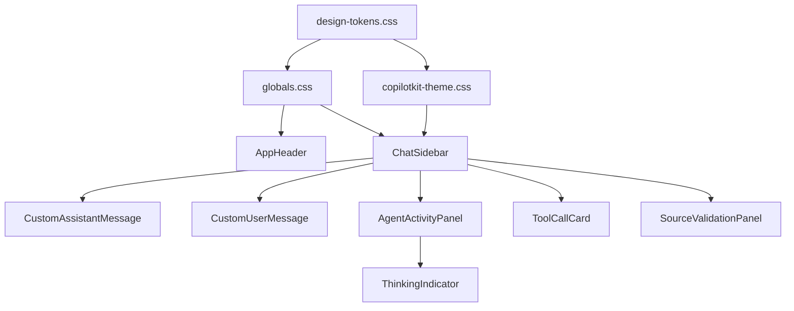

# Ultimate AI RAG - Comprehensive UI/UX Upgrade Plan

**Document Version:** 1.0
**Created:** 2026-01-17
**Author:** BMAD Party Mode (Sally, Caravaggio, Maya, Winston, Amelia, Mary, Bob, Murat, Dr. Quinn)
**Status:** Ready for Implementation

---

## Executive Summary

This document outlines a comprehensive UI/UX upgrade plan for the Ultimate AI RAG platform. The plan transforms the current functional interface into a premium, polished AI application by leveraging:

- **AG-UI Protocol** event visualization for transparency
- **CopilotKit** theming and custom components for branded experience
- **A2UI Protocol** for declarative agent-generated interfaces
- **shadcn/ui** components for consistent design language
- **React Flow** enhancements for Knowledge Graph visualization

### Key Metrics
- **47 features** across 7 tiers
- **6 implementation phases** (sprints)
- **4 user personas** supported (Developer, Researcher, Ops Engineer, Data Engineer)

---

## Table of Contents

1. [Current State Analysis](#1-current-state-analysis)
2. [Protocol Capabilities Research](#2-protocol-capabilities-research)
3. [Design System Foundation](#3-design-system-foundation)
4. [Feature Implementation Plan](#4-feature-implementation-plan)
5. [Code Implementation Guide](#5-code-implementation-guide)
6. [Component Architecture](#6-component-architecture)
7. [Phase-by-Phase Roadmap](#7-phase-by-phase-roadmap)
8. [Testing & Validation](#8-testing--validation)
9. [References & Citations](#9-references--citations)

---

## 1. Current State Analysis

### 1.1 Visual Audit Findings

Based on Playwright browser inspection of the live application:

| Page | Current State | Issues Identified |
|------|---------------|-------------------|
| **Homepage** | Basic cards with minimal styling | No icons, no visual hierarchy, lifeless feature cards |
| **Chat** | Default CopilotKit sidebar | Generic styling, no branded experience |
| **Knowledge Graph** | React Flow with basic nodes | No color coding, overwhelming data, no clustering |
| **Ops Dashboard** | Functional data display | Flat charts, no color-coded alerts, hard to scan |
| **Trajectories** | List of sessions | No timeline visualization, missing event icons |

### 1.2 Existing Component Assessment

**Components Already Implemented (to enhance):**

```
frontend/components/
├── copilot/
│   ├── ThoughtTraceStepper.tsx      ✓ Uses useCoAgentStateRender
│   ├── SourceValidationPanel.tsx    ✓ HITL validation exists
│   ├── ChatSidebar.tsx              ✓ Basic CopilotKit integration
│   └── VectorSearchCard.tsx         ✓ Tool rendering exists
├── graphs/
│   ├── EntityNode.tsx               ✓ Has entityColors mapping
│   ├── RelationshipEdge.tsx         ✓ Basic edge styling
│   └── KnowledgeGraph.tsx           ✓ React Flow integration
└── layout/
    └── AppHeader.tsx                ✓ Basic navigation
```

**Current Design Tokens (from `tailwind.config.ts`):**
```typescript
colors: {
  primary: {
    DEFAULT: "#4F46E5", // Indigo-600
    // ... palette exists but underutilized
  },
  secondary: {
    DEFAULT: "#10B981", // Emerald-500
  },
  accent: {
    DEFAULT: "#FBBF24", // Amber-400 for HITL
  },
}
```

### 1.3 User Persona Requirements (from PRD)

| Persona | Role | Primary Need | UI Priority |
|---------|------|--------------|-------------|
| **Alex** | Speed-Driven Developer | < 15 min setup, production-ready feel | Professional polish, clear navigation |
| **Sarah** | Safety-First Researcher | Trust through transparency | HITL validation ceremony, source cards |
| **Jordan** | Reliability Ops Engineer | At-a-glance monitoring | Color-coded dashboards, sparklines |
| **Maya** | Quality Data Engineer | Knowledge exploration | Rich graph visualization, filtering |

---

## 2. Protocol Capabilities Research

### 2.1 AG-UI Protocol

**Source:** https://docs.ag-ui.com/introduction

AG-UI is an "open, lightweight, event-based protocol that standardizes how AI agents connect to user-facing applications."

#### Event Types for UI Enhancement

| Event Category | Events | UI Opportunity |
|---------------|--------|----------------|
| **Lifecycle** | `RunStarted`, `RunFinished`, `RunError`, `StepStarted`, `StepFinished` | Progress indicators, step visualization |
| **Text Message** | `TextMessageStart`, `TextMessageContent`, `TextMessageEnd` | Streaming text animation |
| **Tool Call** | `ToolCallStart`, `ToolCallArgs`, `ToolCallEnd`, `ToolCallResult` | Live tool execution cards |
| **State** | `StateSnapshot`, `StateDelta` (RFC 6902 JSON Patch) | Reactive state panels |
| **Activity** | `ActivitySnapshot`, `ActivityDelta` | In-progress structured updates |

**Citation:** "Events represent the fundamental units of communication between agents and frontends, enabling real-time, structured interaction." - AG-UI Documentation

### 2.2 A2UI Protocol

**Source:** https://a2ui.org/

A2UI is a "declarative protocol enabling AI agents to generate rich, interactive user interfaces that render natively across web, mobile, and desktop platforms without executing arbitrary code."

#### Key Characteristics

- **Security Model:** "Declarative data format, not executable code. Agents can only use pre-approved components from your catalog—no UI injection attacks."
- **Streaming JSON:** Optimized for LLM generation, incremental interface building
- **Cross-Platform:** Angular, Flutter, React, native mobile from single agent response

**Citation:** Version 0.8 is in public preview under Apache 2.0 license, created by Google with contributions from CopilotKit.

### 2.3 CopilotKit Customization

**Source:** https://github.com/copilotkit/copilotkit (Context7 library ID: /copilotkit/copilotkit)

#### CSS Variables System

```css
:root {
  --copilot-kit-primary-color: #3b82f6;
  --copilot-kit-contrast-color: white;
  --copilot-kit-secondary-contrast-color: #1e293b;
  --copilot-kit-background-color: white;
  --copilot-kit-muted-color: #64748b;
  --copilot-kit-separator-color: rgba(0, 0, 0, 0.08);
  --copilot-kit-scrollbar-color: rgba(0, 0, 0, 0.2);
}
```

**Citation:** "The easiest way to change the colors used in the Copilot UI components is to override CopilotKit CSS variables." - CopilotKit Documentation

#### Dark Mode Support

```css
/* Built-in dark mode via .dark class */
.dark {
  --copilot-kit-background-color: #0F172A;
  --copilot-kit-contrast-color: #1E293B;
}
```

**Citation:** "CopilotKit now includes out-of-the-box dark mode support controlled by the `.dark` class using Tailwind CSS as well as the `color-scheme` CSS selector."

#### Custom Component Renderers

| Prop | Description |
|------|-------------|
| `AssistantMessage` | Custom rendering of AI responses |
| `UserMessage` | Custom rendering of user messages |
| `Input` | Custom input field component |
| `Window` | Custom container (Sidebar/Popup) |
| `Header` | Custom header component |
| `RenderMessage` | Low-level override for complete control |

#### Key Hooks for Generative UI

```typescript
// Agent state visualization
useCoAgentStateRender({
  name: "orchestrator",
  render: ({ state, status }) => <AgentActivityPanel state={state} />
});

// Custom tool rendering
useFrontendTool({
  name: "vector_search",
  handler: async ({ query }) => { /* ... */ },
  render: ({ status, result }) => <VectorSearchCard status={status} results={result} />
});

// HITL patterns
useHumanInTheLoop({
  render: ({ sources, onApprove, onReject }) =>
    <SourceValidationPanel sources={sources} onApprove={onApprove} onReject={onReject} />
});
```

**Citation:** "Render custom UI components dynamically based on agent state and tool outputs. Includes standard generative UI, agentic generative UI, and tool-based rendering capabilities." - CopilotKit API Docs

---

## 3. Design System Foundation

### 3.1 Color Palette

```css
/* design-tokens.css */
:root {
  /* === PRIMARY BRAND === */
  --color-primary-50: #EEF2FF;
  --color-primary-100: #E0E7FF;
  --color-primary-200: #C7D2FE;
  --color-primary-300: #A5B4FC;
  --color-primary-400: #818CF8;
  --color-primary-500: #6366F1;
  --color-primary-600: #4F46E5;  /* Main brand color */
  --color-primary-700: #4338CA;
  --color-primary-800: #3730A3;
  --color-primary-900: #312E81;

  /* === SECONDARY (SUCCESS) === */
  --color-secondary-50: #ECFDF5;
  --color-secondary-500: #10B981;  /* Emerald */
  --color-secondary-600: #059669;

  /* === ACCENT (HITL/WARNING) === */
  --color-accent-50: #FFFBEB;
  --color-accent-400: #FBBF24;  /* Amber */
  --color-accent-500: #F59E0B;

  /* === SEMANTIC === */
  --color-success: #22C55E;
  --color-error: #EF4444;
  --color-warning: #F59E0B;
  --color-info: #3B82F6;

  /* === NEUTRALS === */
  --color-slate-50: #F8FAFC;
  --color-slate-100: #F1F5F9;
  --color-slate-200: #E2E8F0;
  --color-slate-300: #CBD5E1;
  --color-slate-400: #94A3B8;
  --color-slate-500: #64748B;
  --color-slate-600: #475569;
  --color-slate-700: #334155;
  --color-slate-800: #1E293B;
  --color-slate-900: #0F172A;

  /* === GRADIENTS === */
  --gradient-hero: linear-gradient(135deg, #4F46E5 0%, #7C3AED 100%);
  --gradient-glow: radial-gradient(circle, rgba(99,102,241,0.3) 0%, transparent 70%);
  --gradient-card-hover: linear-gradient(180deg, rgba(99,102,241,0.05) 0%, transparent 100%);

  /* === SHADOWS === */
  --shadow-sm: 0 1px 2px 0 rgba(0, 0, 0, 0.05);
  --shadow-md: 0 4px 6px -1px rgba(0, 0, 0, 0.1);
  --shadow-lg: 0 10px 15px -3px rgba(0, 0, 0, 0.1);
  --shadow-glow: 0 0 20px rgba(99, 102, 241, 0.3);
  --shadow-elevated: 0 10px 25px rgba(0, 0, 0, 0.15);

  /* === ANIMATIONS === */
  --duration-micro: 150ms;
  --duration-standard: 300ms;
  --duration-page: 500ms;
  --easing-standard: cubic-bezier(0.4, 0, 0.2, 1);
  --easing-bounce: cubic-bezier(0.68, -0.55, 0.265, 1.55);
}

/* === DARK MODE === */
.dark {
  --color-slate-50: #0F172A;
  --color-slate-100: #1E293B;
  --color-slate-200: #334155;
  --color-slate-800: #F1F5F9;
  --color-slate-900: #F8FAFC;

  --copilot-kit-background-color: #0F172A;
  --copilot-kit-contrast-color: #1E293B;
  --copilot-kit-text-color: #F8FAFC;
}
```

### 3.2 Typography Scale

```css
:root {
  /* Font Families */
  --font-sans: 'Inter', system-ui, -apple-system, sans-serif;
  --font-mono: 'JetBrains Mono', 'Fira Code', monospace;

  /* Font Sizes */
  --text-xs: 0.75rem;     /* 12px */
  --text-sm: 0.875rem;    /* 14px */
  --text-base: 1rem;      /* 16px */
  --text-lg: 1.125rem;    /* 18px */
  --text-xl: 1.25rem;     /* 20px */
  --text-2xl: 1.5rem;     /* 24px */
  --text-3xl: 1.875rem;   /* 30px */
  --text-4xl: 2.25rem;    /* 36px */

  /* Font Weights */
  --font-normal: 400;
  --font-medium: 500;
  --font-semibold: 600;
  --font-bold: 700;

  /* Line Heights */
  --leading-tight: 1.25;
  --leading-normal: 1.5;
  --leading-relaxed: 1.625;
}
```

### 3.3 Animation Tokens

```css
/* Keyframes */
@keyframes pulse-glow {
  0%, 100% { box-shadow: 0 0 0 0 rgba(99, 102, 241, 0.4); }
  50% { box-shadow: 0 0 0 8px rgba(99, 102, 241, 0); }
}

@keyframes thinking-pulse {
  0%, 100% { opacity: 1; }
  50% { opacity: 0.5; }
}

@keyframes slide-up {
  from { opacity: 0; transform: translateY(10px); }
  to { opacity: 1; transform: translateY(0); }
}

@keyframes fade-in {
  from { opacity: 0; }
  to { opacity: 1; }
}

/* Utility Classes */
.animate-pulse-glow { animation: pulse-glow 2s ease-in-out infinite; }
.animate-thinking { animation: thinking-pulse 1.5s ease-in-out infinite; }
.animate-slide-up { animation: slide-up var(--duration-standard) var(--easing-standard); }
.animate-fade-in { animation: fade-in var(--duration-micro) var(--easing-standard); }
```

---

## 4. Feature Implementation Plan

### 4.1 TIER 1: Foundation (P0)

| ID | Feature | Description | Implementation |
|----|---------|-------------|----------------|
| 1.1 | **Design Token System** | CSS variables for colors, spacing, typography, shadows, animations | Create `styles/design-tokens.css`, update `tailwind.config.ts` |
| 1.2 | **CopilotKit Theming** | Configure full CSS variable palette | Update `globals.css` with `--copilot-kit-*` variables |
| 1.3 | **Dark Mode Toggle** | Expose built-in dark mode with UI toggle | Add `ThemeToggle.tsx` component, use `.dark` class |
| 1.4 | **Header Rebrand** | Gradient background, premium nav styling | Enhance `AppHeader.tsx` with gradient and animations |
| 1.5 | **Typography Hierarchy** | Bold hero text, lighter secondary, monospace for data | Update Tailwind config, apply to all pages |

### 4.2 TIER 2: Chat Hero Experience (P0)

| ID | Feature | Description | Implementation |
|----|---------|-------------|----------------|
| 2.1 | **Agent Activity Panel** | Real-time visualization of agent steps | Enhance `ThoughtTraceStepper.tsx` with premium styling |
| 2.2 | **Streaming Text Animation** | Smooth typing effect for AI responses | CSS `@keyframes` + component wrapper |
| 2.3 | **Custom Tool Call Cards** | Rich cards showing tool execution | Create `ToolCallCard.tsx` with `useFrontendTool` |
| 2.4 | **HITL Source Validation UI** | Premium "trust ceremony" | Enhance `SourceValidationPanel.tsx` styling |
| 2.5 | **Custom Message Renderers** | Branded AssistantMessage/UserMessage | Create custom renderers with avatars |
| 2.6 | **Chat Suggestions Styling** | Premium quick-action buttons | Style `useCopilotChatSuggestions` output |
| 2.7 | **Loading/Thinking States** | Skeleton loaders, pulsing indicators | Add `shadcn/skeleton`, create `ThinkingIndicator.tsx` |

### 4.3 TIER 3: Knowledge Graph (P1)

| ID | Feature | Description | Implementation |
|----|---------|-------------|----------------|
| 3.1 | **Entity Type Color Coding** | Different colors for entity types | Enhance `EntityNode.tsx` with expanded color map |
| 3.2 | **Relationship Edge Styling** | Styled edges per relationship type | Enhance `RelationshipEdge.tsx` with animations |
| 3.3 | **Node Clustering** | Visual grouping of related entities | React Flow layout algorithms |
| 3.4 | **Zoom-Level Detail** | Progressive disclosure on zoom | React Flow `onZoom` handler |
| 3.5 | **Graph Statistics Cards** | Premium stat cards with sparklines | Create `GraphStatsCard.tsx` |
| 3.6 | **Search Highlighting** | Highlight searched entities | CSS transitions + state management |
| 3.7 | **Empty State Design** | Welcoming illustration | Create `EmptyGraphState.tsx` |

### 4.4 TIER 4: Ops Dashboard (P1)

| ID | Feature | Description | Implementation |
|----|---------|-------------|----------------|
| 4.1 | **Cost Trend Charts** | Larger, interactive charts | Use `shadcn/chart` + `recharts` |
| 4.2 | **At-a-Glance Status Cards** | Color-coded status cards | Create `StatusCard.tsx` with semantic colors |
| 4.3 | **Model Usage Breakdown** | Pie/donut chart | `recharts` PieChart component |
| 4.4 | **Trajectory Timeline** | Visual timeline with events | Create `TrajectoryTimeline.tsx` |
| 4.5 | **Event Type Icons** | Icons for AG-UI events | Lucide icons mapped to event types |
| 4.6 | **Alert Badges** | Visual threshold indicators | `shadcn/badge` with variants |
| 4.7 | **Request Sparklines** | Mini charts in request list | `recharts` Sparkline component |

### 4.5 TIER 5: Homepage & Navigation (P2)

| ID | Feature | Description | Implementation |
|----|---------|-------------|----------------|
| 5.1 | **Hero Section Redesign** | Bold headline, animated gradient | CSS gradients + Framer Motion |
| 5.2 | **Feature Cards with Icons** | Icons for each feature | Lucide icons + `shadcn/card` |
| 5.3 | **Feature Card Hover Effects** | Scale, shadow lift, glow | Tailwind transitions |
| 5.4 | **Quick Actions Bar** | Persistent action bar | Create `QuickActionsBar.tsx` |
| 5.5 | **Navigation Active States** | Clear current page indicator | Tailwind `ring` + `bg` utilities |
| 5.6 | **Breadcrumbs** | Contextual navigation | `shadcn/breadcrumb` component |

### 4.6 TIER 6: Micro-interactions (P2)

| ID | Feature | Description | Implementation |
|----|---------|-------------|----------------|
| 6.1 | **Button Hover/Press States** | Scale, color shift feedback | Tailwind `hover:` + `active:` |
| 6.2 | **Page Transitions** | Smooth fade/slide between pages | Framer Motion or CSS |
| 6.3 | **Toast Notifications** | Premium toast styling | `shadcn/sonner` customization |
| 6.4 | **Form Input Focus States** | Glowing borders | Tailwind `focus:ring` |
| 6.5 | **Scroll Animations** | Fade-in on viewport entry | Intersection Observer |
| 6.6 | **Loading State Consistency** | Unified skeleton patterns | Design system enforcement |

### 4.7 TIER 7: Advanced Features (P3)

| ID | Feature | Description | Implementation |
|----|---------|-------------|----------------|
| 7.1 | **Command Palette** | Raycast-style ⌘K menu | `shadcn/command` component |
| 7.2 | **A2UI Component Catalog** | Agent-generated UI | A2UI protocol integration |
| 7.3 | **Voice Input UI** | Waveform visualization | Canvas/SVG animation |
| 7.4 | **Keyboard Shortcuts** | Power user shortcuts | Custom hook + hints |
| 7.5 | **Mobile Responsive** | Full mobile optimization | Tailwind responsive utilities |
| 7.6 | **Accessibility Audit** | WCAG 2.1 AA compliance | axe-core + manual testing |

---

## 5. Code Implementation Guide

### 5.1 CopilotKit Theme Configuration

**File: `frontend/styles/copilotkit-theme.css`**

```css
/* CopilotKit Theme Overrides */
:root {
  /* Primary Brand */
  --copilot-kit-primary-color: #4F46E5;
  --copilot-kit-contrast-color: #FFFFFF;
  --copilot-kit-secondary-contrast-color: #1E293B;

  /* Background */
  --copilot-kit-background-color: #FAFAFA;
  --copilot-kit-muted-color: #64748B;
  --copilot-kit-separator-color: rgba(0, 0, 0, 0.08);

  /* Extended */
  --copilot-kit-response-button-color: #4F46E5;
  --copilot-kit-response-button-background-color: #EEF2FF;
}

/* Custom CopilotKit Styling */
.copilotKitSidebar .copilotKitWindow {
  box-shadow: var(--shadow-elevated);
  border-radius: 1rem;
}

.copilotKitButton {
  transition: transform var(--duration-micro) var(--easing-standard),
              box-shadow var(--duration-micro) var(--easing-standard);
}

.copilotKitButton:hover {
  transform: scale(1.05);
  box-shadow: var(--shadow-glow);
}

/* Message Styling */
.copilotKitAssistantMessage {
  animation: slide-up var(--duration-standard) var(--easing-standard);
}

.copilotKitUserMessage {
  background: linear-gradient(135deg, var(--color-primary-500), var(--color-primary-600));
}

/* Dark Mode */
.dark .copilotKitSidebar .copilotKitWindow {
  background-color: var(--color-slate-900);
  border-color: var(--color-slate-700);
}
```

### 5.2 Custom Assistant Message Component

**File: `frontend/components/copilot/CustomAssistantMessage.tsx`**

```tsx
"use client";

import { type AssistantMessageProps, useChatContext, Markdown } from "@copilotkit/react-ui";
import { SparklesIcon } from "lucide-react";
import { cn } from "@/lib/utils";

export function CustomAssistantMessage(props: AssistantMessageProps) {
  const { icons } = useChatContext();
  const { message, isLoading, subComponent } = props;

  return (
    <div className="py-3 animate-slide-up">
      <div className="flex items-start gap-3">
        {/* Avatar */}
        {!subComponent && (
          <div className={cn(
            "flex items-center justify-center",
            "h-10 w-10 rounded-full",
            "bg-gradient-to-br from-primary-500 to-primary-600",
            "shadow-lg shadow-primary-500/30"
          )}>
            <SparklesIcon className="h-5 w-5 text-white" />
          </div>
        )}

        {/* Message Content */}
        <div className={cn(
          "flex-1 px-4 py-3 rounded-2xl",
          "bg-white border border-slate-100",
          "shadow-sm"
        )}>
          {message && (
            <Markdown
              content={message.content || ""}
              className="prose prose-slate prose-sm max-w-none"
            />
          )}
          {isLoading && (
            <div className="flex items-center gap-2 text-primary-600">
              {icons.spinnerIcon}
              <span className="text-sm animate-thinking">Thinking...</span>
            </div>
          )}
        </div>
      </div>

      {/* Generative UI SubComponent */}
      {subComponent && (
        <div className="mt-3 ml-13">
          {subComponent}
        </div>
      )}
    </div>
  );
}
```

### 5.3 Enhanced Agent Activity Panel

**File: `frontend/components/copilot/AgentActivityPanel.tsx`**

```tsx
"use client";

import { useCoAgentStateRender } from "@copilotkit/react-core";
import {
  Search,
  GitBranch,
  CheckCircle2,
  Loader2,
  Circle,
  Sparkles,
  Database,
  Brain
} from "lucide-react";
import { cn } from "@/lib/utils";

interface AgentStep {
  id: string;
  step: string;
  status: "pending" | "in_progress" | "completed";
  details?: string;
  type?: "search" | "graph" | "rerank" | "generate";
}

interface AgentState {
  steps: AgentStep[];
}

const stepIcons = {
  search: Search,
  graph: GitBranch,
  rerank: Database,
  generate: Brain,
  default: Sparkles,
};

const statusConfig = {
  pending: {
    icon: Circle,
    color: "text-slate-400",
    bg: "bg-slate-100",
  },
  in_progress: {
    icon: Loader2,
    color: "text-primary-600",
    bg: "bg-primary-50",
    animate: "animate-spin",
  },
  completed: {
    icon: CheckCircle2,
    color: "text-secondary-500",
    bg: "bg-secondary-50",
  },
};

export function AgentActivityPanel() {
  useCoAgentStateRender<AgentState>({
    name: "orchestrator",
    render: ({ state, status }) => {
      if (!state?.steps?.length) return null;

      return (
        <div className={cn(
          "rounded-xl border border-slate-200",
          "bg-gradient-to-b from-white to-slate-50",
          "shadow-sm overflow-hidden"
        )}>
          {/* Header */}
          <div className="px-4 py-3 border-b border-slate-100 bg-slate-50/50">
            <div className="flex items-center gap-2">
              <div className={cn(
                "h-2 w-2 rounded-full",
                status === "running" ? "bg-primary-500 animate-pulse-glow" : "bg-secondary-500"
              )} />
              <h3 className="text-sm font-semibold text-slate-700">
                Agent Activity
              </h3>
            </div>
          </div>

          {/* Steps */}
          <div className="p-4 space-y-3">
            {state.steps.map((step, idx) => {
              const config = statusConfig[step.status];
              const StepIcon = stepIcons[step.type || "default"];
              const StatusIcon = config.icon;

              return (
                <div
                  key={step.id || idx}
                  className={cn(
                    "flex items-center gap-3 p-3 rounded-lg transition-all",
                    config.bg,
                    step.status === "in_progress" && "ring-2 ring-primary-200"
                  )}
                >
                  {/* Step Type Icon */}
                  <div className={cn(
                    "flex items-center justify-center",
                    "h-8 w-8 rounded-lg",
                    step.status === "completed" ? "bg-secondary-100" : "bg-white",
                    "shadow-sm"
                  )}>
                    <StepIcon className={cn(
                      "h-4 w-4",
                      step.status === "completed" ? "text-secondary-600" : "text-slate-500"
                    )} />
                  </div>

                  {/* Step Info */}
                  <div className="flex-1 min-w-0">
                    <p className={cn(
                      "text-sm font-medium truncate",
                      step.status === "in_progress" ? "text-primary-700" : "text-slate-700"
                    )}>
                      {step.step}
                    </p>
                    {step.details && (
                      <p className="text-xs text-slate-500 truncate mt-0.5">
                        {step.details}
                      </p>
                    )}
                  </div>

                  {/* Status Icon */}
                  <StatusIcon className={cn(
                    "h-5 w-5 flex-shrink-0",
                    config.color,
                    config.animate
                  )} />
                </div>
              );
            })}
          </div>
        </div>
      );
    },
  });

  return null;
}
```

### 5.4 Premium Tool Call Card

**File: `frontend/components/copilot/ToolCallCard.tsx`**

```tsx
"use client";

import { useFrontendTool } from "@copilotkit/react-core";
import { cn } from "@/lib/utils";
import {
  Search,
  Database,
  GitBranch,
  Loader2,
  CheckCircle2,
  AlertCircle
} from "lucide-react";

interface ToolCallCardProps {
  toolName: string;
  status: "executing" | "inProgress" | "complete" | "error";
  args?: Record<string, unknown>;
  result?: unknown;
}

const toolConfig: Record<string, { icon: typeof Search; label: string; color: string }> = {
  vector_search: { icon: Search, label: "Vector Search", color: "blue" },
  graph_query: { icon: GitBranch, label: "Graph Query", color: "purple" },
  retrieve_documents: { icon: Database, label: "Document Retrieval", color: "emerald" },
};

export function ToolCallCard({ toolName, status, args, result }: ToolCallCardProps) {
  const config = toolConfig[toolName] || {
    icon: Database,
    label: toolName,
    color: "slate"
  };
  const ToolIcon = config.icon;

  const isLoading = status === "executing" || status === "inProgress";
  const isComplete = status === "complete";
  const isError = status === "error";

  return (
    <div className={cn(
      "rounded-xl border-2 overflow-hidden transition-all duration-300",
      isLoading && "border-primary-300 bg-primary-50/50 animate-pulse-glow",
      isComplete && "border-secondary-300 bg-secondary-50/30",
      isError && "border-red-300 bg-red-50/30",
      !isLoading && !isComplete && !isError && "border-slate-200 bg-slate-50/50"
    )}>
      {/* Header */}
      <div className={cn(
        "flex items-center justify-between px-4 py-3",
        "border-b",
        isLoading && "border-primary-200 bg-primary-100/50",
        isComplete && "border-secondary-200 bg-secondary-100/50",
        isError && "border-red-200 bg-red-100/50"
      )}>
        <div className="flex items-center gap-3">
          <div className={cn(
            "flex items-center justify-center h-8 w-8 rounded-lg",
            isLoading && "bg-primary-200",
            isComplete && "bg-secondary-200",
            isError && "bg-red-200",
            !isLoading && !isComplete && !isError && "bg-slate-200"
          )}>
            <ToolIcon className={cn(
              "h-4 w-4",
              isLoading && "text-primary-700",
              isComplete && "text-secondary-700",
              isError && "text-red-700"
            )} />
          </div>
          <div>
            <p className="text-sm font-semibold text-slate-800">{config.label}</p>
            {args?.query && (
              <p className="text-xs text-slate-500 truncate max-w-[200px]">
                {String(args.query)}
              </p>
            )}
          </div>
        </div>

        {/* Status Indicator */}
        <div className="flex items-center gap-2">
          {isLoading && (
            <>
              <Loader2 className="h-4 w-4 text-primary-600 animate-spin" />
              <span className="text-xs text-primary-600 font-medium">Running...</span>
            </>
          )}
          {isComplete && (
            <>
              <CheckCircle2 className="h-4 w-4 text-secondary-600" />
              <span className="text-xs text-secondary-600 font-medium">Complete</span>
            </>
          )}
          {isError && (
            <>
              <AlertCircle className="h-4 w-4 text-red-600" />
              <span className="text-xs text-red-600 font-medium">Error</span>
            </>
          )}
        </div>
      </div>

      {/* Result Preview */}
      {isComplete && result && (
        <div className="px-4 py-3">
          <p className="text-xs text-slate-500 mb-1">Results</p>
          <pre className="text-xs bg-white rounded-lg p-2 overflow-x-auto border border-slate-100">
            {JSON.stringify(result, null, 2).slice(0, 200)}
            {JSON.stringify(result).length > 200 && "..."}
          </pre>
        </div>
      )}
    </div>
  );
}
```

### 5.5 Dark Mode Toggle

**File: `frontend/components/layout/ThemeToggle.tsx`**

```tsx
"use client";

import { useEffect, useState } from "react";
import { Moon, Sun } from "lucide-react";
import { cn } from "@/lib/utils";

export function ThemeToggle() {
  const [isDark, setIsDark] = useState(false);

  useEffect(() => {
    // Check for saved preference or system preference
    const saved = localStorage.getItem("theme");
    const prefersDark = window.matchMedia("(prefers-color-scheme: dark)").matches;

    if (saved === "dark" || (!saved && prefersDark)) {
      setIsDark(true);
      document.documentElement.classList.add("dark");
    }
  }, []);

  const toggleTheme = () => {
    const newValue = !isDark;
    setIsDark(newValue);

    if (newValue) {
      document.documentElement.classList.add("dark");
      localStorage.setItem("theme", "dark");
    } else {
      document.documentElement.classList.remove("dark");
      localStorage.setItem("theme", "light");
    }
  };

  return (
    <button
      onClick={toggleTheme}
      className={cn(
        "relative flex items-center justify-center",
        "h-9 w-9 rounded-full",
        "bg-slate-100 dark:bg-slate-800",
        "hover:bg-slate-200 dark:hover:bg-slate-700",
        "transition-colors duration-200"
      )}
      aria-label={isDark ? "Switch to light mode" : "Switch to dark mode"}
    >
      <Sun className={cn(
        "h-4 w-4 absolute transition-all",
        isDark ? "opacity-0 rotate-90 scale-0" : "opacity-100 rotate-0 scale-100"
      )} />
      <Moon className={cn(
        "h-4 w-4 absolute transition-all",
        isDark ? "opacity-100 rotate-0 scale-100" : "opacity-0 -rotate-90 scale-0"
      )} />
    </button>
  );
}
```

### 5.6 Enhanced Header with Gradient

**File: `frontend/components/layout/AppHeader.tsx` (enhanced)**

```tsx
"use client";

import Link from "next/link";
import { usePathname } from "next/navigation";
import { cn } from "@/lib/utils";
import { ThemeToggle } from "./ThemeToggle";
import { Sparkles } from "lucide-react";

const NAV_ITEMS = [
  { href: "/chat", label: "Chat" },
  { href: "/ingest", label: "Ingest" },
  { href: "/knowledge", label: "Knowledge" },
  { href: "/ops", label: "Ops" },
  { href: "/ops/trajectories", label: "Trajectories" },
  { href: "/workflow", label: "Workflow" },
];

export function AppHeader() {
  const pathname = usePathname();

  return (
    <header className={cn(
      "sticky top-0 z-40",
      "border-b border-slate-200 dark:border-slate-800",
      "bg-white/80 dark:bg-slate-900/80 backdrop-blur-lg"
    )}>
      <div className="container mx-auto flex items-center justify-between px-4 py-3">
        {/* Logo */}
        <Link
          href="/"
          className="flex items-center gap-2 group"
        >
          <div className={cn(
            "flex items-center justify-center",
            "h-8 w-8 rounded-lg",
            "bg-gradient-to-br from-primary-500 to-primary-600",
            "shadow-md shadow-primary-500/30",
            "group-hover:shadow-lg group-hover:shadow-primary-500/40",
            "transition-shadow duration-200"
          )}>
            <Sparkles className="h-4 w-4 text-white" />
          </div>
          <span className={cn(
            "text-lg font-bold",
            "bg-gradient-to-r from-primary-600 to-primary-500",
            "bg-clip-text text-transparent"
          )}>
            Ultimate AI RAG
          </span>
        </Link>

        {/* Navigation */}
        <nav className="flex flex-wrap items-center gap-1 text-sm">
          {NAV_ITEMS.map((item) => {
            const isActive = pathname === item.href;
            return (
              <Link
                key={item.href}
                href={item.href}
                className={cn(
                  "px-3 py-1.5 rounded-lg font-medium transition-all duration-200",
                  isActive
                    ? "bg-primary-100 text-primary-700 dark:bg-primary-900/50 dark:text-primary-300"
                    : "text-slate-600 hover:text-slate-900 hover:bg-slate-100 dark:text-slate-400 dark:hover:text-slate-100 dark:hover:bg-slate-800"
                )}
              >
                {item.label}
              </Link>
            );
          })}
        </nav>

        {/* Theme Toggle */}
        <ThemeToggle />
      </div>
    </header>
  );
}
```

---

## 6. Component Architecture

### 6.1 Directory Structure

```
frontend/
├── styles/
│   ├── design-tokens.css          # NEW: CSS custom properties
│   ├── copilotkit-theme.css       # NEW: CopilotKit overrides
│   ├── animations.css             # NEW: Keyframes and utilities
│   └── globals.css                # ENHANCE: Import new styles
│
├── components/
│   ├── ui/                        # shadcn/ui components
│   │   ├── badge.tsx              # ADD
│   │   ├── card.tsx               # EXISTS
│   │   ├── chart.tsx              # ADD
│   │   ├── command.tsx            # ADD (P3)
│   │   ├── progress.tsx           # ADD
│   │   ├── skeleton.tsx           # ADD
│   │   ├── spinner.tsx            # ADD
│   │   └── tabs.tsx               # ADD
│   │
│   ├── copilot/
│   │   ├── AgentActivityPanel.tsx      # NEW: useCoAgentStateRender
│   │   ├── CustomAssistantMessage.tsx  # NEW: Branded AI message
│   │   ├── CustomUserMessage.tsx       # NEW: Branded user message
│   │   ├── ToolCallCard.tsx            # NEW: Premium tool cards
│   │   ├── StreamingText.tsx           # NEW: Typing animation
│   │   ├── ThinkingIndicator.tsx       # NEW: Loading state
│   │   ├── SourceValidationPanel.tsx   # ENHANCE: Premium styling
│   │   ├── ThoughtTraceStepper.tsx     # ENHANCE: Premium styling
│   │   └── ChatSidebar.tsx             # ENHANCE: Custom renderers
│   │
│   ├── graphs/
│   │   ├── EntityNode.tsx              # ENHANCE: Expanded colors
│   │   ├── RelationshipEdge.tsx        # ENHANCE: Animated edges
│   │   ├── GraphLegend.tsx             # NEW: Color legend
│   │   ├── GraphStatsCard.tsx          # NEW: Premium stats
│   │   └── EmptyGraphState.tsx         # NEW: Empty illustration
│   │
│   ├── dashboard/
│   │   ├── CostTrendChart.tsx          # NEW: Recharts area chart
│   │   ├── ModelBreakdownChart.tsx     # NEW: Recharts pie chart
│   │   ├── StatusCard.tsx              # NEW: Color-coded cards
│   │   ├── AlertBadge.tsx              # NEW: Threshold badges
│   │   ├── RequestSparkline.tsx        # NEW: Mini charts
│   │   └── TrajectoryTimeline.tsx      # NEW: Event timeline
│   │
│   └── layout/
│       ├── AppHeader.tsx               # ENHANCE: Gradient + branding
│       ├── ThemeToggle.tsx             # NEW: Dark mode switch
│       ├── QuickActionsBar.tsx         # NEW: Persistent actions
│       └── CommandPalette.tsx          # NEW: ⌘K menu (P3)
│
├── hooks/
│   ├── use-theme.ts                    # NEW: Theme state hook
│   └── use-keyboard-shortcuts.ts       # NEW: Shortcuts (P3)
│
└── lib/
    └── design-tokens.ts                # NEW: Token type exports
```

### 6.2 Component Dependencies



---

## 7. Phase-by-Phase Roadmap

### Phase 1: Foundation (Sprint 1)

**Duration:** 1 sprint
**Dependencies:** None
**Deliverables:**
- [ ] 1.1 Design Token System (`design-tokens.css`)
- [ ] 1.2 CopilotKit Theming (`copilotkit-theme.css`)
- [ ] 1.3 Dark Mode Toggle (`ThemeToggle.tsx`)
- [ ] 1.4 Header Rebrand (`AppHeader.tsx` enhancement)
- [ ] 1.5 Typography Hierarchy (Tailwind config updates)

**Acceptance Criteria:**
- Design tokens documented and applied
- Dark mode toggle functional across all pages
- Header displays gradient and branded logo
- Typography scales correctly

### Phase 2: Chat Hero (Sprint 2)

**Duration:** 1 sprint
**Dependencies:** Phase 1 complete
**Deliverables:**
- [ ] 2.1 Agent Activity Panel
- [ ] 2.2 Streaming Text Animation
- [ ] 2.3 Custom Tool Call Cards
- [ ] 2.5 Custom Message Renderers
- [ ] 2.7 Loading/Thinking States

**Acceptance Criteria:**
- Agent steps visualized in real-time
- AI responses animate smoothly
- Tool calls display rich status cards
- Messages use branded styling

### Phase 3: Trust & HITL (Sprint 3)

**Duration:** 1 sprint
**Dependencies:** Phase 2 complete
**Deliverables:**
- [ ] 2.4 HITL Source Validation UI (enhancement)
- [ ] 2.6 Chat Suggestions Styling
- [ ] 4.4 Trajectory Timeline
- [ ] 4.5 Event Type Icons

**Acceptance Criteria:**
- Source validation feels like "trust ceremony"
- Trajectories show visual timeline
- Event icons correctly mapped to AG-UI types

### Phase 4: Visualizations (Sprint 4)

**Duration:** 1 sprint
**Dependencies:** Phase 1 complete
**Deliverables:**
- [ ] 3.1 Entity Type Color Coding
- [ ] 3.2 Relationship Edge Styling
- [ ] 3.5 Graph Statistics Cards
- [ ] 4.1 Cost Trend Charts
- [ ] 4.2 At-a-Glance Status Cards

**Acceptance Criteria:**
- Knowledge Graph entities colored by type
- Ops dashboard scannable at-a-glance
- Charts interactive with tooltips

### Phase 5: Polish (Sprint 5)

**Duration:** 1 sprint
**Dependencies:** Phases 1-4 complete
**Deliverables:**
- [ ] 5.1 Hero Section Redesign
- [ ] 5.2 Feature Cards with Icons
- [ ] 6.1-6.6 Micro-interactions
- [ ] 3.7 Empty State Designs

**Acceptance Criteria:**
- Homepage feels premium
- All interactive elements have feedback
- Empty states welcoming, not blank

### Phase 6: Advanced (Future)

**Duration:** Multiple sprints
**Dependencies:** Phase 5 complete
**Deliverables:**
- [ ] 7.1 Command Palette
- [ ] 7.2 A2UI Component Catalog
- [ ] 7.3 Voice Input UI
- [ ] 7.4 Keyboard Shortcuts
- [ ] 7.5 Mobile Responsive
- [ ] 7.6 Accessibility Audit

---

## 8. Testing & Validation

### 8.1 Visual Regression Testing

```typescript
// playwright/tests/visual-regression.spec.ts
import { test, expect } from '@playwright/test';

test.describe('Visual Regression', () => {
  test('homepage matches snapshot', async ({ page }) => {
    await page.goto('/');
    await expect(page).toHaveScreenshot('homepage.png');
  });

  test('chat page matches snapshot', async ({ page }) => {
    await page.goto('/chat');
    await expect(page).toHaveScreenshot('chat.png');
  });

  test('dark mode matches snapshot', async ({ page }) => {
    await page.goto('/');
    await page.click('[aria-label="Switch to dark mode"]');
    await expect(page).toHaveScreenshot('homepage-dark.png');
  });
});
```

### 8.2 Accessibility Testing

```typescript
// playwright/tests/accessibility.spec.ts
import { test, expect } from '@playwright/test';
import AxeBuilder from '@axe-core/playwright';

test.describe('Accessibility', () => {
  test('homepage passes axe audit', async ({ page }) => {
    await page.goto('/');
    const results = await new AxeBuilder({ page }).analyze();
    expect(results.violations).toEqual([]);
  });
});
```

### 8.3 Animation Performance

```typescript
// Ensure animations run at 60fps
test('animations maintain 60fps', async ({ page }) => {
  await page.goto('/chat');

  // Trigger animation
  await page.type('[placeholder="Type a message..."]', 'test');
  await page.click('button:has-text("Send")');

  // Measure frame rate
  const metrics = await page.metrics();
  expect(metrics.TaskDuration).toBeLessThan(16.67); // 60fps = 16.67ms per frame
});
```

---

## 9. References & Citations

### 9.1 Protocol Documentation

| Protocol | Source | Key Capability |
|----------|--------|----------------|
| AG-UI | https://docs.ag-ui.com/introduction | Event-based agent-frontend communication |
| A2UI | https://a2ui.org/ | Declarative agent-generated UI |
| CopilotKit | https://docs.copilotkit.ai/ | AI copilot framework |

### 9.2 CopilotKit API References

**Hooks:**
- `useCoAgentStateRender` - Agent state visualization
- `useFrontendTool` - Custom tool rendering
- `useHumanInTheLoop` - HITL patterns
- `useCopilotChat` - Headless chat interface
- `useCopilotChatHeadless_c` - Advanced headless UI

**Components:**
- `CopilotSidebar` - Pre-built sidebar
- `CopilotPopup` - Popup interface
- `CopilotChat` - Embeddable chat

**CSS Variables:**
- `--copilot-kit-primary-color`
- `--copilot-kit-background-color`
- `--copilot-kit-contrast-color`
- `--copilot-kit-muted-color`

### 9.3 Design System References

| Resource | Purpose |
|----------|---------|
| Linear.app | Animation inspiration |
| Vercel Dashboard | Dark mode reference |
| Notion | Empty states, typography |
| Raycast | Command palette UX |
| shadcn/ui | Component library |

### 9.4 Research Sources

- Context7 Library ID: `/copilotkit/copilotkit` (3889 code snippets)
- DeepWiki: `CopilotKit/CopilotKit` repository analysis
- AG-UI Documentation: Event types and streaming patterns
- A2UI Specification: Component catalogs and security model

---

## Appendix A: shadcn Components to Install

```bash
# Required components
pnpm dlx shadcn@latest add badge
pnpm dlx shadcn@latest add chart
pnpm dlx shadcn@latest add progress
pnpm dlx shadcn@latest add skeleton
pnpm dlx shadcn@latest add tabs

# Optional (Phase 6)
pnpm dlx shadcn@latest add command
pnpm dlx shadcn@latest add breadcrumb
```

---

## Appendix B: Existing Component Enhancements

### B.1 EntityNode.tsx Color Expansion

```typescript
// Current entityColors (from types/graphs.ts)
export const entityColors: Record<EntityType | 'orphan', string> = {
  Person: '#3B82F6',      // Blue
  Organization: '#8B5CF6', // Purple
  Technology: '#10B981',   // Emerald
  Concept: '#F59E0B',      // Amber
  Location: '#EF4444',     // Red
  orphan: '#F97316',       // Orange
};

// Enhanced with code entity types
export const entityColors: Record<string, string> = {
  // People & Orgs
  Person: '#3B82F6',
  Organization: '#8B5CF6',

  // Technical
  Technology: '#10B981',
  CodeFile: '#06B6D4',      // Cyan
  CodeSymbol: '#14B8A6',    // Teal
  CodeClass: '#0EA5E9',     // Sky
  CodeFunction: '#22D3EE',  // Cyan-light
  CodeModule: '#2DD4BF',    // Teal-light

  // Abstract
  Concept: '#F59E0B',
  Location: '#EF4444',

  // Special
  orphan: '#F97316',
};
```

---

## Appendix C: Page-Level Enhancement Details

### C.1 Homepage Enhancement (`frontend/app/page.tsx`)

**Current State:** Basic card grid, no icons, minimal styling

**Enhancement Code:**

```tsx
// frontend/app/page.tsx (enhanced)
import Link from "next/link";
import { ChatSidebar } from "@/components/copilot/ChatSidebar";
import {
  MessageSquare,
  FileUp,
  GitBranch,
  BarChart3,
  Route,
  Workflow,
  Sparkles,
  ArrowRight,
} from "lucide-react";
import { cn } from "@/lib/utils";

const features = [
  {
    href: "/chat",
    title: "AI Chat",
    description: "Query the knowledge base with sources, actions, and HITL validation.",
    icon: MessageSquare,
    color: "indigo",
  },
  {
    href: "/ingest",
    title: "Ingestion",
    description: "Crawl URLs or upload PDFs to populate the graph.",
    icon: FileUp,
    color: "emerald",
  },
  {
    href: "/knowledge",
    title: "Knowledge Graph",
    description: "Explore entities, relationships, and graph stats.",
    icon: GitBranch,
    color: "purple",
  },
  {
    href: "/ops",
    title: "Ops Dashboard",
    description: "Monitor costs, alerts, and recent requests.",
    icon: BarChart3,
    color: "blue",
  },
  {
    href: "/ops/trajectories",
    title: "Trajectories",
    description: "Inspect agent timelines and debugging events.",
    icon: Route,
    color: "amber",
  },
  {
    href: "/workflow",
    title: "Workflow Editor",
    description: "Design pipeline steps and test execution paths.",
    icon: Workflow,
    color: "rose",
  },
];

const colorClasses = {
  indigo: {
    bg: "bg-indigo-50 dark:bg-indigo-900/20",
    icon: "text-indigo-600 dark:text-indigo-400",
    hover: "group-hover:bg-indigo-100 dark:group-hover:bg-indigo-900/30",
  },
  emerald: {
    bg: "bg-emerald-50 dark:bg-emerald-900/20",
    icon: "text-emerald-600 dark:text-emerald-400",
    hover: "group-hover:bg-emerald-100 dark:group-hover:bg-emerald-900/30",
  },
  purple: {
    bg: "bg-purple-50 dark:bg-purple-900/20",
    icon: "text-purple-600 dark:text-purple-400",
    hover: "group-hover:bg-purple-100 dark:group-hover:bg-purple-900/30",
  },
  blue: {
    bg: "bg-blue-50 dark:bg-blue-900/20",
    icon: "text-blue-600 dark:text-blue-400",
    hover: "group-hover:bg-blue-100 dark:group-hover:bg-blue-900/30",
  },
  amber: {
    bg: "bg-amber-50 dark:bg-amber-900/20",
    icon: "text-amber-600 dark:text-amber-400",
    hover: "group-hover:bg-amber-100 dark:group-hover:bg-amber-900/30",
  },
  rose: {
    bg: "bg-rose-50 dark:bg-rose-900/20",
    icon: "text-rose-600 dark:text-rose-400",
    hover: "group-hover:bg-rose-100 dark:group-hover:bg-rose-900/30",
  },
};

export default function Home() {
  return (
    <main className="min-h-screen bg-gradient-to-b from-slate-50 to-white dark:from-slate-900 dark:to-slate-800">
      {/* Hero Section */}
      <div className="container mx-auto py-16 px-4">
        <div className="text-center space-y-6 max-w-3xl mx-auto">
          {/* Animated logo badge */}
          <div className="inline-flex items-center gap-2 px-4 py-2 bg-primary-50 dark:bg-primary-900/30 rounded-full border border-primary-200 dark:border-primary-800">
            <Sparkles className="h-4 w-4 text-primary-600 dark:text-primary-400" />
            <span className="text-sm font-medium text-primary-700 dark:text-primary-300">
              AI-Powered Knowledge Platform
            </span>
          </div>

          {/* Hero headline with gradient */}
          <h1 className={cn(
            "text-5xl md:text-6xl font-bold tracking-tight",
            "bg-gradient-to-r from-slate-900 via-primary-700 to-primary-600",
            "dark:from-white dark:via-primary-400 dark:to-primary-300",
            "bg-clip-text text-transparent"
          )}>
            Ultimate AI RAG
          </h1>

          <p className="text-xl text-slate-600 dark:text-slate-300 max-w-2xl mx-auto">
            Agentic RAG and GraphRAG with CopilotKit experiences.
            Explore your knowledge base with AI-powered insights.
          </p>

          {/* CTA Buttons */}
          <div className="flex flex-wrap justify-center gap-4 pt-4">
            <Link
              href="/chat"
              className={cn(
                "inline-flex items-center gap-2 px-6 py-3 rounded-xl",
                "bg-gradient-to-r from-primary-600 to-primary-500",
                "text-white font-semibold",
                "shadow-lg shadow-primary-500/30",
                "hover:shadow-xl hover:shadow-primary-500/40",
                "transform hover:-translate-y-0.5",
                "transition-all duration-200"
              )}
            >
              Start Chatting
              <ArrowRight className="h-4 w-4" />
            </Link>
            <Link
              href="/ingest"
              className={cn(
                "inline-flex items-center gap-2 px-6 py-3 rounded-xl",
                "bg-white dark:bg-slate-800",
                "text-slate-700 dark:text-slate-200 font-semibold",
                "border border-slate-200 dark:border-slate-700",
                "shadow-sm hover:shadow-md",
                "transform hover:-translate-y-0.5",
                "transition-all duration-200"
              )}
            >
              Ingest Content
            </Link>
          </div>
        </div>

        {/* Feature Cards Grid */}
        <div className="grid grid-cols-1 md:grid-cols-2 xl:grid-cols-3 gap-6 mt-16">
          {features.map((feature) => {
            const colors = colorClasses[feature.color as keyof typeof colorClasses];
            const Icon = feature.icon;

            return (
              <Link
                key={feature.href}
                href={feature.href}
                className={cn(
                  "group relative",
                  "bg-white dark:bg-slate-800/50",
                  "border border-slate-200 dark:border-slate-700",
                  "rounded-2xl p-6",
                  "hover:border-slate-300 dark:hover:border-slate-600",
                  "hover:shadow-lg hover:shadow-slate-200/50 dark:hover:shadow-slate-900/50",
                  "transform hover:-translate-y-1",
                  "transition-all duration-300"
                )}
              >
                {/* Icon */}
                <div className={cn(
                  "inline-flex items-center justify-center",
                  "h-12 w-12 rounded-xl mb-4",
                  colors.bg,
                  colors.hover,
                  "transition-colors duration-300"
                )}>
                  <Icon className={cn("h-6 w-6", colors.icon)} />
                </div>

                {/* Content */}
                <h2 className="text-lg font-semibold text-slate-900 dark:text-white">
                  {feature.title}
                </h2>
                <p className="text-sm text-slate-600 dark:text-slate-400 mt-2">
                  {feature.description}
                </p>

                {/* Hover arrow */}
                <div className={cn(
                  "absolute bottom-6 right-6",
                  "opacity-0 group-hover:opacity-100",
                  "transform translate-x-2 group-hover:translate-x-0",
                  "transition-all duration-300"
                )}>
                  <ArrowRight className={cn("h-5 w-5", colors.icon)} />
                </div>
              </Link>
            );
          })}
        </div>
      </div>

      <ChatSidebar />
    </main>
  );
}
```

### C.2 Ingest Page Enhancement (`frontend/app/ingest/page.tsx`)

**Key Enhancements:**
1. Add icons to section headers
2. Add loading skeletons to job list
3. Add status badges with semantic colors
4. Add empty state illustration
5. Add animated submit buttons

**Enhancement Code Snippets:**

```tsx
// Section header with icon
<div className="flex items-center gap-3">
  <div className={cn(
    "flex items-center justify-center",
    "h-10 w-10 rounded-xl",
    "bg-indigo-50 dark:bg-indigo-900/20"
  )}>
    <Globe className="h-5 w-5 text-indigo-600" />
  </div>
  <div>
    <h2 className="text-lg font-semibold text-slate-800 dark:text-white">
      Ingest a URL
    </h2>
    <p className="text-sm text-slate-500">
      Crawl a documentation site and ingest discovered pages.
    </p>
  </div>
</div>

// Job status badge component
const statusColors = {
  queued: "bg-slate-100 text-slate-700 border-slate-200",
  running: "bg-blue-50 text-blue-700 border-blue-200 animate-pulse",
  completed: "bg-emerald-50 text-emerald-700 border-emerald-200",
  failed: "bg-red-50 text-red-700 border-red-200",
};

<span className={cn(
  "inline-flex items-center gap-1.5 px-2 py-0.5 rounded-full text-xs font-medium border",
  statusColors[job.status as keyof typeof statusColors] || statusColors.queued
)}>
  {job.status === "running" && <Loader2 className="h-3 w-3 animate-spin" />}
  {job.status === "completed" && <CheckCircle2 className="h-3 w-3" />}
  {job.status === "failed" && <XCircle className="h-3 w-3" />}
  {job.status}
</span>

// Empty jobs state
{jobRows.length === 0 && !jobsStatus && (
  <div className="text-center py-12">
    <FileUp className="h-12 w-12 text-slate-300 mx-auto mb-4" />
    <p className="text-sm text-slate-500">No ingestion jobs yet.</p>
    <p className="text-xs text-slate-400 mt-1">
      Start by crawling a URL or uploading a PDF.
    </p>
  </div>
)}
```

### C.3 EmbeddedChat Enhancement (`frontend/components/copilot/EmbeddedChat.tsx`)

**Current State:** Basic CopilotChat wrapper

**Enhancement Code:**

```tsx
"use client";

import { CopilotChat } from "@copilotkit/react-ui";
import "@copilotkit/react-ui/styles.css";
import { cn } from "@/lib/utils";
import { ThoughtTraceStepper } from "./ThoughtTraceStepper";
import { CopilotErrorBoundary } from "./CopilotErrorBoundary";
import { GenerativeUIRenderer } from "./GenerativeUIRenderer";
import { useChatSuggestions } from "@/hooks/use-chat-suggestions";
import { CustomAssistantMessage } from "./CustomAssistantMessage";
import { CustomUserMessage } from "./CustomUserMessage";

export interface EmbeddedChatProps {
  className?: string;
  welcomeMessage?: string;
  title?: string;
}

export function EmbeddedChat({
  className,
  welcomeMessage = "Welcome! Ask me anything about your documents.",
  title = "AI Assistant",
}: EmbeddedChatProps) {
  const suggestions = useChatSuggestions();

  return (
    <CopilotErrorBoundary>
      <div className={cn(
        "embedded-chat-container",
        "bg-white dark:bg-slate-900",
        "rounded-2xl overflow-hidden",
        "shadow-lg shadow-slate-200/50 dark:shadow-slate-900/50",
        className
      )}>
        <CopilotChat
          labels={{
            title,
            initial: welcomeMessage,
          }}
          className="h-full"
          suggestions={suggestions}
          AssistantMessage={CustomAssistantMessage}
          UserMessage={CustomUserMessage}
        >
          <ThoughtTraceStepper />
          <GenerativeUIRenderer />
        </CopilotChat>
      </div>
    </CopilotErrorBoundary>
  );
}
```

**CSS addition to `globals.css`:**

```css
/* Embedded Chat Container Styling */
.embedded-chat-container {
  --copilot-kit-background-color: transparent;
}

.embedded-chat-container .copilotKitHeader {
  @apply bg-gradient-to-r from-primary-600 to-primary-500 text-white;
  border-bottom: none;
}

.embedded-chat-container .copilotKitMessages {
  @apply bg-slate-50 dark:bg-slate-800/50;
}

.embedded-chat-container .copilotKitInput {
  @apply border-t border-slate-200 dark:border-slate-700 bg-white dark:bg-slate-900;
}
```

### C.4 QuickActions Component Clarification

**Note:** `QuickActions.tsx` already exists at `frontend/components/copilot/QuickActions.tsx`.

**Enhancement (not new file):** Update existing component styling.

```tsx
// Existing QuickActions.tsx enhancement
const actionColors = {
  send: "bg-primary-50 hover:bg-primary-100 text-primary-700 border-primary-200",
  navigate: "bg-slate-50 hover:bg-slate-100 text-slate-700 border-slate-200",
};

// Add to each action button:
className={cn(
  "flex items-center gap-2 px-3 py-2 rounded-lg border",
  "transition-all duration-200",
  "transform hover:-translate-y-0.5 hover:shadow-sm",
  actionColors[action.action as keyof typeof actionColors]
)}
```

---

## Appendix D: Voice Component Styling

### D.1 VoiceInput Enhancement

**File:** `frontend/components/copilot/VoiceInput.tsx`

**Enhancement Code:**

```tsx
// Waveform animation for active recording
const waveformBars = [1, 2, 3, 4, 5];

{isRecording && (
  <div className="flex items-center gap-1">
    {waveformBars.map((bar) => (
      <div
        key={bar}
        className={cn(
          "w-1 bg-red-500 rounded-full",
          "animate-waveform"
        )}
        style={{
          animationDelay: `${bar * 0.1}s`,
          height: `${8 + Math.random() * 16}px`,
        }}
      />
    ))}
  </div>
)}

// CSS keyframe for waveform
@keyframes waveform {
  0%, 100% { height: 8px; }
  50% { height: 24px; }
}

.animate-waveform {
  animation: waveform 0.5s ease-in-out infinite;
}
```

### D.2 SpeakButton Enhancement

```tsx
// Pulsing microphone button
<button
  onClick={toggleRecording}
  className={cn(
    "flex items-center justify-center",
    "h-10 w-10 rounded-full",
    "transition-all duration-200",
    isRecording
      ? "bg-red-500 text-white animate-pulse-glow"
      : "bg-slate-100 text-slate-600 hover:bg-slate-200"
  )}
  aria-label={isRecording ? "Stop recording" : "Start recording"}
>
  {isRecording ? (
    <MicOff className="h-5 w-5" />
  ) : (
    <Mic className="h-5 w-5" />
  )}
</button>
```

---

## Appendix E: Open-JSON-UI Component Styling

**Directory:** `frontend/components/open-json-ui/`

### E.1 Consistent Styling Pattern

Apply to all Open-JSON-UI components:

```tsx
// AlertComponent.tsx enhancement
const alertVariants = {
  info: "bg-blue-50 border-blue-200 text-blue-800",
  success: "bg-emerald-50 border-emerald-200 text-emerald-800",
  warning: "bg-amber-50 border-amber-200 text-amber-800",
  error: "bg-red-50 border-red-200 text-red-800",
};

<div className={cn(
  "flex items-start gap-3 p-4 rounded-xl border",
  alertVariants[variant],
  "animate-slide-up"
)}>
  {/* Alert content */}
</div>

// ProgressComponent.tsx enhancement
<div className="space-y-2">
  <div className="flex justify-between text-sm">
    <span className="text-slate-600">{label}</span>
    <span className="text-slate-500">{value}%</span>
  </div>
  <div className="h-2 bg-slate-100 rounded-full overflow-hidden">
    <div
      className="h-full bg-gradient-to-r from-primary-500 to-primary-600 rounded-full transition-all duration-500"
      style={{ width: `${value}%` }}
    />
  </div>
</div>

// TableComponent.tsx enhancement
<div className="overflow-hidden rounded-xl border border-slate-200">
  <table className="w-full">
    <thead className="bg-slate-50">
      <tr>
        {columns.map((col) => (
          <th className="px-4 py-3 text-left text-xs font-semibold text-slate-600 uppercase tracking-wide">
            {col.label}
          </th>
        ))}
      </tr>
    </thead>
    <tbody className="divide-y divide-slate-100">
      {/* rows with hover:bg-slate-50 */}
    </tbody>
  </table>
</div>
```

---

## Appendix F: CopilotProvider Configuration

**File:** `frontend/components/copilot/CopilotProvider.tsx`

**Configuration for custom renderers:**

```tsx
import { CopilotKit } from "@copilotkit/react-core";
import { CustomAssistantMessage } from "./CustomAssistantMessage";
import { CustomUserMessage } from "./CustomUserMessage";

export function CopilotProvider({ children }: { children: React.ReactNode }) {
  return (
    <CopilotKit
      runtimeUrl="/api/copilot"
      // Enable dark mode detection
      // CopilotKit auto-detects .dark class on html element
    >
      {children}
    </CopilotKit>
  );
}
```

**Note:** Custom message renderers are passed at the component level (`CopilotSidebar`, `CopilotChat`) not at the provider level.

---

## Appendix G: Implementation Checklist

Use this checklist to track progress:

### Phase 1: Foundation
- [ ] Create `styles/design-tokens.css`
- [ ] Create `styles/copilotkit-theme.css`
- [ ] Create `styles/animations.css`
- [ ] Update `globals.css` to import new styles
- [ ] Create `components/layout/ThemeToggle.tsx`
- [ ] Enhance `components/layout/AppHeader.tsx`
- [ ] Update `tailwind.config.ts` with new tokens

### Phase 2: Chat Hero
- [ ] Create `components/copilot/CustomAssistantMessage.tsx`
- [ ] Create `components/copilot/CustomUserMessage.tsx`
- [ ] Create `components/copilot/AgentActivityPanel.tsx`
- [ ] Create `components/copilot/ToolCallCard.tsx`
- [ ] Create `components/copilot/ThinkingIndicator.tsx`
- [ ] Enhance `components/copilot/ThoughtTraceStepper.tsx`
- [ ] Enhance `components/copilot/ChatSidebar.tsx` with custom renderers
- [ ] Enhance `components/copilot/EmbeddedChat.tsx` with custom renderers

### Phase 3: Trust & HITL
- [ ] Enhance `components/copilot/SourceValidationPanel.tsx`
- [ ] Create `components/dashboard/TrajectoryTimeline.tsx`
- [ ] Add AG-UI event type icons mapping

### Phase 4: Visualizations
- [ ] Enhance `components/graphs/EntityNode.tsx` colors
- [ ] Enhance `components/graphs/RelationshipEdge.tsx` styling
- [ ] Create `components/graphs/GraphLegend.tsx`
- [ ] Create `components/graphs/GraphStatsCard.tsx`
- [ ] Create `components/dashboard/CostTrendChart.tsx`
- [ ] Create `components/dashboard/StatusCard.tsx`

### Phase 5: Polish
- [ ] Enhance `app/page.tsx` (homepage)
- [ ] Enhance `app/ingest/page.tsx`
- [ ] Enhance `app/chat/page.tsx`
- [ ] Add micro-interactions to all buttons
- [ ] Create empty state components

### Phase 6: Advanced
- [ ] Install and configure `shadcn/command`
- [ ] Create `components/layout/CommandPalette.tsx`
- [ ] Enhance voice components
- [ ] Accessibility audit with axe-core

---

**Document End**

*This plan was created collaboratively by the BMAD Party Mode agents and represents a comprehensive roadmap for transforming Ultimate AI RAG into a premium AI application.*
