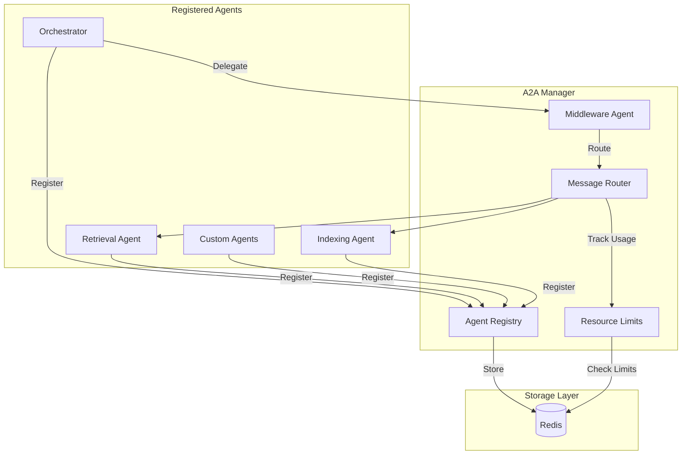

# A2A Protocol Guide

**Version:** 1.0
**Last Updated:** 2026-01-11
**Related Stories:** 22-A1, 22-A2

---

## Overview

A2A (Agent-to-Agent) is the internal protocol for agent delegation and collaboration within the Agentic RAG platform. It enables agents to discover capabilities, delegate tasks, and share context.

## Architecture



## Core Components

### Agent Registry

Manages agent registration and capability discovery.

```python
class A2AAgentRegistration(BaseModel):
    agent_id: str           # Unique identifier
    tenant_id: str          # Tenant scope
    capabilities: list[str] # Supported operations
    endpoint: str           # Callback URL
    metadata: dict          # Additional info
```

### Middleware Agent

Routes messages between agents with context preservation.

```python
class A2AMiddlewareAgent:
    async def delegate(
        self,
        capability: str,
        payload: dict,
        tenant_id: str,
        context: dict | None = None,
    ) -> AsyncIterator[A2AMessage]:
        """Delegate a task to an agent with the requested capability."""
```

### Resource Limits

Enforces per-tenant and per-session limits.

```python
class A2AResourceLimits(BaseModel):
    session_limit_per_tenant: int = 100    # Max concurrent sessions
    message_limit_per_session: int = 1000  # Max messages per session
    session_ttl_hours: int = 24            # Session expiration
    message_rate_limit: int = 60           # Messages per minute
```

## Capabilities

### Standard Capabilities

| Capability | Description | Agent |
|------------|-------------|-------|
| `QUERY` | Information retrieval | Retrieval Agent |
| `INGEST` | Document ingestion | Indexing Agent |
| `ANALYZE` | Data analysis | Analysis Agent |
| `SUMMARIZE` | Content summarization | Summarization Agent |

### Capability Discovery

```python
# Find agents with specific capability
agents = await registry.find_by_capability("QUERY", tenant_id)

# Get all capabilities for tenant
capabilities = await registry.list_capabilities(tenant_id)
```

## Message Format

### A2A Message Structure

```python
class A2AMessage(BaseModel):
    message_id: str
    sender_id: str
    recipient_id: str
    capability: str
    payload: dict
    context: dict | None
    timestamp: datetime
    tenant_id: str
```

### Delegation Request

```json
{
  "capability": "QUERY",
  "payload": {
    "query": "What is RAG?",
    "filters": {"source": "documentation"}
  },
  "context": {
    "session_id": "sess_abc123",
    "parent_task_id": "task_xyz"
  }
}
```

### Delegation Response

```json
{
  "status": "success",
  "result": {
    "answer": "RAG stands for...",
    "sources": [{"title": "...", "url": "..."}]
  },
  "agent_id": "retrieval-agent-1",
  "execution_time_ms": 450
}
```

## Resource Limits

### Limit Types

| Limit | Default | Description |
|-------|---------|-------------|
| `session_limit_per_tenant` | 100 | Max concurrent sessions |
| `message_limit_per_session` | 1000 | Max messages per session |
| `session_ttl_hours` | 24 | Session expiration |
| `message_rate_limit` | 60/min | Rate limit per session |

### Enforcement

```python
# Create resource manager
manager = A2AResourceManagerFactory.create(
    implementation="redis",
    redis_client=redis,
    limits=A2AResourceLimits(
        session_limit_per_tenant=50,
        message_rate_limit=30,
    ),
)

# Check before processing
if not await manager.check_and_increment(tenant_id, session_id):
    raise RateLimitError("Session limit exceeded")
```

### Redis Key Structure

```
a2a:sessions:{tenant_id}:{session_id}     # Session metadata
a2a:session_count:{tenant_id}             # Session counter
a2a:message_count:{tenant_id}:{session_id} # Message counter
a2a:rate_limit:{tenant_id}:{session_id}   # Rate limit window
```

## Configuration

### Environment Variables

```bash
# Enable A2A
A2A_ENABLED=true

# Default timeout for delegation
A2A_DEFAULT_TIMEOUT_SECONDS=30

# Maximum delegation depth (prevent cycles)
A2A_MAX_DELEGATION_DEPTH=3

# Resource limits
A2A_SESSION_LIMIT_PER_TENANT=100
A2A_MESSAGE_LIMIT_PER_SESSION=1000
A2A_SESSION_TTL_HOURS=24
A2A_MESSAGE_RATE_LIMIT=60

# Redis configuration
A2A_REDIS_URL=redis://localhost:6379/1
```

### Python Configuration

```python
# settings.py
class A2ASettings(BaseModel):
    enabled: bool = True
    default_timeout: int = 30
    max_delegation_depth: int = 3
    resource_limits: A2AResourceLimits = A2AResourceLimits()
```

## Code Examples

### Registering an Agent

```python
from agentic_rag_backend.protocols.a2a_registry import A2ARegistry

registry = A2ARegistry(redis_client)

await registry.register(
    A2AAgentRegistration(
        agent_id="retrieval-agent-1",
        tenant_id="tenant_abc",
        capabilities=["QUERY", "SUMMARIZE"],
        endpoint="http://internal:8001/invoke",
        metadata={"version": "1.0"},
    )
)
```

### Delegating a Task

```python
from agentic_rag_backend.protocols.a2a_middleware import A2AMiddlewareAgent

middleware = A2AMiddlewareAgent(registry, resource_manager)

async for message in middleware.delegate(
    capability="QUERY",
    payload={"query": "What is GraphRAG?"},
    tenant_id="tenant_abc",
    context={"session_id": "sess_123"},
):
    process_message(message)
```

### Handling Rate Limits

```python
from agentic_rag_backend.protocols.a2a_resource_limits import (
    A2AResourceManagerFactory,
)

manager = A2AResourceManagerFactory.create("redis", redis_client)

try:
    await manager.acquire_session(tenant_id, session_id)
    # Process messages
    for msg in messages:
        if not await manager.check_message_limit(tenant_id, session_id):
            raise RateLimitError("Message limit exceeded")
        await process(msg)
finally:
    await manager.release_session(tenant_id, session_id)
```

## Security Considerations

### SSRF Protection

The middleware validates all agent endpoints to prevent SSRF attacks:

```python
def is_safe_endpoint_url(url: str) -> bool:
    """Rejects:
    - Non-HTTP(S) schemes
    - Localhost variants
    - Private IP ranges (10.x, 192.168.x, 172.16-31.x)
    - Link-local and reserved addresses
    """
```

### Tenant Isolation

- Agent IDs are prefixed with tenant_id
- All queries include tenant_id filter
- Sessions are scoped to tenant

### Rate Limiting

- Per-session message limits prevent abuse
- Rate limiting prevents burst attacks
- Session TTL ensures cleanup

## Troubleshooting

### Agent Not Found

**Symptoms**: `A2AAgentNotFoundError` when delegating

**Causes**:
- Agent not registered
- Wrong tenant_id
- Agent registration expired

**Solutions**:
```python
# Verify registration
agents = await registry.list_agents(tenant_id)
print(f"Registered agents: {agents}")

# Re-register if needed
await registry.register(agent_config)
```

### Session Limit Exceeded

**Symptoms**: `SessionLimitExceeded` error

**Causes**:
- Too many concurrent sessions
- Sessions not being released

**Solutions**:
```python
# Check current usage
usage = await manager.get_tenant_usage(tenant_id)
print(f"Active sessions: {usage.active_sessions}")

# Force cleanup stale sessions
await manager.cleanup_expired_sessions(tenant_id)
```

### Rate Limit Exceeded

**Symptoms**: `RateLimitExceeded` error

**Causes**:
- Messages sent too quickly
- Rate limit too low for use case

**Solutions**:
```bash
# Increase rate limit
export A2A_MESSAGE_RATE_LIMIT=120

# Or implement backoff in client
```

### Circular Delegation

**Symptoms**: Stack overflow or timeout

**Causes**:
- Agent A delegates to B, B delegates back to A

**Solutions**:
```python
# Middleware tracks delegation depth
# MAX_DELEGATION_DEPTH prevents infinite loops

# Check logs for delegation chain
logger.info("delegation_chain", chain=context.get("delegation_path"))
```

## Prometheus Metrics

| Metric | Labels | Description |
|--------|--------|-------------|
| `a2a_delegations_total` | `tenant_id`, `capability` | Total delegations |
| `a2a_delegation_duration_seconds` | `tenant_id` | Delegation latency |
| `a2a_active_sessions` | `tenant_id` | Active sessions |
| `a2a_rate_limit_rejections_total` | `tenant_id` | Rate limit hits |

## Related Documentation

- [Overview](./overview.md)
- [AG-UI Protocol](./ag-ui-protocol.md)
- [MCP Integration](./mcp-integration.md)
