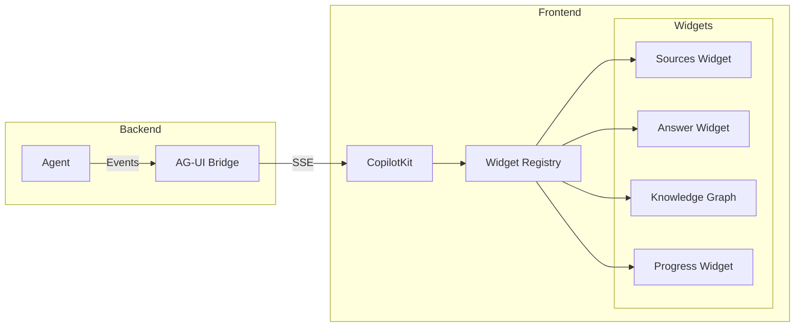
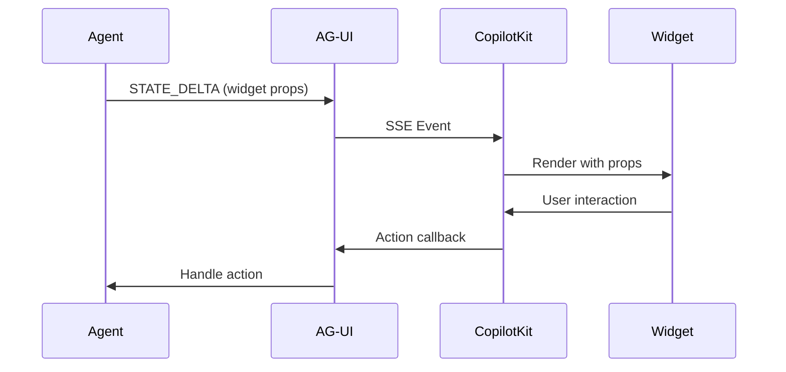

# A2UI Widgets Guide

**Version:** 1.0
**Last Updated:** 2026-01-11
**Related Epic:** 21-D

---

## Overview

A2UI (Agent-to-UI) widgets are CopilotKit-powered React components that enable agents to render interactive UI elements within the chat interface. They provide a rich, type-safe way to display structured data and collect user input.

## Architecture



## Built-in Widgets

### Sources Widget

Displays source citations for answers.

```typescript
interface SourcesWidgetProps {
  sources: Array<{
    title: string;
    url: string;
    snippet: string;
    relevance: number;
  }>;
  onSourceClick?: (url: string) => void;
}
```

**Usage:**
```python
# Backend: Emit sources event
events = create_show_sources_events(sources=[
    {"title": "RAG Guide", "url": "...", "snippet": "...", "relevance": 0.95}
])
for event in events:
    yield event
```

### Answer Widget

Displays formatted answers with citations.

```typescript
interface AnswerWidgetProps {
  answer: string;
  sources: Source[];
  confidence: number;
  timestamp: string;
}
```

**Usage:**
```python
# Backend: Emit answer event
events = create_show_answer_events(
    answer="RAG stands for...",
    sources=sources,
    confidence=0.92,
)
```

### Knowledge Graph Widget

Displays interactive knowledge graph visualization.

```typescript
interface KnowledgeGraphWidgetProps {
  nodes: Array<{
    id: string;
    label: string;
    type: string;
    properties: Record<string, unknown>;
  }>;
  edges: Array<{
    source: string;
    target: string;
    type: string;
    properties: Record<string, unknown>;
  }>;
  onNodeClick?: (nodeId: string) => void;
}
```

**Usage:**
```python
# Backend: Emit knowledge graph event
events = create_show_knowledge_graph_events(
    nodes=graph_nodes,
    edges=graph_edges,
)
```

### Progress Widget

Displays task progress.

```typescript
interface ProgressWidgetProps {
  label: string;
  value: number;  // 0-100
  status: "pending" | "in_progress" | "completed" | "error";
}
```

## Widget Registration

### Frontend Registration

```typescript
// components/copilot/widget-registry.ts
import { useCopilotWidgets } from "@copilotkit/react-ui";

export function registerWidgets() {
  useCopilotWidgets([
    {
      name: "sources",
      component: SourcesWidget,
      description: "Display source citations",
    },
    {
      name: "answer",
      component: AnswerWidget,
      description: "Display formatted answer",
    },
    {
      name: "knowledge-graph",
      component: KnowledgeGraphWidget,
      description: "Display knowledge graph",
    },
  ]);
}
```

### Backend Event Creation

```python
# protocols/a2ui.py
from agentic_rag_backend.models.copilot import AGUIEvent, AGUIEventType

def create_widget_event(
    widget_name: str,
    props: dict,
) -> AGUIEvent:
    """Create AG-UI event for widget rendering."""
    return AGUIEvent(
        event=AGUIEventType.STATE_DELTA,
        data={
            "delta": [{
                "op": "add",
                "path": f"/widgets/{widget_name}",
                "value": props,
            }]
        },
    )
```

## Configuration

### Environment Variables

```bash
# Enable A2UI widgets
A2UI_WIDGETS_ENABLED=true

# Widget configuration
A2UI_MAX_SOURCES_DISPLAYED=10
A2UI_KNOWLEDGE_GRAPH_MAX_NODES=50
```

### Frontend Configuration

```typescript
// copilot-config.ts
export const copilotConfig = {
  widgets: {
    enabled: true,
    maxSourcesDisplayed: 10,
    knowledgeGraph: {
      maxNodes: 50,
      layout: "force-directed",
    },
  },
};
```

## Code Examples

### Creating Sources Widget

```python
# In agent code
async def process_query(query: str, tenant_id: str):
    # Retrieve sources
    sources = await retrieval.search(query, tenant_id)

    # Emit sources widget
    for event in create_show_sources_events(sources):
        yield event

    # Generate answer
    answer = await generate_answer(query, sources)

    # Emit answer widget
    for event in create_show_answer_events(answer, sources):
        yield event
```

### Rendering Knowledge Graph

```python
async def show_entity_graph(entity: str, tenant_id: str):
    # Get graph data
    nodes, edges = await graphiti.get_entity_graph(entity)

    # Emit knowledge graph widget
    for event in create_show_knowledge_graph_events(nodes, edges):
        yield event
```

### Custom Widget

```typescript
// components/widgets/CustomWidget.tsx
interface CustomWidgetProps {
  data: any;
  onAction: (action: string) => void;
}

export function CustomWidget({ data, onAction }: CustomWidgetProps) {
  return (
    <div className="custom-widget">
      <h3>{data.title}</h3>
      <p>{data.description}</p>
      <Button onClick={() => onAction("confirm")}>
        Confirm
      </Button>
    </div>
  );
}

// Register
useCopilotWidgets([
  {
    name: "custom",
    component: CustomWidget,
    description: "Custom action widget",
  },
]);
```

## Widget Events

### Event Flow



### Event Types

| Event | Purpose |
|-------|---------|
| `STATE_DELTA` | Add/update widget |
| `STATE_SNAPSHOT` | Full state with widgets |
| `ACTION_REQUEST` | Request user action |

## Security Considerations

1. **XSS Prevention**: Widget props sanitized before rendering
2. **URL Validation**: Source URLs validated before display
3. **Content Limits**: Maximum sources/nodes enforced
4. **Action Validation**: User actions validated against allowed list

## Troubleshooting

### Widget Not Rendering

**Symptoms**: Event received but widget doesn't appear

**Causes**:
- Widget not registered
- Invalid props shape
- Missing CSS styles

**Solutions**:
```typescript
// Verify registration
console.log(copilot.getRegisteredWidgets());

// Check props validation
if (!validateWidgetProps(props)) {
  console.error("Invalid widget props", props);
}
```

### Widget State Not Updating

**Symptoms**: Widget shows stale data

**Causes**:
- STATE_DELTA not applied
- Key prop missing

**Solutions**:
```python
# Ensure unique keys for list items
events = create_show_sources_events(
    sources=sources,
    key=f"sources-{query_id}",  # Unique key
)
```

### Knowledge Graph Performance

**Symptoms**: Slow rendering with many nodes

**Solutions**:
```python
# Limit nodes
events = create_show_knowledge_graph_events(
    nodes=nodes[:50],  # Limit to 50 nodes
    edges=edges[:100],  # Limit edges
)
```

## Accessibility

- All widgets implement ARIA attributes
- Keyboard navigation for interactive elements
- Screen reader support for data tables
- High contrast mode support

## Related Documentation

- [Overview](./overview.md)
- [AG-UI Protocol](./ag-ui-protocol.md)
- [Open-JSON-UI](./open-json-ui.md)
