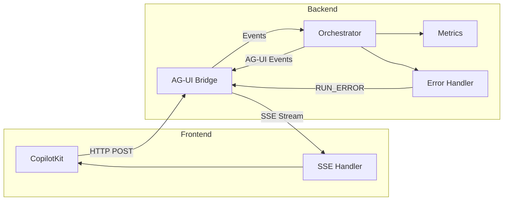

# AG-UI Protocol Guide

**Version:** 1.0
**Last Updated:** 2026-01-11
**Related Stories:** 21-D, 22-B1, 22-B2

---

## Overview

AG-UI (Agent-UI) is the event streaming protocol used between the CopilotKit frontend and the FastAPI backend. It enables real-time, bidirectional communication for AI agent interactions.

## Architecture



## Event Types

### Core Events

| Event Type | Description | Payload |
|------------|-------------|---------|
| `RUN_STARTED` | Stream initialized | `{ run_id: string }` |
| `RUN_FINISHED` | Stream completed | `{ run_id: string }` |
| `RUN_ERROR` | Error occurred | `{ code, message, retry_after? }` |

### Text Events

| Event Type | Description | Payload |
|------------|-------------|---------|
| `TEXT_MESSAGE_START` | Message begins | `{ message_id: string }` |
| `TEXT_MESSAGE_CONTENT` | Incremental text | `{ delta: string }` |
| `TEXT_MESSAGE_END` | Message complete | `{ message_id: string }` |

### Tool Events

| Event Type | Description | Payload |
|------------|-------------|---------|
| `TOOL_CALL_START` | Tool execution begins | `{ tool_call_id, name }` |
| `TOOL_CALL_ARGS` | Tool arguments | `{ args_delta: string }` |
| `TOOL_CALL_END` | Tool complete | `{ result: any }` |

### State Events

| Event Type | Description | Payload |
|------------|-------------|---------|
| `STATE_SNAPSHOT` | Full state | `{ state: object }` |
| `STATE_DELTA` | State patch | `{ delta: JSONPatch[] }` |
| `MESSAGES_SNAPSHOT` | Full messages | `{ messages: Message[] }` |

## Error Codes

AG-UI defines standardized error codes aligned with RFC 7807:

| Code | HTTP Status | Description |
|------|-------------|-------------|
| `AGENT_EXECUTION_ERROR` | 500 | Unhandled agent exception |
| `TENANT_REQUIRED` | 401 | Missing tenant_id header |
| `TENANT_UNAUTHORIZED` | 403 | Invalid tenant_id |
| `SESSION_NOT_FOUND` | 404 | Invalid session reference |
| `RATE_LIMITED` | 429 | Rate limit exceeded |
| `TIMEOUT` | 504 | Request timeout |
| `INVALID_REQUEST` | 400 | Malformed request |
| `CAPABILITY_NOT_FOUND` | 404 | Unknown capability |
| `UPSTREAM_ERROR` | 502 | External service failure |
| `SERVICE_UNAVAILABLE` | 503 | System overloaded |

### Error Event Structure

```python
class AGUIErrorEvent:
    event: Literal["RUN_ERROR"]
    code: AGUIErrorCode
    message: str
    http_status: int
    retry_after: int | None  # Seconds until retry (for RATE_LIMITED)
    details: dict | None     # Debug info (when DEBUG=true)
```

## Prometheus Metrics

### Counters

| Metric | Labels | Description |
|--------|--------|-------------|
| `agui_stream_started_total` | `tenant_id` | Streams started |
| `agui_stream_completed_total` | `tenant_id`, `status` | Streams completed |
| `agui_event_emitted_total` | `tenant_id`, `event_type` | Events emitted |
| `agui_stream_bytes_total` | `tenant_id` | Bytes streamed |

### Gauges

| Metric | Labels | Description |
|--------|--------|-------------|
| `agui_active_streams` | `tenant_id` | Currently active streams |

### Histograms

| Metric | Labels | Buckets | Description |
|--------|--------|---------|-------------|
| `agui_stream_duration_seconds` | `tenant_id` | 0.1-300s | Stream duration |
| `agui_event_latency_seconds` | `tenant_id` | 0.001-1s | Inter-event latency |
| `agui_stream_event_count` | `tenant_id` | 1-1000 | Events per stream |

## Configuration

### Environment Variables

```bash
# Stream timeout (default: 300 seconds)
AGUI_STREAM_TIMEOUT_SECONDS=300

# Maximum events per stream (default: 1000)
AGUI_MAX_EVENTS_PER_STREAM=1000

# Enable debug mode for error details
DEBUG=false

# Prometheus metrics prefix
METRICS_PREFIX=agentic_rag
```

### Python Configuration

```python
# settings.py
class AGUISettings:
    stream_timeout: int = 300
    max_events_per_stream: int = 1000
    enable_metrics: bool = True
```

## Code Examples

### Creating Error Events

```python
from agentic_rag_backend.protocols.ag_ui_errors import (
    AGUIErrorCode,
    create_error_event,
)

# From exception
try:
    await orchestrator.process()
except Exception as e:
    error_event = create_error_event(e)
    yield error_event

# Rate limit with retry
error_event = create_error_event(
    RateLimitError("Too many requests"),
    retry_after=60,
)
```

### Tracking Metrics

```python
from agentic_rag_backend.protocols.ag_ui_metrics import track_agui_stream

async def stream_events(tenant_id: str):
    async with track_agui_stream(tenant_id) as metrics:
        for event in generate_events():
            metrics.event_emitted(
                event.event.value,
                len(event.to_sse())
            )
            yield event
```

### Frontend Event Handling

```typescript
// CopilotKit event handler
import { useCopilotChat } from "@copilotkit/react-core";

function ChatComponent() {
  const { events } = useCopilotChat({
    onError: (error) => {
      if (error.code === "RATE_LIMITED" && error.retry_after) {
        // Retry after specified seconds
        setTimeout(() => retry(), error.retry_after * 1000);
      }
    },
    onToolCall: (toolCall) => {
      console.log("Tool called:", toolCall.name);
    },
  });
}
```

## Security Considerations

1. **Tenant Isolation**: All streams include tenant_id for isolation
2. **Rate Limiting**: `RATE_LIMITED` error prevents abuse
3. **Input Validation**: Messages validated via Pydantic schemas
4. **Timeout Protection**: Streams terminated after timeout
5. **Error Sanitization**: Debug details only shown when `DEBUG=true`

## Troubleshooting

### Stream Disconnects Early

**Symptoms**: Stream ends before completion

**Causes**:
- Timeout exceeded
- Network interruption
- Server restart

**Solutions**:
```bash
# Increase timeout
export AGUI_STREAM_TIMEOUT_SECONDS=600

# Enable keep-alive
export UVICORN_KEEP_ALIVE=300
```

### Events Not Reaching Frontend

**Symptoms**: Backend logs events but frontend doesn't receive

**Causes**:
- SSE parsing errors
- Proxy buffering

**Solutions**:
```nginx
# Nginx: Disable buffering for SSE
location /api/v1/copilot {
    proxy_buffering off;
    proxy_cache off;
    proxy_read_timeout 300s;
}
```

### High Metric Cardinality

**Symptoms**: Prometheus high memory usage

**Causes**:
- Unknown event types creating labels

**Solutions**:
- AG-UI automatically maps unknown types to "OTHER"
- Check KNOWN_EVENT_TYPES in ag_ui_metrics.py

### Missing Metrics

**Symptoms**: Metrics not appearing in Prometheus

**Causes**:
- Registry not initialized
- Metrics endpoint not exposed

**Solutions**:
```python
# Verify metrics endpoint
from agentic_rag_backend.observability.metrics import get_metrics_registry

registry = get_metrics_registry()
# Metrics should be available at /metrics
```

## API Reference

### Endpoint

```
POST /api/v1/copilot/stream
Content-Type: application/json
X-Tenant-ID: {tenant_id}

Response: text/event-stream
```

### Request Body

```json
{
  "messages": [
    {"role": "user", "content": "Hello"}
  ],
  "config": {
    "model": "gpt-4",
    "temperature": 0.7
  }
}
```

### SSE Response Format

```
event: RUN_STARTED
data: {"run_id": "abc123"}

event: TEXT_MESSAGE_CONTENT
data: {"delta": "Hello"}

event: RUN_FINISHED
data: {"run_id": "abc123"}
```

## Related Documentation

- [Overview](./overview.md)
- [A2A Protocol](./a2a-protocol.md)
- [MCP Integration](./mcp-integration.md)
