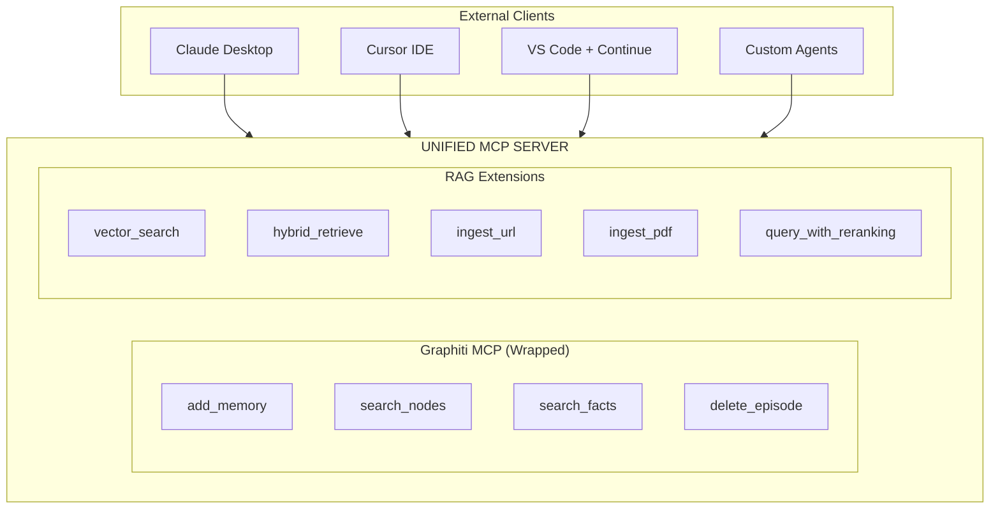

# MCP Integration Guide

**Version:** 1.0
**Last Updated:** 2026-01-11
**Related Epics:** 7, 14

---

## Overview

MCP (Model Context Protocol) is an open protocol for connecting AI models to external tools and data sources. The Agentic RAG platform implements MCP for tool execution and integrates with Graphiti's built-in MCP server.

## Architecture



## Tool Categories

### Graphiti Tools (Graph Operations)

| Tool | Description | Parameters |
|------|-------------|------------|
| `add_memory` | Add content to knowledge graph | `content`, `source` |
| `search_nodes` | Search graph nodes | `query`, `limit` |
| `search_facts` | Search graph facts | `query`, `limit` |
| `delete_episode` | Delete episode from graph | `episode_id` |
| `clear_graph` | Clear entire graph | - |

### RAG Extension Tools

| Tool | Description | Parameters |
|------|-------------|------------|
| `vector_search` | Semantic vector search | `query`, `top_k`, `filters` |
| `hybrid_retrieve` | Combined graph + vector | `query`, `top_k`, `alpha` |
| `ingest_url` | Ingest URL content | `url`, `crawl_depth` |
| `ingest_pdf` | Ingest PDF document | `file_path` |
| `query_with_reranking` | Query with result reranking | `query`, `reranker` |
| `explain_answer` | Explain answer sources | `answer_id` |

## Tool Definition

### Schema Format

```json
{
  "name": "vector_search",
  "description": "Perform semantic search on document vectors",
  "input_schema": {
    "type": "object",
    "properties": {
      "query": {
        "type": "string",
        "description": "Search query"
      },
      "top_k": {
        "type": "integer",
        "default": 10,
        "description": "Number of results"
      },
      "filters": {
        "type": "object",
        "description": "Optional filters"
      }
    },
    "required": ["query"]
  }
}
```

### Python Implementation

```python
from agentic_rag_backend.protocols.mcp import MCPTool, MCPToolRegistry

@MCPTool(
    name="vector_search",
    description="Perform semantic search on document vectors",
)
async def vector_search(
    query: str,
    top_k: int = 10,
    filters: dict | None = None,
    tenant_id: str = Depends(get_tenant_id),
) -> list[SearchResult]:
    """Execute semantic vector search."""
    return await retrieval.vector_search(
        query=query,
        top_k=top_k,
        filters=filters,
        tenant_id=tenant_id,
    )
```

## Configuration

### Environment Variables

```bash
# Enable MCP server
MCP_SERVER_ENABLED=true

# Server configuration
MCP_SERVER_HOST=0.0.0.0
MCP_SERVER_PORT=3001

# Tool timeout (milliseconds)
MCP_TOOL_TIMEOUT_MS=30000

# Graphiti integration
GRAPHITI_MCP_ENABLED=true

# Tool discovery
MCP_TOOL_DISCOVERY_ENABLED=true
```

### Server Configuration

```python
# mcp_config.py
class MCPServerConfig(BaseModel):
    enabled: bool = True
    host: str = "0.0.0.0"
    port: int = 3001
    tool_timeout_ms: int = 30000
    graphiti_enabled: bool = True
```

## Tool Registration

### Automatic Registration

```python
from agentic_rag_backend.protocols.mcp import MCPToolRegistry

registry = MCPToolRegistry()

# Register all tools in module
registry.register_module("agentic_rag_backend.tools.retrieval")

# Register individual tool
registry.register(vector_search_tool)
```

### Manual Registration

```python
from agentic_rag_backend.protocols.mcp import MCPTool

tool = MCPTool(
    name="custom_tool",
    description="Custom tool description",
    handler=custom_handler,
    input_schema={
        "type": "object",
        "properties": {
            "param1": {"type": "string"}
        },
        "required": ["param1"]
    }
)

registry.register(tool)
```

## Tool Invocation

### Request Format

```json
{
  "jsonrpc": "2.0",
  "method": "tools/call",
  "params": {
    "name": "vector_search",
    "arguments": {
      "query": "What is RAG?",
      "top_k": 5
    }
  },
  "id": 1
}
```

### Response Format

```json
{
  "jsonrpc": "2.0",
  "result": {
    "content": [
      {
        "type": "text",
        "text": "Found 5 results..."
      }
    ]
  },
  "id": 1
}
```

## Error Handling

### Error Types

| Error | Description | HTTP Status |
|-------|-------------|-------------|
| `ToolNotFound` | Unknown tool name | 404 |
| `InvalidInput` | Schema validation failed | 400 |
| `ToolTimeout` | Execution timeout | 504 |
| `ToolError` | Tool execution failed | 500 |

### Error Response

```json
{
  "jsonrpc": "2.0",
  "error": {
    "code": -32602,
    "message": "Invalid params",
    "data": {
      "details": "Missing required parameter: query"
    }
  },
  "id": 1
}
```

## Code Examples

### Invoking Tools from Agent

```python
from agentic_rag_backend.protocols.mcp import MCPClient

client = MCPClient("http://localhost:3001")

# Invoke tool
result = await client.invoke_tool(
    name="vector_search",
    arguments={"query": "GraphRAG benefits", "top_k": 5},
)

# Process results
for item in result.content:
    print(item.text)
```

### Implementing Custom Tool

```python
from agentic_rag_backend.protocols.mcp import MCPTool, MCPToolResult

@MCPTool(
    name="analyze_sentiment",
    description="Analyze sentiment of text",
)
async def analyze_sentiment(text: str) -> MCPToolResult:
    """Analyze text sentiment."""
    # Implementation
    sentiment = await sentiment_analyzer.analyze(text)

    return MCPToolResult(
        content=[{
            "type": "text",
            "text": f"Sentiment: {sentiment.label} ({sentiment.score:.2f})"
        }]
    )
```

### Tool with Resource Access

```python
@MCPTool(
    name="query_database",
    description="Query the knowledge database",
    resources=["database:read"],
)
async def query_database(
    sql: str,
    tenant_id: str = Depends(get_tenant_id),
) -> MCPToolResult:
    """Execute database query with tenant isolation."""
    # Tenant isolation enforced
    results = await db.execute(sql, tenant_id=tenant_id)
    return MCPToolResult.from_data(results)
```

## Security Considerations

### Input Validation

- All tool inputs validated against JSON Schema
- Pydantic models enforce type safety
- SQL injection prevented via parameterized queries

### Tenant Isolation

- Tools receive tenant_id from request context
- All queries scoped by tenant_id
- Cross-tenant access prevented

### Timeout Protection

```python
async with asyncio.timeout(MCP_TOOL_TIMEOUT_MS / 1000):
    result = await tool.execute(arguments)
```

### Audit Logging

```python
logger.info(
    "mcp_tool_invoked",
    tool=tool_name,
    tenant_id=tenant_id,
    arguments=sanitized_args,
    duration_ms=duration,
)
```

## Troubleshooting

### Tool Not Found

**Symptoms**: `ToolNotFound` error

**Causes**:
- Tool not registered
- Server not started
- Wrong tool name

**Solutions**:
```python
# List registered tools
tools = await client.list_tools()
print(f"Available tools: {[t.name for t in tools]}")

# Verify registration
if not registry.has_tool("vector_search"):
    registry.register(vector_search_tool)
```

### Timeout Errors

**Symptoms**: `ToolTimeout` after 30 seconds

**Causes**:
- Long-running operation
- Database connection issues
- External API slow

**Solutions**:
```bash
# Increase timeout
export MCP_TOOL_TIMEOUT_MS=60000

# Or optimize the tool implementation
```

### Invalid Input

**Symptoms**: `InvalidInput` error with schema details

**Causes**:
- Missing required parameters
- Wrong parameter types
- Schema mismatch

**Solutions**:
```python
# Validate before calling
from jsonschema import validate
validate(arguments, tool.input_schema)
```

## Client Configuration

### Claude Desktop

```json
{
  "mcpServers": {
    "agentic-rag": {
      "url": "http://localhost:3001",
      "transport": "http"
    }
  }
}
```

### Cursor IDE

```json
{
  "mcp": {
    "servers": [
      {
        "name": "agentic-rag",
        "url": "http://localhost:3001"
      }
    ]
  }
}
```

## Prometheus Metrics

| Metric | Labels | Description |
|--------|--------|-------------|
| `mcp_tool_calls_total` | `tool`, `status` | Tool invocations |
| `mcp_tool_duration_seconds` | `tool` | Execution time |
| `mcp_tool_errors_total` | `tool`, `error_type` | Tool errors |

## Related Documentation

- [Overview](./overview.md)
- [MCP Wrapper Architecture](../mcp-wrapper-architecture.md)
- [AG-UI Protocol](./ag-ui-protocol.md)
