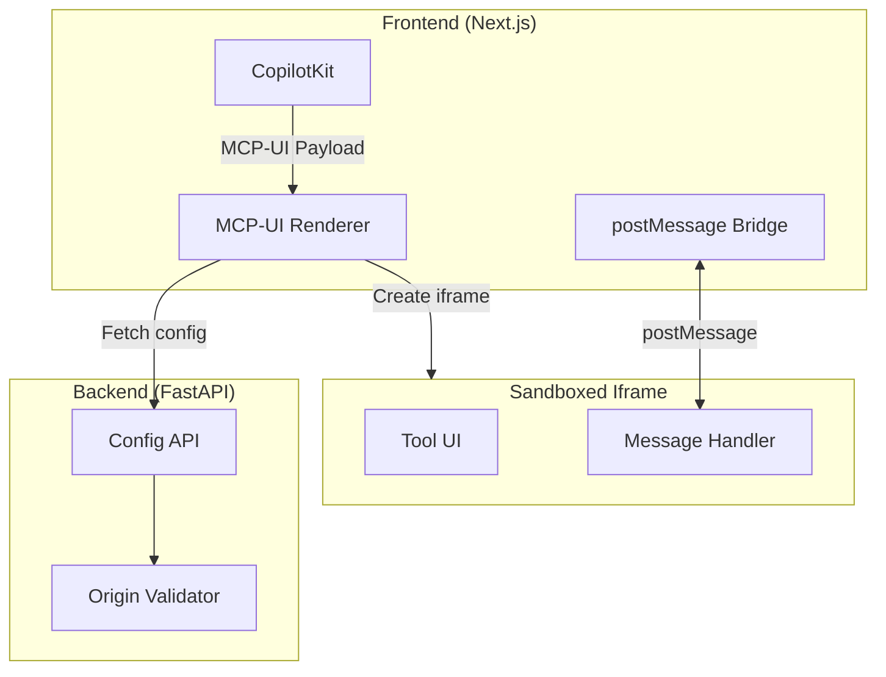

# MCP-UI Rendering Guide

**Version:** 1.0
**Last Updated:** 2026-01-11
**Related Story:** 22-C1

---

## Overview

MCP-UI enables secure rendering of external tool UIs within iframes. It implements strict security controls including origin validation, Content Security Policy (CSP), and a postMessage bridge for cross-origin communication.

## Architecture



## Security Model

### Iframe Sandboxing

All MCP-UI iframes use restrictive sandbox attributes:

```html
<iframe
  src="https://trusted-origin.com/tool-ui"
  sandbox="allow-scripts allow-forms allow-same-origin"
  referrerpolicy="strict-origin-when-cross-origin"
/>
```

**Sandbox Attributes:**
- `allow-scripts`: Required for interactive UIs
- `allow-forms`: Required for form submissions
- `allow-same-origin`: Required for postMessage origin validation
- **NOT included**: `allow-top-navigation`, `allow-popups`, `allow-modals`

### Origin Allowlist

Origins are validated against a configurable allowlist:

```python
# Backend configuration
MCP_UI_ALLOWED_ORIGINS = [
    "https://trusted-tool.example.com",
    "https://verified-partner.com",
]
```

### PostMessage Validation

All postMessage payloads are validated using Zod schemas:

```typescript
const MCPUIMessageSchema = z.discriminatedUnion("type", [
  z.object({
    type: z.literal("mcp_ui_resize"),
    width: z.number().min(100).max(4000),
    height: z.number().min(50).max(4000),
  }),
  z.object({
    type: z.literal("mcp_ui_result"),
    result: z.unknown(),
  }),
  z.object({
    type: z.literal("mcp_ui_error"),
    error: z.string(),
  }),
]);
```

## Configuration

### Environment Variables

```bash
# Enable MCP-UI rendering
MCP_UI_ENABLED=true

# Comma-separated allowed origins
NEXT_PUBLIC_MCP_UI_ALLOWED_ORIGINS=https://trusted1.com,https://trusted2.com

# Backend API URL
NEXT_PUBLIC_API_URL=http://localhost:8000/api/v1
```

### Backend Configuration

```python
# config.py
class MCPUIConfig(BaseModel):
    enabled: bool = True
    allowed_origins: list[str] = []
    max_iframe_width: int = 800
    max_iframe_height: int = 600
```

### API Endpoint

```python
# GET /api/v1/mcp/ui/config
@router.get("/mcp/ui/config")
async def get_mcp_ui_config(
    tenant_id: str = Header(..., alias="X-Tenant-ID"),
) -> MCPUIConfig:
    """Return MCP-UI configuration for tenant."""
    return MCPUIConfig(
        enabled=settings.MCP_UI_ENABLED,
        allowed_origins=settings.MCP_UI_ALLOWED_ORIGINS,
    )
```

## PostMessage Protocol

### Message Types

| Type | Direction | Description |
|------|-----------|-------------|
| `mcp_ui_resize` | Iframe -> Parent | Request size change |
| `mcp_ui_result` | Iframe -> Parent | Return tool result |
| `mcp_ui_error` | Iframe -> Parent | Report error |

### Resize Message

```json
{
  "type": "mcp_ui_resize",
  "width": 600,
  "height": 400
}
```

### Result Message

```json
{
  "type": "mcp_ui_result",
  "result": {
    "selected": ["item1", "item2"],
    "confirmed": true
  }
}
```

### Error Message

```json
{
  "type": "mcp_ui_error",
  "error": "User cancelled operation"
}
```

## Code Examples

### Using the Renderer

```tsx
import { MCPUIRenderer } from "@/components/mcp-ui";

function ToolUIContainer({ payload }) {
  const handleResult = (result: unknown) => {
    console.log("Tool result:", result);
    // Process result
  };

  const handleError = (error: string) => {
    console.error("Tool error:", error);
    // Handle error
  };

  return (
    <MCPUIRenderer
      payload={payload}
      tenantId={tenantId}
      onResult={handleResult}
      onError={handleError}
    />
  );
}
```

### PostMessage Bridge Hook

```tsx
import { useMCPUIBridge } from "@/components/mcp-ui";

function MCPUIComponent({ iframeUrl, allowedOrigins }) {
  const { iframeRef, dimensions, result, error } = useMCPUIBridge({
    allowedOrigins,
    onResult: (r) => processResult(r),
    onError: (e) => handleError(e),
  });

  return (
    <iframe
      ref={iframeRef}
      src={iframeUrl}
      style={{ width: dimensions.width, height: dimensions.height }}
      sandbox="allow-scripts allow-forms allow-same-origin"
    />
  );
}
```

### Implementing Tool UI (External)

```html
<!-- External tool UI (tool-ui.html) -->
<script>
  // Resize notification
  function notifyResize() {
    parent.postMessage({
      type: "mcp_ui_resize",
      width: document.body.scrollWidth,
      height: document.body.scrollHeight,
    }, "https://your-app.com");
  }

  // Submit result
  function submitResult(data) {
    parent.postMessage({
      type: "mcp_ui_result",
      result: data,
    }, "https://your-app.com");
  }

  // Report error
  function reportError(message) {
    parent.postMessage({
      type: "mcp_ui_error",
      error: message,
    }, "https://your-app.com");
  }
</script>
```

### Origin Validation

```typescript
// lib/mcp-ui-security.ts
export function validateMCPUIMessage(
  event: MessageEvent,
  allowedOrigins: Set<string>,
): MCPUIMessage | null {
  // Validate origin
  if (!allowedOrigins.has(event.origin)) {
    console.warn("MCP-UI: Blocked message from untrusted origin", event.origin);
    return null;
  }

  // Validate message shape
  const result = MCPUIMessageSchema.safeParse(event.data);
  if (!result.success) {
    console.warn("MCP-UI: Invalid message shape", result.error);
    return null;
  }

  return result.data;
}
```

## Security Considerations

### SSRF Prevention

Tool UI URLs are validated before rendering:
- Must use HTTPS (except localhost in development)
- Must be in allowed origins list
- Private IP ranges blocked

### XSS Prevention

- Iframe sandbox restricts JavaScript capabilities
- PostMessage payloads validated via Zod schema
- No innerHTML or dangerouslySetInnerHTML

### CSP Configuration

Recommended Content Security Policy for MCP-UI:

```
Content-Security-Policy:
  frame-src https://trusted1.com https://trusted2.com;
  frame-ancestors 'self';
  script-src 'self';
```

### Clickjacking Prevention

```
X-Frame-Options: SAMEORIGIN
```

## Troubleshooting

### Iframe Blocked

**Symptoms**: Iframe doesn't load, browser console shows blocked frame

**Causes**:
- Origin not in allowlist
- CSP blocking frame-src
- X-Frame-Options on target

**Solutions**:
```bash
# Add origin to allowlist
export NEXT_PUBLIC_MCP_UI_ALLOWED_ORIGINS=https://trusted.com,https://new-trusted.com

# Verify CSP headers
curl -I https://your-app.com | grep -i content-security
```

### PostMessage Not Received

**Symptoms**: Messages sent but not received

**Causes**:
- Wrong target origin
- Origin mismatch
- Schema validation failing

**Solutions**:
```javascript
// Debug messages
window.addEventListener("message", (e) => {
  console.log("Received message:", e.origin, e.data);
});

// Check origin in tool UI
console.log("Parent origin:", document.referrer);
```

### Size Not Updating

**Symptoms**: Iframe stays at default size

**Causes**:
- resize message malformed
- Dimensions out of bounds (100-4000)

**Solutions**:
```javascript
// Validate dimensions before sending
const width = Math.min(Math.max(100, actualWidth), 4000);
const height = Math.min(Math.max(50, actualHeight), 4000);
```

### CORS Errors

**Symptoms**: Cross-origin errors in console

**Causes**:
- Tool UI server missing CORS headers
- Wrong origin in postMessage

**Solutions**:
```nginx
# Tool UI server configuration
add_header Access-Control-Allow-Origin "https://your-app.com";
add_header Access-Control-Allow-Methods "GET, POST, OPTIONS";
```

## Payload Structure

### MCP-UI Payload

```typescript
interface MCPUIPayload {
  type: "mcp_ui";
  url: string;          // Tool UI URL
  title?: string;       // Optional title
  width?: number;       // Initial width (default: 400)
  height?: number;      // Initial height (default: 300)
  metadata?: Record<string, unknown>;
}
```

### Example Payload

```json
{
  "type": "mcp_ui",
  "url": "https://tool.example.com/file-picker",
  "title": "Select Files",
  "width": 600,
  "height": 400,
  "metadata": {
    "allowed_types": ["pdf", "docx"],
    "max_files": 5
  }
}
```

## Related Documentation

- [Overview](./overview.md)
- [MCP Integration](./mcp-integration.md)
- [Open-JSON-UI](./open-json-ui.md)
- [Frontend Security Checklist](../../checklists/frontend-security-checklist.md)
