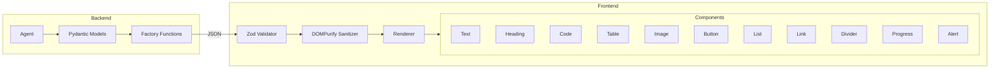

# Open-JSON-UI Guide

**Version:** 1.0.0-internal
**Last Updated:** 2026-01-11
**Related Story:** 22-C2

---

## Overview

Open-JSON-UI is an internal specification for declarative UI rendering, inspired by OpenAI patterns. It enables agents to return structured JSON payloads that render as rich, interactive UI components without requiring external iframes.

## Architecture



## Component Types

### Text

Plain text block with optional styling.

```json
{
  "type": "text",
  "content": "Hello, world!",
  "style": "normal"  // normal | muted | error | success
}
```

### Heading

Section headers (h1-h6).

```json
{
  "type": "heading",
  "level": 2,
  "content": "Section Title"
}
```

### Code

Syntax-highlighted code block.

```json
{
  "type": "code",
  "content": "const x = 42;",
  "language": "javascript"  // optional
}
```

### Table

Data table with headers and rows.

```json
{
  "type": "table",
  "headers": ["Name", "Value", "Status"],
  "rows": [
    ["Item 1", "100", "Active"],
    ["Item 2", "200", "Pending"]
  ],
  "caption": "Summary table"  // optional
}
```

### Image

Image with alt text.

```json
{
  "type": "image",
  "src": "https://example.com/image.png",
  "alt": "Description of image",
  "width": 400,   // optional
  "height": 300   // optional
}
```

### Button

Interactive action button.

```json
{
  "type": "button",
  "label": "Click Me",
  "action": "confirm_action",
  "variant": "default"  // default | destructive | outline | ghost | secondary
}
```

### List

Ordered or unordered list.

```json
{
  "type": "list",
  "items": ["First item", "Second item", "Third item"],
  "ordered": false  // true for numbered list
}
```

### Link

Hyperlink with target control.

```json
{
  "type": "link",
  "text": "Learn more",
  "href": "https://example.com/docs",
  "target": "_blank"  // _self | _blank
}
```

### Divider

Horizontal rule separator.

```json
{
  "type": "divider"
}
```

### Progress

Progress bar indicator.

```json
{
  "type": "progress",
  "value": 75,       // 0-100
  "label": "Upload progress"  // optional
}
```

### Alert

Notification box.

```json
{
  "type": "alert",
  "title": "Warning",  // optional
  "description": "This action cannot be undone.",
  "variant": "warning"  // default | destructive | warning | success
}
```

## Payload Structure

### Full Payload

```json
{
  "type": "open_json_ui",
  "components": [
    { "type": "heading", "level": 1, "content": "Results" },
    { "type": "text", "content": "Found 3 items", "style": "muted" },
    { "type": "divider" },
    { "type": "table", "headers": ["Name", "Score"], "rows": [...] },
    { "type": "button", "label": "Export", "action": "export_results" }
  ]
}
```

## Schema Validation

### Frontend (Zod)

```typescript
import { z } from "zod";

const TextComponentSchema = z.object({
  type: z.literal("text"),
  content: z.string(),
  style: z.enum(["normal", "muted", "error", "success"]).optional(),
});

const OpenJSONUIComponentSchema = z.discriminatedUnion("type", [
  TextComponentSchema,
  HeadingComponentSchema,
  CodeComponentSchema,
  // ... all component schemas
]);

const OpenJSONUIPayloadSchema = z.object({
  type: z.literal("open_json_ui"),
  components: z.array(OpenJSONUIComponentSchema),
});
```

### Backend (Pydantic)

```python
from pydantic import BaseModel
from typing import Literal

class OpenJSONUIText(BaseModel):
    type: Literal["text"] = "text"
    content: str
    style: str | None = None

class OpenJSONUIPayload(BaseModel):
    type: str = "open_json_ui"
    components: list[dict]
```

## Sanitization

All text content is sanitized using DOMPurify to prevent XSS attacks.

### Allowed Tags

```typescript
const ALLOWED_TAGS = ["b", "i", "em", "strong", "code", "br", "span"];
const ALLOWED_ATTR: string[] = [];  // No attributes allowed
```

### Sanitization Function

```typescript
import DOMPurify from "dompurify";

export function sanitizeContent(content: string): string {
  return DOMPurify.sanitize(content, {
    ALLOWED_TAGS,
    ALLOWED_ATTR,
  });
}
```

### What Gets Sanitized

| Input | Output |
|-------|--------|
| `<script>alert('xss')</script>` | (removed) |
| `<b>bold</b>` | `<b>bold</b>` |
| `<a href="...">link</a>` | `link` |
| `` | (removed) |

## Configuration

### Environment Variables

```bash
# Enable Open-JSON-UI rendering
OPEN_JSON_UI_ENABLED=true
```

### Feature Flag

```typescript
// Check feature flag before rendering
if (process.env.OPEN_JSON_UI_ENABLED !== "true") {
  return <FallbackRenderer content={payload} />;
}
```

## Code Examples

### Backend: Creating Payloads

```python
from agentic_rag_backend.protocols.open_json_ui import (
    create_open_json_ui,
    create_text,
    create_heading,
    create_table,
    create_button,
)

# Create payload
payload = create_open_json_ui([
    create_heading(1, "Search Results"),
    create_text("Found 5 matching documents", style="muted"),
    create_table(
        headers=["Title", "Score"],
        rows=[["Doc 1", "0.95"], ["Doc 2", "0.87"]],
    ),
    create_button("Export", "export_results"),
])

# Serialize for response
return payload.model_dump()
```

### Frontend: Rendering Payloads

```tsx
import { OpenJSONUIRenderer } from "@/components/open-json-ui";

function ResponseRenderer({ payload }) {
  const handleAction = (action: string) => {
    switch (action) {
      case "export_results":
        exportResults();
        break;
      case "confirm":
        confirmAction();
        break;
    }
  };

  return (
    <OpenJSONUIRenderer
      payload={payload}
      onAction={handleAction}
    />
  );
}
```

### Validation Helper

```typescript
import { validatePayload } from "@/lib/open-json-ui";

const result = validatePayload(unknownPayload);

if (result.success) {
  // Safe to render
  return <OpenJSONUIRenderer payload={result.data} />;
} else {
  // Show error
  console.error("Invalid payload:", result.message);
  return <ErrorMessage>{result.message}</ErrorMessage>;
}
```

### Type Guard

```typescript
import { isComponentType } from "@/lib/open-json-ui";

function renderComponent(component: OpenJSONUIComponent) {
  if (isComponentType(component, "button")) {
    // TypeScript knows component is ButtonComponent
    return <ButtonComponent {...component} onClick={onAction} />;
  }
  // ...
}
```

## Security Considerations

### XSS Prevention

1. **DOMPurify sanitization** on all text content
2. **No dangerouslySetInnerHTML** without sanitization
3. **URL validation** for image src and link href
4. **Zod schema validation** rejects malformed payloads

### Content Security Policy

Open-JSON-UI is CSP compliant:
- No inline scripts
- No inline styles (uses Tailwind classes)
- Images require valid HTTPS URLs

### Button Actions

Button actions are string identifiers, not executable code:

```json
{
  "type": "button",
  "label": "Delete",
  "action": "delete_item_123"  // NOT eval'd code
}
```

The parent component handles actions via callbacks:

```typescript
const handleAction = (action: string) => {
  // Safe: action is a string identifier
  dispatch({ type: action });
};
```

## Accessibility

All components implement WCAG 2.1 AA requirements:

| Component | Accessibility Features |
|-----------|----------------------|
| Button | `role="button"`, `tabIndex={0}`, keyboard events |
| Image | Required `alt` text |
| Table | `role="table"`, header scope |
| Alert | `role="alert"`, proper variant semantics |
| Progress | `aria-valuenow`, `aria-label` |
| Link | `aria-label` for external links |

## Troubleshooting

### Invalid Payload Error

**Symptoms**: "Invalid UI payload" message

**Causes**:
- Missing required fields
- Wrong component type
- Invalid enum value

**Solutions**:
```typescript
// Debug validation
const result = OpenJSONUIPayloadSchema.safeParse(payload);
if (!result.success) {
  console.error(result.error.issues);
}
```

### Sanitization Removing Content

**Symptoms**: Content appears empty after rendering

**Causes**:
- HTML tags not in allowed list
- Script injection attempts

**Solutions**:
- Use allowed tags only: `b`, `i`, `em`, `strong`, `code`, `br`, `span`
- Plain text content is always preserved

### Image Not Loading

**Symptoms**: Image shows broken icon

**Causes**:
- Invalid URL
- CORS blocking
- External server down

**Solutions**:
```typescript
// ImageComponent has error handling
<ImageComponent
  {...props}
  onError={() => setShowFallback(true)}
/>
```

### Button Action Not Firing

**Symptoms**: Button click does nothing

**Causes**:
- `onAction` callback not provided
- Action string mismatch

**Solutions**:
```typescript
// Verify onAction is wired up
<OpenJSONUIRenderer
  payload={payload}
  onAction={(action) => {
    console.log("Action received:", action);
    // Handle action
  }}
/>
```

## Component Mapping

| Open-JSON-UI Type | React Component | shadcn/ui Primitive |
|-------------------|-----------------|---------------------|
| `text` | `TextComponent` | - |
| `heading` | `HeadingComponent` | - |
| `code` | `CodeComponent` | - |
| `table` | `TableComponent` | Table, TableRow, etc. |
| `image` | `ImageComponent` | next/image |
| `button` | `ButtonComponent` | Button |
| `list` | `ListComponent` | - |
| `link` | `LinkComponent` | - |
| `divider` | `DividerComponent` | Separator |
| `progress` | `ProgressComponent` | Progress |
| `alert` | `AlertComponent` | Alert |

## Related Documentation

- [Overview](./overview.md)
- [A2UI Widgets](./a2ui-widgets.md)
- [MCP-UI Rendering](./mcp-ui-rendering.md)
- [Frontend Security Checklist](../../checklists/frontend-security-checklist.md)
