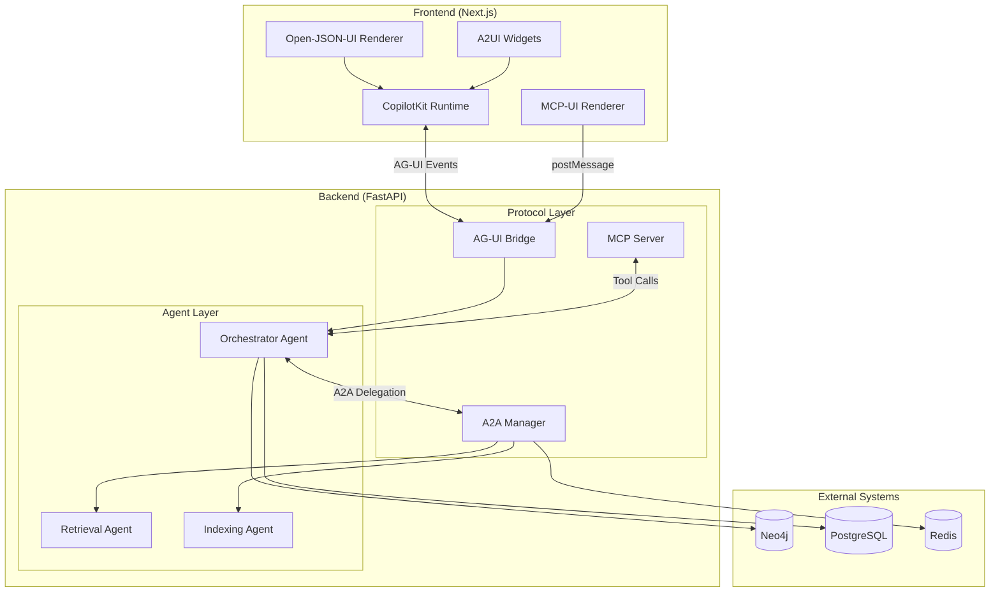
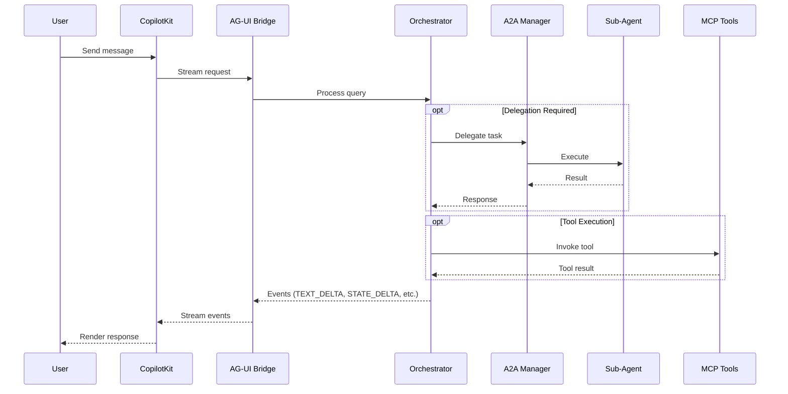

# Protocol Integration Overview

**Version:** 1.0
**Last Updated:** 2026-01-11
**Related Epics:** 7, 14, 21, 22

---

## Introduction

The Agentic RAG platform implements multiple protocols for AI agent communication, UI rendering, and tool execution. This guide provides a comprehensive overview of all protocol integrations.

## Architecture Overview



## Protocol Summary

| Protocol | Purpose | Layer | Direction |
|----------|---------|-------|-----------|
| **AG-UI** | Event streaming for CopilotKit | Frontend-Backend | Bidirectional |
| **A2A** | Agent-to-Agent delegation | Backend | Internal |
| **MCP** | Model Context Protocol tools | Backend | External |
| **A2UI** | Widget rendering | Frontend | Outbound |
| **MCP-UI** | Iframe embedding for MCP tools | Frontend | External |
| **Open-JSON-UI** | Declarative component rendering | Frontend | Internal |

## Protocol Relationships

### Data Flow



## Quick Reference

### Event Types (AG-UI)

| Event | Description |
|-------|-------------|
| `RUN_STARTED` | Stream initiated |
| `TEXT_DELTA` | Incremental text |
| `STATE_DELTA` | State patch (JSON Patch) |
| `TOOL_CALL_START` | Tool execution begins |
| `TOOL_CALL_END` | Tool execution complete |
| `RUN_FINISHED` | Stream complete |
| `RUN_ERROR` | Error occurred |

### A2A Capabilities

| Capability | Description |
|------------|-------------|
| `QUERY` | Information retrieval |
| `INGEST` | Document ingestion |
| `ANALYZE` | Data analysis |
| `SUMMARIZE` | Content summarization |

### MCP Tools

| Tool | Description |
|------|-------------|
| `vector_search` | Semantic vector search |
| `hybrid_retrieve` | Combined graph + vector |
| `ingest_url` | URL document ingestion |
| `search_nodes` | Graph node search |
| `search_facts` | Graph fact search |

### UI Components (Open-JSON-UI)

| Component | Description |
|-----------|-------------|
| `text` | Plain text block |
| `heading` | Section header (h1-h6) |
| `code` | Syntax-highlighted code |
| `table` | Data table |
| `button` | Interactive action |
| `alert` | Notification box |

## Configuration Overview

### Environment Variables

```bash
# AG-UI Configuration
AGUI_STREAM_TIMEOUT_SECONDS=300
AGUI_MAX_EVENTS_PER_STREAM=1000

# A2A Configuration
A2A_DEFAULT_TIMEOUT_SECONDS=30
A2A_MAX_DELEGATION_DEPTH=3
A2A_SESSION_LIMITS_ENABLED=true

# MCP Configuration
MCP_SERVER_ENABLED=true
MCP_TOOL_TIMEOUT_MS=30000

# MCP-UI Configuration
MCP_UI_ENABLED=true
MCP_UI_ALLOWED_ORIGINS=https://trusted-origin.com

# Open-JSON-UI Configuration
OPEN_JSON_UI_ENABLED=true
```

### Redis Keys (A2A)

```
a2a:sessions:{session_id}          # Session metadata
a2a:agents:{agent_id}              # Agent registration
a2a:limits:{session_id}            # Resource limits
```

## Security Considerations

1. **Origin Validation**: MCP-UI validates iframe origins against allowlist
2. **Sanitization**: Open-JSON-UI sanitizes all content with DOMPurify
3. **Rate Limiting**: A2A enforces per-session resource limits
4. **Tenant Isolation**: All database queries include tenant_id filter

## Detailed Documentation

- [AG-UI Protocol](./ag-ui-protocol.md)
- [A2A Protocol](./a2a-protocol.md)
- [MCP Integration](./mcp-integration.md)
- [A2UI Widgets](./a2ui-widgets.md)
- [MCP-UI Rendering](./mcp-ui-rendering.md)
- [Open-JSON-UI](./open-json-ui.md)

## Troubleshooting

### Common Issues

| Issue | Likely Cause | Solution |
|-------|--------------|----------|
| Stream disconnects | Timeout exceeded | Increase `AGUI_STREAM_TIMEOUT_SECONDS` |
| A2A delegation fails | Agent not registered | Check agent registration in Redis |
| MCP tools not found | Server not initialized | Verify MCP server startup |
| MCP-UI blocked | Origin not allowed | Add origin to `MCP_UI_ALLOWED_ORIGINS` |
| Invalid UI payload | Schema mismatch | Validate against Zod/Pydantic schemas |

### Debug Logging

Enable protocol-specific logging:

```python
# settings.py
LOGGING = {
    "loggers": {
        "agentic_rag_backend.protocols.ag_ui_bridge": {"level": "DEBUG"},
        "agentic_rag_backend.protocols.a2a": {"level": "DEBUG"},
        "agentic_rag_backend.protocols.mcp": {"level": "DEBUG"},
    }
}
```

## Version History

| Version | Date | Changes |
|---------|------|---------|
| 1.0 | 2026-01-11 | Initial release with Epic 22 protocols |
