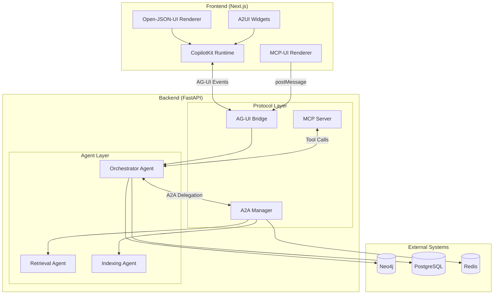
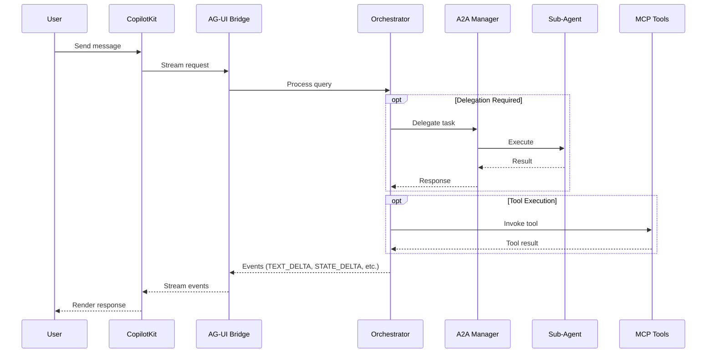

# Protocol Integration Overview

**Version:** 1.0
**Last Updated:** 2026-01-11
**Related Epics:** 7, 14, 21, 22

---

## Introduction

The Agentic RAG platform implements multiple protocols for AI agent communication, UI rendering, and tool execution. This guide provides a comprehensive overview of all protocol integrations.

## Architecture Overview


```mermaid
graph TB
    subgraph Frontend["Frontend (Next.js)"]
        CK[CopilotKit Runtime]
        MCPUI[MCP-UI Renderer]
        OJUI[Open-JSON-UI Renderer]
        A2UIW[A2UI Widgets]
    end

    subgraph Backend["Backend (FastAPI)"]
        subgraph Protocols["Protocol Layer"]
            AGUI[AG-UI Bridge]
            A2A[A2A Manager]
            MCP[MCP Server]
        end

        subgraph Agents["Agent Layer"]
            ORC[Orchestrator Agent]
            RET[Retrieval Agent]
            IDX[Indexing Agent]
        end
    end

    subgraph External["External Systems"]
        NEO4J[(Neo4j)]
        PG[(PostgreSQL)]
        REDIS[(Redis)]
    end

    CK <-->|AG-UI Events| AGUI
    AGUI --> ORC
    ORC <-->|A2A Delegation| A2A
    A2A --> RET
    A2A --> IDX
    MCP <-->|Tool Calls| ORC

    MCPUI -->|postMessage| AGUI
    OJUI --> CK
    A2UIW --> CK

    ORC --> NEO4J
    ORC --> PG
    A2A --> REDIS
```

## Protocol Summary

| Protocol | Purpose | Layer | Direction |
|----------|---------|-------|-----------|
| **AG-UI** | Event streaming for CopilotKit | Frontend-Backend | Bidirectional |
| **A2A** | Agent-to-Agent delegation | Backend | Internal |
| **MCP** | Model Context Protocol tools | Backend | External |
| **A2UI** | Widget rendering | Frontend | Outbound |
| **MCP-UI** | Iframe embedding for MCP tools | Frontend | External |
| **Open-JSON-UI** | Declarative component rendering | Frontend | Internal |

## Protocol Relationships

### Data Flow


```mermaid
sequenceDiagram
    participant User
    participant CopilotKit
    participant AG-UI as AG-UI Bridge
    participant Orchestrator
    participant A2A as A2A Manager
    participant SubAgent as Sub-Agent
    participant MCP as MCP Tools

    User->>CopilotKit: Send message
    CopilotKit->>AG-UI: Stream request
    AG-UI->>Orchestrator: Process query

    opt Delegation Required
        Orchestrator->>A2A: Delegate task
        A2A->>SubAgent: Execute
        SubAgent-->>A2A: Result
        A2A-->>Orchestrator: Response
    end

    opt Tool Execution
        Orchestrator->>MCP: Invoke tool
        MCP-->>Orchestrator: Tool result
    end

    Orchestrator-->>AG-UI: Events (TEXT_DELTA, STATE_DELTA, etc.)
    AG-UI-->>CopilotKit: Stream events
    CopilotKit-->>User: Render response
```

## Quick Reference

### Event Types (AG-UI)

| Event | Description |
|-------|-------------|
| `RUN_STARTED` | Stream initiated |
| `TEXT_DELTA` | Incremental text |
| `STATE_DELTA` | State patch (JSON Patch) |
| `TOOL_CALL_START` | Tool execution begins |
| `TOOL_CALL_END` | Tool execution complete |
| `RUN_FINISHED` | Stream complete |
| `RUN_ERROR` | Error occurred |

### A2A Capabilities

| Capability | Description |
|------------|-------------|
| `QUERY` | Information retrieval |
| `INGEST` | Document ingestion |
| `ANALYZE` | Data analysis |
| `SUMMARIZE` | Content summarization |

### MCP Tools

| Tool | Description |
|------|-------------|
| `vector_search` | Semantic vector search |
| `hybrid_retrieve` | Combined graph + vector |
| `ingest_url` | URL document ingestion |
| `search_nodes` | Graph node search |
| `search_facts` | Graph fact search |

### UI Components (Open-JSON-UI)

| Component | Description |
|-----------|-------------|
| `text` | Plain text block |
| `heading` | Section header (h1-h6) |
| `code` | Syntax-highlighted code |
| `table` | Data table |
| `button` | Interactive action |
| `alert` | Notification box |

## Configuration Overview

### Environment Variables

```bash
# A2A Configuration
A2A_ENABLED=true
A2A_AGENT_ID=agentic-rag-001
A2A_ENDPOINT_URL=http://localhost:8000
A2A_HEARTBEAT_INTERVAL_SECONDS=30
A2A_HEARTBEAT_TIMEOUT_SECONDS=60
A2A_TASK_DEFAULT_TIMEOUT_SECONDS=300
A2A_TASK_MAX_RETRIES=3

# A2A Resource Limits
A2A_LIMITS_BACKEND=memory  # memory | redis
A2A_SESSION_LIMIT_PER_TENANT=100
A2A_MESSAGE_LIMIT_PER_SESSION=1000
A2A_SESSION_TTL_HOURS=24
A2A_MESSAGE_RATE_LIMIT=60
A2A_LIMITS_CLEANUP_INTERVAL_MINUTES=15

# MCP Configuration
MCP_TOOL_TIMEOUT_SECONDS=30
MCP_TOOL_MAX_TIMEOUT_SECONDS=300
MCP_TOOL_TIMEOUT_OVERRIDES={"knowledge.query":30,"knowledge.graph_stats":10}

# MCP-UI Configuration
MCP_UI_ENABLED=true
MCP_UI_ALLOWED_ORIGINS=https://trusted-origin.com
MCP_UI_SIGNING_SECRET=
NEXT_PUBLIC_MCP_UI_ALLOWED_ORIGINS=https://trusted-origin.com
```

### Redis Keys (A2A)

```
a2a:sessions:{session_id}          # Session metadata (A2ASessionManager)
a2a:tenant:{tenant_id}             # Resource limits (tenant usage)
a2a:session:{session_id}:info      # Resource limits (session usage)
a2a:session:{session_id}:rate      # Resource limits (rate window)
```

## Security Considerations

1. **Origin Validation**: MCP-UI validates iframe origins against allowlist
2. **Sanitization**: Open-JSON-UI sanitizes all content with DOMPurify
3. **Rate Limiting**: A2A enforces per-session resource limits
4. **Tenant Isolation**: All database queries include tenant_id filter

## Detailed Documentation

- [AG-UI Protocol](./ag-ui-protocol.md)
- [A2A Protocol](./a2a-protocol.md)
- [MCP Integration](./mcp-integration.md)
- [A2UI Widgets](./a2ui-widgets.md)
- [MCP-UI Rendering](./mcp-ui-rendering.md)
- [Open-JSON-UI](./open-json-ui.md)

## Troubleshooting

### Common Issues

| Issue | Likely Cause | Solution |
|-------|--------------|----------|
| Stream disconnects | Upstream timeout | Check upstream agent timeouts and network stability |
| A2A delegation fails | Agent not registered | Check agent registration in Redis |
| MCP tools not found | Server not initialized | Verify MCP server startup |
| MCP-UI blocked | Origin not allowed | Add origin to `MCP_UI_ALLOWED_ORIGINS` |
| Invalid UI payload | Schema mismatch | Validate against Zod/Pydantic schemas |

### Debug Logging

Enable protocol-specific logging:

```python
# settings.py
LOGGING = {
    "loggers": {
        "agentic_rag_backend.protocols.ag_ui_bridge": {"level": "DEBUG"},
        "agentic_rag_backend.protocols.a2a": {"level": "DEBUG"},
        "agentic_rag_backend.protocols.mcp": {"level": "DEBUG"},
    }
}
```

## Version History

| Version | Date | Changes |
|---------|------|---------|
| 1.0 | 2026-01-11 | Initial release with Epic 22 protocols |
